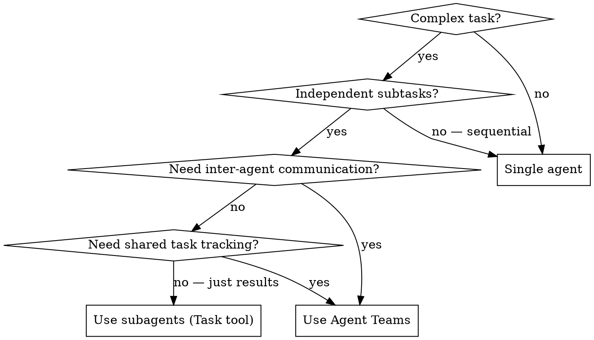

# Agent Teams

Coordinate multiple Claude Code instances with shared task list and direct messaging.

**Core principle:** Teams for collaboration with shared state. Subagents for focused tasks returning results. Don't use teams when subagents suffice.

## Setup

Agent teams are **experimental, disabled by default**. Enable in settings.json:

```json
{ "env": { "CLAUDE_CODE_EXPERIMENTAL_AGENT_TEAMS": "1" } }
```

## When to Use



**Teams:** research and review, new modules/features, debugging with competing hypotheses, cross-layer coordination (frontend + backend + tests).

**Subagents instead:** focused tasks returning results, no inter-agent communication needed.

| Aspect | Subagents | Agent Teams |
|--------|-----------|-------------|
| Communication | Back to caller only | Teammates message each other directly |
| Coordination | Main agent manages all | Shared task list + self-coordination |
| Token cost | Lower (summarized) | Higher (each = separate Claude instance) |
| Best for | Focused tasks | Complex work requiring discussion |

## Quick Reference

| Tool | Purpose |
|------|---------|
| `TeamCreate(team_name=..., description=...)` | Create team + shared task list |
| `Task(team_name=..., name=..., subagent_type=...)` | Spawn teammate |
| `TaskCreate` / `TaskList` / `TaskUpdate` | Manage shared tasks |
| `SendMessage(type="message", recipient=..., summary=...)` | DM a teammate |
| `SendMessage(type="broadcast", summary=...)` | Message all (use sparingly) |
| `SendMessage(type="shutdown_request", recipient=...)` | Graceful shutdown |
| `SendMessage(type="plan_approval_response", request_id=...)` | Approve/reject plan |
| `TeamDelete()` | Remove team resources (lead only, after all shutdown) |

**Keyboard shortcuts (in-process mode):** Shift+Up/Down select teammate, Enter view session, Escape interrupt, Ctrl+T toggle tasks, Shift+Tab delegate mode.

## Starting a Team

Tell Claude to create a team in natural language:

```
I'm designing a CLI tool that helps developers track TODO comments across
their codebase. Create an agent team to explore this from different angles: one
teammate on UX, one on technical architecture, one playing devil's advocate.
```

Claude creates team, spawns teammates, coordinates work, synthesizes findings, and cleans up when finished. You can also specify models:

```
Create a team with 4 teammates to refactor these modules in parallel.
Use Sonnet for each teammate.
```

Two ways teams start: **you request** one, or **Claude proposes** one (you confirm before it proceeds).

## Controlling the Team

### Display Modes

- **in-process** (default): all in main terminal, Shift+Up/Down to navigate. Works anywhere.
- **split panes**: each in own pane (requires tmux or iTerm2). Click pane to interact.

Override: `{ "teammateMode": "in-process" }` in settings.json or `claude --teammate-mode in-process`.

Default `"auto"` — uses split panes if inside tmux, in-process otherwise.

### Delegate Mode

Shift+Tab — restricts lead to coordination-only tools (spawn, message, shutdown, tasks). Prevents lead from implementing instead of waiting for teammates.

### Plan Approval

Require teammates to plan before implementing:

```
Spawn an architect teammate to refactor the authentication module.
Require plan approval before they make any changes.
```

Teammate works read-only until lead approves. If rejected, teammate revises and resubmits. Lead decides autonomously — influence with criteria: "only approve plans that include test coverage".

### Task Assignment

Shared task list with three states: pending, in progress, completed. Tasks can depend on other tasks (blocked until dependencies complete).

- **Lead assigns**: tell the lead which task to give to which teammate.
- **Self-claim**: after finishing, teammate picks next unassigned, unblocked task. File locking prevents race conditions.

### Talking to Teammates Directly

Each teammate is a full independent Claude Code session. Message any teammate directly:
- **In-process**: Shift+Up/Down to select, type to message.
- **Split panes**: click into pane.

### Shutdown and Cleanup

```
Ask the researcher teammate to shut down
```

Lead sends shutdown request → teammate approves (exits) or rejects (with explanation). After all shut down:

```
Clean up the team
```

**Always use the lead to clean up.** Teammates must not run cleanup — their team context may not resolve correctly.

## Architecture

| Component | Role |
|-----------|------|
| **Team lead** | Main session — creates team, spawns teammates, coordinates |
| **Teammates** | Separate Claude Code instances with own context windows |
| **Task list** | Shared work items teammates claim and complete |
| **Mailbox** | Messaging system for inter-agent communication |

Storage: `~/.claude/teams/{team-name}/config.json` (members), `~/.claude/tasks/{team-name}/` (tasks).

Task dependencies managed automatically — completing a task unblocks dependents.

### Context and Communication

Teammates load project context (CLAUDE.md, MCP servers, skills) + spawn prompt. **Lead's conversation history does NOT carry over.**

- **Automatic message delivery** — no polling needed.
- **Idle notifications** — teammate notifies lead when turn ends.
- **Shared task list** — all agents see status and claim work.

Messaging: `message` (to one) or `broadcast` (to all — use sparingly, costs scale with team size).

### Permissions

Teammates start with lead's permission settings. Changeable individually after spawning, but not at spawn time.

## Model Selection

**Default: Opus 4.6** (`model: "opus"`) for all teammates. Sonnet/Haiku only for trivial read-only tasks.

```python
# Always specify model explicitly
Task(name="reviewer", model="opus", team_name="my-team", ...)
```

## Git Worktrees (MANDATORY for parallel branch work)

**Problem:** Multiple agents sharing one repo switch branches simultaneously → lost edits, false test failures, repeated rework.

**Rule:** When 2+ agents work on **different branches** — each MUST use its own worktree.

```bash
# Before spawning teammates
git worktree add /home/user/projects/rag-fresh-wt-pr280 claude/optimize-test-suite-RBhOe
git worktree add /home/user/projects/rag-fresh-wt-pr251 feat/docker-cleanup

# In teammate spawn prompt — specify working directory
"Working directory: /home/user/projects/rag-fresh-wt-pr280"

# Cleanup after merge
git worktree remove /home/user/projects/rag-fresh-wt-pr280
```

| Scenario | Approach |
|----------|----------|
| All agents on same branch (e.g. review) | Normal — shared repo OK |
| Agents on different branches | **Worktree per agent** |
| Sequential PR fixes (one at a time) | Normal — switch branches between tasks |
| Lead + workers on different PRs | Lead in main repo, workers in worktrees |

## Teammate Skills Workflow

**MANDATORY** — include in every teammate spawn prompt:

```
SKILLS (invoke in this order):
1. /executing-plans — step-by-step execution
2. /requesting-code-review — code review AFTER finishing work (before commit)
   Invoke: Skill(skill="requesting-code-review")
3. /verification-before-completion — final check before reporting done
   Invoke: Skill(skill="verification-before-completion")

MCP TOOLS:
- Context7: resolve-library-id → query-docs for SDK documentation
- Exa: web_search_exa, get_code_context_exa for fresh examples

ISSUE TRACKING:
- Found pre-existing bug? Create issue via Skill(skill="gh-issues")
- Include "Found during PR #N review" in description
```

## Teammate Prompt Template

```
You are **{role}** on team "{team_name}".

## YOUR TASK
{task_description}

## WORKING DIRECTORY
{worktree_path or main repo path}
Branch: {branch_name} (already checked out)

## SAFETY RULES
- Do NOT switch branches. Do NOT cd to other directories.
- Do NOT use `git add -A` — only add files you actually changed
- Do NOT merge PRs — report back when ready
- BEFORE commit: `git diff --cached --stat` — verify ONLY your files

## SKILLS (invoke in order)
1. Skill(skill="requesting-code-review") — after finishing work
2. Skill(skill="verification-before-completion") — before reporting done

## MCP TOOLS
- Context7: resolve-library-id → query-docs for SDK docs
- Exa: web_search_exa for fresh solutions

## WORKFLOW
1. Claim task via TaskUpdate(taskId="{id}", status="in_progress")
2. Do the work
3. Run skills (review → verification)
4. Send findings to lead via SendMessage
5. Mark task completed via TaskUpdate
```

## Best Practices

### Give Teammates Enough Context

Include task-specific details in spawn prompt — teammates don't inherit conversation history. Use the template above.

### Size Tasks Appropriately

- **Too small**: coordination overhead exceeds benefit.
- **Too large**: too long without check-ins, wasted effort risk.
- **Just right**: self-contained deliverable (function, test file, review).

5-6 tasks per teammate keeps everyone productive.

### Wait for Teammates to Finish

If lead starts implementing instead of waiting:

```
Wait for your teammates to complete their tasks before proceeding
```

Or use delegate mode (Shift+Tab).

### Start with Research and Review

New to agent teams? Start with read-only tasks: reviewing a PR, researching a library, investigating a bug. Clear boundaries, no file-conflict risk.

### Avoid File Conflicts

Two teammates editing same file = overwrites. Use worktrees for branch isolation, and break work so each teammate owns different files within a branch.

### Monitor and Steer

Check in on progress, redirect failing approaches, synthesize findings. Unattended teams risk wasted effort.

## Use Case Examples

### Parallel Code Review
```
Create an agent team to review PR #142. Spawn three reviewers:
- One focused on security implications
- One checking performance impact
- One validating test coverage
Have them each review and report findings.
```

### Competing Hypotheses Debug
```
Users report the app exits after one message instead of staying connected.
Spawn 5 agent teammates to investigate different hypotheses. Have them talk to
each other to try to disprove each other's theories, like a scientific
debate. Update the findings doc with whatever consensus emerges.
```

## Troubleshooting

| Problem | Solution |
|---------|----------|
| Teammates not appearing | Shift+Down to cycle; check task complexity warrants a team |
| Too many permission prompts | Pre-approve common ops in permission settings before spawning |
| Teammates stop on errors | Check via Shift+Up/Down, give instructions or spawn replacement |
| Lead shuts down early | Tell it to keep going, or use delegate mode |
| Orphaned tmux sessions | `tmux ls` then `tmux kill-session -t <name>` |
| Task stuck | Check if work done, update status manually or nudge teammate |
| **"Could not determine pane count"** | Ghost pane from shutdown teammate. Fix: `tmux kill-pane -t {window}.{pane}` |
| **Branch switching interference** | Agents share repo and switch branches. Fix: use git worktrees (see above) |
| **Lost edits after teammate switch** | Same root cause — worktrees required for parallel branch work |
| **Task tool fails after shutdown** | Ghost tmux panes block new spawns. Kill orphan panes first |

## Limitations

- No `/resume` for in-process teammates — tell lead to spawn new ones
- Task status can lag — teammates sometimes forget to mark `completed`
- Shutdown can be slow — teammates finish current request first
- One team per session; clean up before starting new one
- No nested teams — only lead can manage team
- Lead is fixed for lifetime — can't transfer leadership
- Permissions set at spawn (changeable individually after)
- Split panes need tmux/iTerm2 (not VS Code terminal, Windows Terminal, Ghostty)
- CLAUDE.md works normally — teammates read it from working directory
- **Shared git repo** — agents switching branches break each other's work. Use worktrees.
- **Ghost tmux panes** — after teammate shutdown, dead panes block new spawns. Kill manually.
- **Task tool after shutdowns** — may fail with "Could not determine pane count". Kill ghost panes first.
