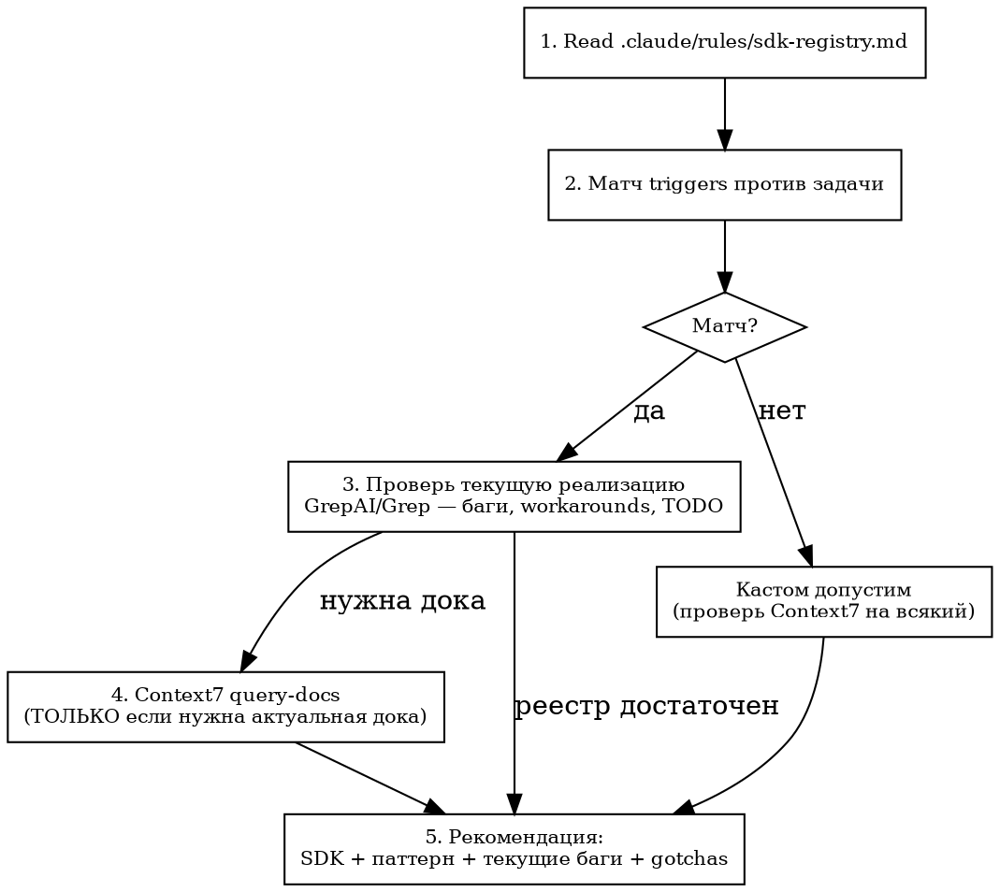

# SDK Research

Проверь SDK реестр ПЕРЕД написанием кода. Вызывается из brainstorming, writing-plans, tmux-swarm Phase 2.7, или вручную: `/sdk-research "описание задачи"`

## Процесс



## Quick Path (субагент / простая задача)

Шаги 1→2→3→5. Пропустить Context7 если реестр + кодбаза дают полную картину.

## Full Path (новый SDK / сложная задача)

Шаги 1→2→3→4→5. Context7 нужен когда API изменился или паттерн в реестре устарел.

## Quick Reference

| Шаг | Что делать | Инструмент |
|-----|-----------|------------|
| 1 | Прочитать реестр | `Read .claude/rules/sdk-registry.md` |
| 2 | Матчить triggers из реестра против описания задачи | Текстовое сравнение |
| 3 | **Проверить текущую реализацию** (≤3 запроса, см. чеклист) | `Grep` по файлам из `как_у_нас` + `context-mode batch_execute` для сжатия |
| 4 | Актуальная дока (если нужна) | `mcp__context7__resolve-library-id` → `query-docs` |
| 5 | Вернуть рекомендацию | Таблица: SDK / покрывает / паттерн / баги / gotchas |

Нет реестра → пропустить шаг 1-2, сразу Context7 поиск по ключевым словам задачи.

## Шаг 3: Чеклист проверки (≤3 запроса)

Не исследуй всю кодбазу. Проверь **только файлы из `как_у_нас`** в реестре.

**Предпочтительный инструмент:** `context-mode batch_execute` — один вызов, все запросы, output в sandbox (не в контекст):

```
batch_execute(commands=[
  {label: "todos", command: "grep -rn 'TODO\\|FIXME\\|HACK\\|workaround' {файлы_из_как_у_нас}"},
  {label: "imports", command: "grep -rn 'from {package}\\|import {package}' {файлы_из_как_у_нас}"},
  {label: "key_function", command: "sed -n '{start},{end}p' {файл_с_ключевой_функцией}"}
], queries=[
  "existing bugs or TODOs in {SDK} usage",
  "how {SDK} is imported and wrapped",
  "fallback logic or hardcoded values in {key_function}"
])
```

**Fallback** (если context-mode недоступен): 3 отдельных `Grep` запроса:

1. `Grep "TODO|FIXME|HACK|workaround"` в файлах из `как_у_нас` — известные проблемы
2. `Grep "from {package}"` — как SDK импортируется, есть ли обёртки
3. Прочитай **ключевую функцию** (ту что задача затрагивает) — fallback логика, hardcoded значения, missing DI

| Что искать | Пример из проекта |
|---|---|
| Fallback на захардкоженное значение | `build_semantic_query()` → `"апартамент"` вместо raw query |
| SDK не инжектится где нужен | `ApartmentsService.__init__` не принимает `cache` |
| Фича уже реализована но не подключена | `filter_panel.py` уже имеет `city` фильтр |
| Устаревший API вызов | `.search()` вместо `.query_points()` |

## Формат рекомендации

    ## SDK Coverage
    | SDK | Покрывает | Паттерн из проекта | Текущие баги/TODO | Gotchas |
    | {name} | {что} | {как_у_нас из реестра} | {из шага 3} | {из реестра} |
    Кастом допустим для: {что не покрыто} — обоснование

## Обновление реестра

При обнаружении устаревшего паттерна или новой зависимости — предложи обновить `.claude/rules/sdk-registry.md`. Шаблон новой записи — в конце реестра.

## Common Mistakes

| Ошибка | Правильно |
|--------|-----------|
| Пропустить реестр, сразу писать код | Всегда начинай с Read sdk-registry.md |
| Матч по 1 trigger, пропустить остальные SDK | Проверь ВСЕ секции реестра — задача может затрагивать 2+ SDK |
| Найти SDK но не проверить текущий код на баги | Шаг 3: `grepai_search` по существующей реализации — баги, TODO, workarounds |
| Предложить новый код когда существующий нужно починить | Сначала проверь: может задача решается фиксом 3 строк, а не новым методом |
| Использовать только Context7 без проверки кодбазы | Context7 = актуальная дока, GrepAI = как уже используется. Нужны оба |
| Всегда запускать Context7 даже когда реестр достаточен | Quick Path: реестр + кодбаза → рекомендация. Context7 только если нужна дока |
| Следовать доке не учитывая gotchas из реестра | Gotchas = проектные ограничения, они важнее generic best practices |
| Не предложить обновить реестр при новом паттерне | Реестр — живой документ, обновляй при каждом открытии |
