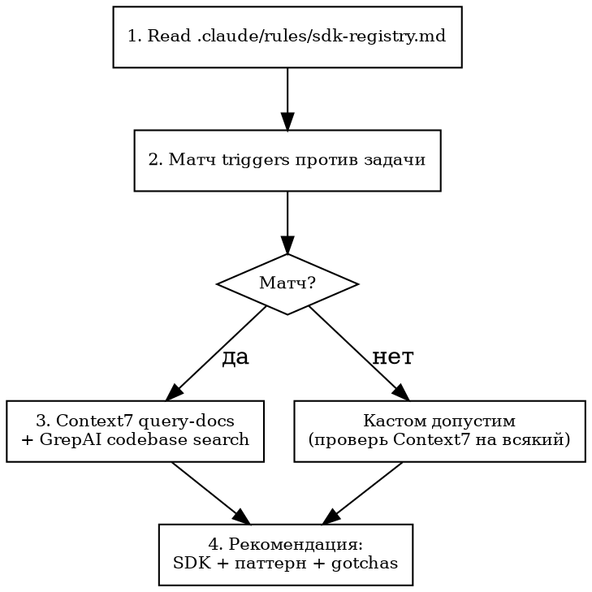

# SDK Research

Проверь SDK реестр ПЕРЕД написанием кода. Вызывается из brainstorming, writing-plans, tmux-swarm Phase 2.7, или вручную: `/sdk-research "описание задачи"`

## Процесс

## Quick Reference

| Шаг | Что делать | Инструмент |
|-----|-----------|------------|
| 1 | Прочитать реестр | `Read .claude/rules/sdk-registry.md` |
| 2 | Матчить triggers из реестра против описания задачи | Текстовое сравнение |
| 3a | Актуальная дока совпавшего SDK | `mcp__context7__resolve-library-id` → `query-docs` |
| 3b | Как SDK уже используется в проекте | `grepai_search` + `Grep "from {package}"` |
| 4 | Вернуть рекомендацию | Таблица: SDK / покрывает / паттерн / gotchas |

Нет реестра → пропустить шаг 1-2, сразу Context7 поиск по ключевым словам задачи.

## Формат рекомендации

    ## SDK Coverage
    | SDK | Покрывает | Паттерн из проекта | Gotchas |
    | {name} | {что} | {как_у_нас из реестра} | {из реестра} |
    Кастом допустим для: {что не покрыто} — обоснование

## Обновление реестра

При обнаружении устаревшего паттерна или новой зависимости — предложи обновить `.claude/rules/sdk-registry.md`. Шаблон новой записи — в конце реестра.

## Common Mistakes

| Ошибка | Правильно |
|--------|-----------|
| Пропустить реестр, сразу писать код | Всегда начинай с Read sdk-registry.md |
| Матч по 1 trigger, пропустить остальные SDK | Проверь ВСЕ секции реестра — задача может затрагивать 2+ SDK |
| Использовать только Context7 без проверки кодбазы | Context7 = актуальная дока, GrepAI = как уже используется. Нужны оба |
| Следовать доке не учитывая gotchas из реестра | Gotchas = проектные ограничения, они важнее generic best practices |
| Не предложить обновить реестр при новом паттерне | Реестр — живой документ, обновляй при каждом открытии |
