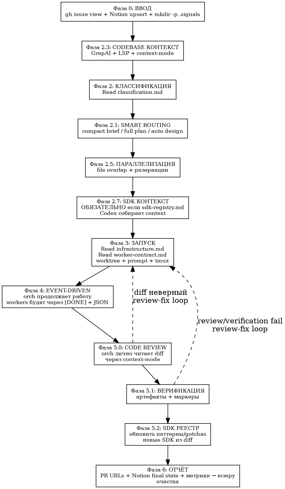

# tmux Swarm Оркестрация v11

<HARD-GATE>
ТЫ = CODEX = ОРКЕСТРАТОР. Юзер дал issues — дальше ВСЁ автоматом до PR URLs.
ОРКЕСТРАТОР изучает issue/codebase, планирует, режет работу на независимые worker-задачи, резервирует файлы и запускает параллельно только непересекающиеся группы.
ОРКЕСТРАТОР НЕ пишет production code inline. Реализация, тесты, commit, push, PR → OpenCode worker.
КАЖДЫЙ worker, включая research/plan, работает в СВОЁМ `git worktree`. Два worker'а в одном worktree или с пересекающимися reserved files = нарушение.
ПОСЛЕ worker: ЛИЧНО читаешь diff (Фаза 5.0) — это твоя ответственность, не worker'а.
КООРДИНАЦИЯ:
- OpenCode workers: low-token tmux protocol — worker-local persisted `{WORKTREE}/.signals/worker-*.json` + короткий `[DONE] ...json` в pane оркестратора.
- GitHub + Notion: GitHub остаётся source of truth для issue/PR/code; Notion ведётся orch как persistent control plane для task brief, статуса, PR, review decision и next action.
- Модель worker'а НЕ указывать natural-language текстом внутри prompt. Выбор модели/agent делает orchestrator явно через launcher: `OPENCODE_AGENT`/`OPENCODE_MODEL` или OpenCode agent config.
БЕЗ чтения больших transcript'ов worker'ов, БЕЗ `opencode export` как штатного мониторинга, БЕЗ polling pane output, БЕЗ `ps`/`pgrep` с args.
</HARD-GATE>

## Low-Token OpenCode Protocol

Если пользователь запускает skill в окне оркестратора (текущий Codex pane) и просит `opencode`, `worker terminal`, `свармить терминалы`:

1. Зафиксируй pane оркестратора ДО запуска worker'ов:

       ORCH_PANE=$(tmux display-message -p '#{pane_id}')
       tmux display-message -p -t "$ORCH_PANE" '#{pane_id}'  # sanity check

2. Запускай ровно 1 tmux window на 1 worker. НЕ создавай отдельные inbox-окна в реальном swarm.
3. Передай worker'у `ORCH_PANE`, worker-local `SIGNAL_FILE={WORKTREE}/.signals/worker-{name}.json` и задачу. Worker обязан:
   - писать компактный результат в `SIGNAL_FILE` атомарно (`.tmp` → `mv`);
   - отправлять в `ORCH_PANE` только короткий wake-up:

         tmux send-keys -t "$ORCH_PANE" '[DONE] worker-{name} {WORKTREE}/.signals/worker-{name}.json'
         sleep 1
         tmux send-keys -t "$ORCH_PANE" Enter

4. Источник истины — JSON, а не сообщение в pane. Сообщение только будит оркестратора.
5. Если оркестратор получил `[DONE] worker-X path`, сразу читай `path`, закрывай tmux window worker'а (`kill-window`) и переходи к review/verify по worktree/files. Не экспортируй opencode session, пока JSON не `failed`, неполный или противоречивый.
6. НЕ требуй от OpenCode worker финальный `tmux wait-for -S`: worker может уже записать JSON и отправить wake-up, но зависнуть до `wait-for -S`. Контракт — JSON + pane wake-up.

Минимальный JSON:

    {
      "status": "done|failed|blocked",
      "worker": "W-{NAME}",
      "issue": 123,
      "branch": "fix/...",
      "pr": "https://github.com/...",
      "base": "dev",
      "changed_files": [],
      "pr_files": [],
      "reserved_files": [],
      "notion_task": "notion-page-id-or-empty",
      "notion_status": "Queued|In Progress|Workers Running|PR Open|Review Fix|Ready to Merge|Done|Blocked|",
      "agent": "pr-worker|pr-review-fix|complex-escalation|",
      "model": "provider/model-or-empty",
      "review_decision": "not_reviewed|clean|blockers|fixed|escalate",
      "autofix_commits": [],
      "prompt_sha256": "sha256-or-empty",
      "commands": [
        {"cmd": "uv run pytest tests/unit/changed_test.py -q", "exit": 0, "summary": "focused tests ok"},
        {"cmd": "make check", "exit": 0, "summary": "ruff+mypy ok"}
      ],
      "summary": "1-3 строки",
      "next_action": "review|verify|escalate",
      "ts": "ISO-8601"
    }

## GitHub + Notion Control Plane

Orch обязан вести GitHub и Notion вместе:

- GitHub = source of truth для issue body, labels, comments, branch, PR, checks, merge.
- Notion = persistent control plane для сжатого AI brief, текущего статуса, worktree/worker/PR/review state, next action.
- Один GitHub issue = одна Notion task. Не создавать дубликаты.
- Worker'ы Notion не ведут. Notion обновляет только orch, потому что он видит весь pipeline.

Canonical Notion data sources:

| Назначение | Notion data source | ID |
|------------|--------------------|----|
| Tasks | `Tasks Tracker` | `34f03b0f-c042-80ad-9aeb-000b77e8853a` |
| Projects | `Projects` | `34f03b0f-c042-80e8-b86a-000b6f814666` |
| Docs / runbooks | `Document Hub` | `34f03b0f-c042-80d4-a189-000bc9a8a72b` |

Context-budget rules:

- Не делать broad Notion workspace search в штатном loop.
- Использовать известный `Tasks Tracker` data source ID и узкие query/update операции.
- `API_retrieve_a_data_source` вызывать только если property update упал из-за schema drift.
- `page_size` держать маленьким (`5` или `10`).
- Не читать большие Notion pages целиком; читать/обновлять только текущую task page.

Observed schema rules:

- `Tasks Tracker.Status` supports only `Not started`, `In progress`, `Done`.
- `Projects.Status` supports only `Not started`, `In progress`, `Done`.
- `Source` is a select; use `Source = Codex`, not a URL.
- GitHub issue/PR URLs live in `Description` and/or the page body `Orchestrator State`.
- Detailed orchestration statuses (`Queued`, `PR Open`, `Review Fix`, `Ready to Merge`, `Blocked`) live in page body, not in Notion's `Status` property.

### Project Bootstrap

Before creating issue tasks for this repository, orch ensures one `Projects` row exists:

1. Query `Projects` by `Project name contains "rag-fresh"`.
2. If no project exists, create:

       Project name: "rag-fresh"
       Status: "In progress"
       Source: "Codex"
       Owner / Agent: "Codex"
       Project Type: "Internal"
       Priority: "High"
       Next Action: "Codex orchestrator tracks GitHub issues and PR review/fix flow here."

3. Use that project page id in every `Tasks Tracker.Project` relation for this repo.
4. Do not create multiple project rows for the same repository.

### Phase 0: Issue Intake → Notion Task

Для каждого выбранного GitHub issue:

1. Получить GitHub issue:

       gh issue view {N} --json number,title,body,labels,state,url,assignees,milestone

2. Сформировать ключи поиска:

       GH #123
       https://github.com/yastman/rag/issues/123

3. Ensure `rag-fresh` project exists in `Projects`; keep `RAG_FRESH_PROJECT={page_id}`.

4. Найти существующую task в `Tasks Tracker`:
   - сначала query `Task name` contains `GH #123`;
   - если не найдено, query `Description` contains issue URL;
   - если Notion schema differs, retrieve data source once and retry with available title/rich_text properties.

5. Если task не найдена — создать page в `Tasks Tracker`:

       Task name: "GH #123: {issue title}"
       Status: "Not started"
       Source: "Codex"
       Owner / Agent: "Codex"
       Project: RAG_FRESH_PROJECT
       System Role: "Active"
       Description: "{issue URL}\n\n{one-paragraph issue summary}"
       Priority: infer from labels if obvious, otherwise leave unchanged/empty
       Effort level: infer from routing if obvious, otherwise leave unchanged/empty

6. Если task найдена — обновить только orchestration fields/status/body. Не перетирать user-authored notes.

7. Page body обязан иметь или получить эти секции:

       ## AI Brief
       Source: GitHub issue #123
       URL:
       Goal:
       Acceptance criteria:
       Reserved files:
       Validation:
       Risks:

       ## Orchestrator State
       Status: Queued
       Branch:
       Worktree:
       Worker agent/model:
       PR:
       Review decision:
       Next action:
       Last updated:

8. Сохранить Notion page id в orch state и worker prompt metadata:

       NOTION_TASK={page_id}

### Notion Status Updates

Orch обновляет Notion на каждом gate:

| Event | Notion Status | Required state fields |
|-------|---------------|-----------------------|
| Issue selected | `Not started` | detailed state `Queued`; source, goal, acceptance criteria |
| Orch starts planning/routing | `In progress` | detailed state `In Progress`; routing, reserved files, validation |
| Workers launched | `In progress` | detailed state `Workers Running`; worker names, agents/models, worktrees |
| Worker opens PR | `In progress` | detailed state `PR Open`; PR URL, branch, changed files summary |
| Review-fix starts | `In progress` | detailed state `Review Fix`; review findings summary, review worker |
| Review clean + checks pass | `In progress` | detailed state `Ready to Merge`; review decision, verification summary |
| Merge pushed | `Done` | detailed state `Done`; merge commit, PR URL, final summary |
| Human/product/env blocker | `In progress` | detailed state `Blocked`; concrete blocker question and next action |

Update rules:

- Append concise progress blocks or comments; do not paste long logs, full diffs, or transcripts.
- Keep `Orchestrator State` current enough that a new session can resume without re-reading the whole GitHub issue.
- If GitHub and Notion conflict, GitHub wins for issue/PR facts; Notion wins only for orch notes and next action.
- If Notion MCP is unavailable, continue GitHub flow and write `notion_status="unavailable"` in local `.signals/orch-log.jsonl`.
  Do not block PR creation on Notion outage.

## Конвейер

| Сложность | Поток | Исполнитель |
|-----------|-------|-------------|
| TRIVIAL/CLEAR | SDK контекст? → OpenCode A → PR | 1 worker |
| MEDIUM | SDK контекст? → OpenCode A → PR | 1 worker |
| COMPLEX | Codex планирует → 1 или N OpenCode B → PR | N worker по независимым группам |
| VERY COMPLEX (группы) | Codex пишет план → N OpenCode B-part → OpenCode B-final → PR | N worktree + final worktree |
| VERY COMPLEX (solo) | OpenCode D полный цикл → PR | 1 worker в отдельном worktree |

| Stage | OpenCode agent | Model | Responsibility |
|-------|----------------|-------|----------------|
| PR implementation | `pr-worker` | `opencode-go/kimi-k2.6` | Code, tests, commit, push, PR, DONE JSON |
| PR review-fix | `pr-review-fix` | `opencode-go/deepseek-v4-pro` | Use `gh-pr-review`, find blockers, autofix only allowed blockers, push same PR |
| Escalation | `complex-escalation` or Codex GPT-5.5 high | strongest available | Complex design, repeated failures, runtime/security/infra risk |

**Smart routing:** не пиши full plan механически. Orch сначала изучает issue+код и выбирает: quick compact brief, compact implementation brief, full `superpowers:writing-plans` plan, или auto design pass. Интерактивный brainstorming/user approval в swarm-flow не нужен; вопрос юзеру только при настоящем product/blocker ambiguity.

## Поток

**Фаза 2.1: SMART ROUTING / ТЗ**

Orch НЕ передает worker'у сырой issue. Сначала он сам делает routing и пишет минимально достаточное ТЗ:

| Routing | Когда | Что передать worker'у |
|---------|-------|-----------------------|
| Quick execution | 1-2 файла, очевидный фикс | Compact brief в prompt: goal, files, AC, tests, non-goals |
| Compact implementation brief | 2-4 файла, нужен context/SDK, путь ясен | Detailed prompt с шагами, exact files, risks, focused tests |
| Full plan | 5+ файлов, refactor/migration, зависимости | `superpowers:writing-plans` plan + worker-specific slice |
| Auto design pass | Архитектурный выбор можно вывести из issue+code | Assumptions/options/chosen approach в plan/brief |
| Human blocker | Нужен product decision/secret/access | `blocked` signal или короткий вопрос юзеру |

Правило автономности: interactive `superpowers:brainstorming` approval loop не используется для обычного swarm. Если нужна design work, orch делает auto design pass сам, фиксирует assumptions, выбирает консервативный подход и запускает workers. Спрашивать юзера только если разумное предположение реально рискованно.

Brief quality gate:
- goal: 1 sentence;
- acceptance criteria: проверяемые пункты;
- reserved/exact files;
- implementation steps или plan slice;
- expected tests/commands;
- non-goals/scope limits;
- risks/gotchas;
- Done definition.

**Фаза 2.7: SDK КОНТЕКСТ** — **ОБЯЗАТЕЛЬНА** если `docs/engineering/sdk-registry.md` или `.codex/rules/sdk-registry.md` существует:

    # 1. Проверить наличие реестра:
    SDK_REGISTRY=""
    test -f docs/engineering/sdk-registry.md && SDK_REGISTRY="docs/engineering/sdk-registry.md"
    test -z "$SDK_REGISTRY" && test -f .codex/rules/sdk-registry.md && SDK_REGISTRY=".codex/rules/sdk-registry.md"
    test -n "$SDK_REGISTRY" || echo "NO_REGISTRY → skip to Phase 3"

    # 2. Если есть — прочитать и матчить triggers:
    Read "$SDK_REGISTRY"
    Для каждого SDK: сравнить triggers с issue body keywords
    Матч = SDK затронут → запомнить context7_id + как_у_нас + gotchas

    # 3. При матче — Codex собирает актуальный SDK context до запуска worker:
    Context7: resolve-library-id('{context7_id}') → query-docs('{topic из issue}')
    Exa: get_code_context_exa('{library} {topic} 2026')
    Сравнить с "как_у_нас" из реестра — отметить если паттерн устарел.
    Резюме (300 слов) → .codex/cache/sdk-{lib}-{N}.md

    # 4. Собрать {sdk_registry_excerpt} — релевантные блоки из реестра для промта worker'а
    # Включает: как_у_нас + паттерны + gotchas для каждого совпавшего SDK

    # 5. Даже без матча — список SDK (имена + triggers) для awareness в промте worker'а
    # 6. Нет реестра → поведение как раньше (по усмотрению orch)

Переиспользование: одно исследование → N воркеров.

**Фаза 2.9: КОММИТ/КОПИРОВАНИЕ АРТЕФАКТОВ** — перед созданием worktree:

    # Планы, промты — всё что нужно worker'у — либо закоммитить, либо явно скопировать в worktree:
    git add docs/plans/{plan}.md .codex/prompts/worker-{name}.md
    git commit -m "chore: add plan and worker prompts for issue #{N}"
    # Без commit/copy worktree НЕ будет содержать эти файлы (git worktree = snapshot коммита)

**Фаза 3: ЗАПУСК — ОБЯЗАТЕЛЬНЫЙ ЧЕКЛИСТ (HARD-GATE):**

<HARD-GATE>
ПЕРЕД спавном КАЖДОГО OpenCode worker'а orch ОБЯЗАН выполнить ВСЕ шаги. Пропуск = сломанный worker.

    # ШАГ 0: Изоляция worker'а
    # Создать отдельный git worktree для ЛЮБОГО worker'а (A/B/C/D/part/final):
    git worktree add "${PROJECT_ROOT}-wt-{name}" -b "{branch_name}"
    mkdir -p "${PROJECT_ROOT}-wt-{name}/logs"
    # Reserved files НЕ должны пересекаться с другими активными worker'ами.
    # Если пересекаются — сделать DAG/последовательную волну, НЕ параллелить.

    # ШАГ 1: Написать prompt в файл (см. worker-contract.md)
    # Промт ОБЯЗАН содержать:
    # - "## IMPLEMENTATION BRIEF" с goal, acceptance criteria, exact files, non-goals, tests
    # - "## WORKTREE ISOLATION" с worktree, branch, reserved files
    # - "## SUPERPOWERS WORKFLOW" с обязательным порядком skill'ов
    # - "## VERIFICATION LADDER" с focused-first проверками и условиями для broad suite
    # - "## SIGNALING" с ORCH_PANE и SIGNAL_FILE
    # - "## DONE JSON" со схемой результата

    # ШАГ 2: Спавнить видимый OpenCode TUI через tmux + short file-handoff --prompt (см. infrastructure.md)
    # Основной режим: отдельное окно, opencode TUI сразу получает короткую ссылку на prompt file.
    # НЕ использовать paste-buffer для основного пути.
    /home/user/.codex/skills/tmux-swarm-orchestration/scripts/launch_opencode_tui_worker.sh \
      "W-{NAME}" "$WT_PATH" "${PROJECT_ROOT}/.codex/prompts/worker-{name}.md"

БЕЗ отдельного `git worktree` на worker'а → worker'ы пересекаются и ломают diff/commit/PR.
БЕЗ секции "## IMPLEMENTATION BRIEF" → worker будет додумывать задачу и часто сделает не то.
БЕЗ секции "## SUPERPOWERS WORKFLOW" → worker может пропустить план/TDD/review/verify/finish.
БЕЗ секции "## VERIFICATION LADDER" → worker либо недотестирует, либо зря гоняет broad suite на каждом small task.
БЕЗ `SIGNAL_FILE` + `[DONE]` wake-up → orch не получает reliable completion.
Untracked файлы (планы, промты) НЕ попадают в worktree — скопировать вручную или закоммитить ДО создания worktree.
`opencode run --file` — fallback только если `opencode --prompt` неприменим. TUI/paste fallback — только если оба native режима неприменимы; тогда named buffer + target pane id, НЕ общий unnamed buffer/window name.
Полный prompt НИКОГДА не передавай в argv: launcher должен передать в `--prompt` только короткий file-handoff (`Read and execute /abs/path/to/prompt.md...`).
Artifact timeout: если за 5-7 минут нет git diff/new files/DONE JSON → закрыть window, записать feedback ledger, перезапустить exact-action prompt.
</HARD-GATE>

**Фаза 3.1: SUPERPOWERS WORKFLOW В PROMPT — ОБЯЗАТЕЛЬНО**

Оркестратор ОБЯЗАН сформировать **отдельный prompt для каждого worker'а**. Prompt должен быть самодостаточным: worker не должен угадывать, какие superpowers skills нужны.

Минимальная структура каждого `.codex/prompts/worker-{name}.md`:

    # W-{NAME}: {short_task}

    ## ROLE
    Ты OpenCode worker. Работаешь только в выданном worktree. Модель не меняй.

    ## TASK
    Issue/цель, acceptance criteria, конкретная группа задач.

    ## IMPLEMENTATION BRIEF
    Goal: {one_sentence_goal}
    Acceptance criteria: {checkable_acceptance}
    Exact files / reserved files: {reserved_files}
    Implementation steps or plan slice: {steps}
    Tests to run: {focused_tests_and_checks}
    Non-goals: {out_of_scope}
    Risks/gotchas: {known_risks}
    Done definition: {done_definition}
    First artifact: {path_or_commit_expected_within_5_min}
    Analysis budget: {max_files_or_minutes_before_first_edit}

    ## WORKTREE ISOLATION
    WORKTREE={worktree_path}
    BRANCH={branch_name}
    RESERVED_FILES={reserved_files}

    ## SUPERPOWERS WORKFLOW
    Обязательные skills: {skills_in_order}
    Правила:
    - Перед работой прочитай/примени каждый skill в указанном порядке.
    - После применения каждого skill запиши маркер:
      echo "[SKILL:{skill_name}] $(date -Iseconds)" >> logs/worker-{name}.log
    - Code review и verification идут ДО commit.
    - `verification-before-completion` идет ДО любого status="done".
    - Coverage-only: TDD = characterization tests for existing behavior; red phase optional unless exposing a real defect.

    ## CONTEXT
    {codebase_context}
    {sdk_summary}
    {sdk_registry_excerpt}

    ## VERIFICATION LADDER
    Сначала focused tests по измененному поведению, затем `make check`.
    Broad `make test-unit` запускай только для final/integration, широких изменений или явного указания orch.
    DONE JSON обязан содержать commands с exit code и summary.

    ## SIGNALING
    ORCH_PANE={orch_pane}
    SIGNAL_FILE={worktree_path}/.signals/worker-{name}.json
    В конце запиши DONE JSON атомарно и отправь `[DONE] W-{NAME} {worktree_path}/.signals/worker-{name}.json`.

Каждый worker prompt обязан передавать worker'у строгий порядок superpowers skills:

| Контракт | Обязательный порядок |
|----------|----------------------|
| A | `test-driven-development` → `requesting-code-review` → `verification-before-completion` → commit → `finishing-a-development-branch` |
| B/B-final | `executing-plans` → `test-driven-development` по шагам → `requesting-code-review` → `verification-before-completion` → commit → `finishing-a-development-branch` |
| B-part | `executing-plans` → `test-driven-development` → `requesting-code-review` → `verification-before-completion` → commit + push branch, PR НЕ создавать |
| C | `writing-plans` → `verification-before-completion` плана → commit plan artifact |
| D | `writing-plans` → `executing-plans` → `test-driven-development` → `requesting-code-review` → `verification-before-completion` → commit → `finishing-a-development-branch` |
| review-fix | `receiving-code-review` → `test-driven-development` для регрессии/правки → `verification-before-completion` → commit + push в тот же PR |

Для A/B/D `finishing-a-development-branch` выполняется в неинтерактивном режиме worker'а: выбрать PR-flow, push branch, создать PR. После DONE orch сразу закрывает tmux window worker'а; worktree оставить для Phase 5 review, затем удалить worktree/branch.

**Фаза 3 (продолжение): ЗАПОЛНЕНИЕ SDK-плейсхолдеров в промте worker'а:**

При записи промта в `.codex/prompts/worker-{name}.md` orch ОБЯЗАН заполнить:

    {sdk_summary}           → Резюме (300 слов) из Фазы 2.7 (или пусто)
    {sdk_registry_excerpt}  → Релевантные блоки из SDK registry:
                               для каждого SDK с совпавшими triggers — скопировать:
                               - как_у_нас (файлы + паттерны)
                               - gotchas (антипаттерны)
                               Без матча → краткий список всех SDK (имя + triggers) для awareness

Пример {sdk_registry_excerpt} для issue "добавить кнопку в меню":

    ## aiogram-dialog
    как_у_нас: telegram_bot/dialogs/ — Window+Select+Button, states.py централизованно
    паттерны: SwitchTo для навигации, Start для дочерних, getter= для данных
    gotchas: НЕ писать кастомные InlineKeyboard — использовать Select/Button/SwitchTo

    ## Другие SDK в проекте (awareness):
    aiogram, langgraph, qdrant-client, instructor, redisvl, langfuse, langmem,
    apscheduler, fluentogram, cocoindex, livekit-agents, asyncpg

**Фаза 2.3: CODEBASE КОНТЕКСТ** — orch использует 3 системы:

    # 1. GrepAI — semantic search + call graph:
    grepai_search(query="{issue_description}", limit=5, format="toon", compact=true)
    grepai_trace_callers(symbol="{affected_function}", format="toon", compact=true)
    grepai_trace_graph(symbol="{key_symbol}", depth=1, format="toon")  # полный граф
    grepai_index_status(format="toon")  # проверить актуальность

    # 2. LSP — точные типы, сигнатуры, references:
    LSP(operation="documentSymbol", filePath="{file}")  # структура файла
    LSP(operation="hover", filePath="{file}", line=N, character=M)  # тип + docstring
    LSP(operation="findReferences", filePath="{file}", line=N, character=M)  # все ссылки
    LSP(operation="incomingCalls", filePath="{file}", line=N, character=M)  # кто вызывает

    # 3. context-mode — сбор контекста без засорения окна:
    batch_execute(commands=[
      {label: "project_scope", command: "head -20 README.md && ls src/"},
      {label: "recent_commits", command: "git log --oneline -5"},
      {label: "open_prs", command: "gh pr list --limit 5 --json number,title"}
    ], queries=["project structure", "recent changes"])

| Система | Когда | Что даёт |
|---------|-------|----------|
| GrepAI | Понять scope issue | Семантический поиск + call graph (edges, callers) |
| LSP | Точные типы/сигнатуры | documentSymbol, hover, findReferences, incomingCalls |
| context-mode | Любой output >20 строк | execute/batch_execute — output в sandbox, summary в контекст |
| Context7/Exa | SDK/библиотека | Документация, примеры (через субагент в Фазе 2.7) |

**Двухволновой запуск (COMPLEX+) — Codex решает:**

Codex анализирует задачи, зависимости и file overlap ДО запуска worker'ов и выбирает `"execution": "sequential"` или `"parallel"`.

    # Orch читает SIGNAL_FILE path из `[DONE] W-{NAME} {absolute_signal_file}`:
    execution=$(cat "{absolute_signal_file}" | python3 -c "import sys,json; print(json.load(sys.stdin).get('execution','sequential'))")

| Решение Codex | Действие orch |
|---------------|---------------|
| `sequential` | 1 OpenCode B с полным планом → 1 PR |
| `parallel` | N OpenCode B/B-part, каждый со своей группой задач и reserved files |

При `parallel` orch создаёт **волны**:
1. **Независимые группы** → параллельные OpenCode workers в отдельных worktree (`{branch}-part-{N}`)
2. **Зависимые группы** → после завершения тех, от кого зависят
3. **Финальная группа** → последний worker ребейзит все ветки в `{branch}`, создаёт 1 PR

Orch НЕ параллелит задачи с пересекающимися reserved files. При сомнении — sequential.

**Фаза 5: ВЕРИФИКАЦИЯ** — трёхуровневая:

### Уровень 0: Code Review (orch лично — ОБЯЗАТЕЛЬНО)

Orch **лично** читает diff через context-mode. Worker может пройти тесты, но решить не ту проблему.

    # Для кодовых контрактов (A/B/D) — diff в sandbox, summary в контекст:
    mcp execute(language="shell", code="""
      cd '{WT_PATH}'
      base=$(gh pr view "{pr}" --json baseRefName --jq .baseRefName)
      git fetch origin "$base"
      git diff "origin/$base"...HEAD 2>&1
    """, intent="code review: verify changes match issue #{N} requirements")

    # Для контракта C — план в sandbox:
    mcp execute_file(path="docs/plans/{DATE}-issue-{N}-plan.md", language="shell",
      code="cat \"$FILE_CONTENT_PATH\"",
      intent="plan review: verify completeness and correctness")

| Проверка | Вопрос |
|----------|--------|
| Соответствие issue | Изменения решают именно то, что описано? |
| Scope creep | Нет лишних изменений? |
| Корректность | Логика правильная? Нет очевидных багов? |

    diff OK → Уровень 1
    diff WRONG → FAIL → review-fix loop
    diff PARTIAL → PASS + WARNING

**HARD-GATE:** Orch НЕ МОЖЕТ пропустить Уровень 0. "Тесты прошли = всё ок" — ЗАПРЕЩЕНО.

### Уровень 1: Артефактная проверка

Через **context-mode execute** (output не засоряет контекст):

    mcp execute(language="shell", code="""
      WT='{WT_PATH}'
      echo "=== New tests ===" && find "$WT" -name "test_*" -newer "$WT/.git/HEAD" 2>/dev/null | wc -l
      echo "=== Worker command evidence ===" && python3 -c 'import json; d=json.load(open("{absolute_signal_file}")); [print("{} {} :: {}".format(c.get("exit"), c.get("cmd"), c.get("summary"))) for c in d.get("commands", [])]'
      echo "=== Lint + types ===" && cd "$WT" && make check 2>&1 | tail -5
      echo "=== PR ===" && gh pr view "{pr_url_or_number}" --json url,title,baseRefName,headRefName,files
    """, intent="verification: tests, lint, PR status")

    # Для контракта C:
    mcp execute(language="shell", code="wc -w < 'docs/plans/{DATE}-issue-{N}-plan.md'")

| Контракт | Артефакты |
|----------|-----------|
| A/B/D | Focused tests по изменению + `make check` чисто + PR создан |
| B-final/D broad | Focused tests + `make check` + один локальный broad run: `PYTEST_ADDOPTS='-n auto --dist=worksteal' make test-unit` |
| C | План >200 слов + содержит секции: файлы, подход, задачи |

Worker-level verification — focused-first. Полный `make test-unit` не обязателен для каждого worker: запускай его на final/integration worker, при широком изменении, перед merge/final verdict, или когда focused tests не покрывают риск. В репозиториях с нерабочим/частичным GitHub CI не жди CI как gate; локальный evidence является источником истины.

Artifact review order:
1. Read DONE JSON.
2. Confirm PR exists and targets expected `base`.
3. Compare PR files with `reserved_files`; extra files fail review unless explicitly justified.
4. Fetch `origin/{base}` from PR metadata and compare `git diff --name-only origin/{base}...HEAD` with PR files.
5. Read bounded diffs only for changed files that need semantic review.
6. Run focused checks if needed; broad local run only for final/broad-risk.
7. Read TUI logs only if JSON is missing/invalid, artifacts contradict each other, or worker stalled.

### Уровень 2: Маркеры скиллов (дополнительный)

    grep '\[SKILL:' logs/worker-{name}.log

| Контракт | Мин. маркеры |
|----------|--------------|
| A | test-driven-development, requesting-code-review, verification-before-completion, finishing-a-development-branch (4) |
| B | executing-plans, test-driven-development, requesting-code-review, verification-before-completion, finishing-a-development-branch (5) |
| B-part | executing-plans, test-driven-development, requesting-code-review, verification-before-completion (4), без finishing/PR |
| C | writing-plans, verification-before-completion (2) |
| D | writing-plans, executing-plans, test-driven-development, requesting-code-review, verification-before-completion, finishing-a-development-branch (6) |
| review-fix | receiving-code-review, test-driven-development, verification-before-completion (3) |

**Артефакты = решение.** Маркеры = быстрая проверка. Артефакты есть, маркеров нет → PASS с WARNING. Артефактов нет → FAIL независимо от маркеров.

### Решение при провале

    Code Review OK + Артефакты OK + локальная required verification OK + маркеры OK → PASS
    Code Review OK + Артефакты OK + локальная required verification OK + маркеры MISSING → PASS + WARNING в отчёте
    Code Review OK + Артефакты OK + focused/make check OK + broad suite FAIL только на доказанном unrelated baseline → PASS + WARNING
    Code Review OK + Артефакты/локальная required verification FAIL → FAIL → review-fix loop
    Code Review FAIL → FAIL → review-fix loop

### Review-Fix Loop

Если orch review или локальная verification нашла blocker после worker PR:

Default review-fix executor is OpenCode agent `pr-review-fix` on `opencode-go/deepseek-v4-pro`.
It must load `gh-pr-review`, review against the true PR merge base, and either:
- write `review_decision="clean"` with verification evidence, or
- commit narrow fixes to the same PR branch and write `review_decision="fixed"`.
Merge remains orchestrator-owned.

1. Orch формирует короткий review-fix prompt с конкретными findings, failing command/output summary, affected files.
2. Worker обязан начать с `receiving-code-review`, затем исправить в той же PR branch/worktree.
3. Worker повторяет focused tests + команду, которая падала (`bandit`, `make check`, конкретный pytest, compose config и т.д.).
4. Worker коммитит/push в тот же PR и пишет новый DONE JSON с exit codes.
5. Orch повторяет Phase 5. GitHub CI можно учитывать как дополнительный сигнал только если он реально доступен и релевантен.

Если старый OpenCode worker завершен или не реагирует — orch запускает нового review-fix worker в отдельном worktree для той же PR branch. Файлы review-fix worker'а получают exclusive reservation.

### Фаза 5.2: Обновление SDK реестра (orch лично)

После PASS верификации — **orch сам** анализирует diff и обновляет реестр. Worker'ы НЕ участвуют в мета-анализе.

    # 1. Orch анализирует diff через context-mode (уже прочитан в Phase 5.0):
    mcp execute(language="shell", code="""
      cd '{WT_PATH}'
      echo '=== Новые импорты ==='
      base=$(gh pr view "{pr}" --json baseRefName --jq .baseRefName)
      git fetch origin "$base"
      git diff "origin/$base"...HEAD | grep -E '^\+.*from .* import|^\+.*import ' | sort -u
      echo '=== pyproject.toml ==='
      git diff "origin/$base"...HEAD -- pyproject.toml 2>/dev/null | grep -E '^\+' | head -20
      echo '=== Новые файлы ==='
      git diff "origin/$base"...HEAD --name-only --diff-filter=A
    """, intent="SDK registry update: detect new imports, deps, patterns in worker diff")

    # 2. Orch ЛИЧНО сверяет с реестром:
    Read "$SDK_REGISTRY"
    # Для каждого нового import/dep:
    #   - Есть в реестре? → проверить: новый паттерн использования?
    #   - Нет в реестре? → добавить секцию по шаблону
    # Для изменённых файлов:
    #   - Новый паттерн SDK (отличается от как_у_нас)? → обновить

    # 3. При обнаружении обновлений — orch редактирует реестр в dev:
    git stash  # если есть незакоммиченное в dev
    Edit "$SDK_REGISTRY"
    git add "$SDK_REGISTRY"
    git commit -m "docs(sdk): update registry - {краткое описание}"
    git stash pop  # вернуть если было

| Что orch ищет в diff | Действие |
|----------------------|----------|
| Новый `from X import` где X — известный SDK | Обновить `как_у_нас` + `паттерны` |
| Новый `from X import` где X — неизвестный SDK | Новая секция по шаблону |
| Новая dep в pyproject.toml | Новая секция по шаблону |
| Удалённая dep из pyproject.toml | Удалить/пометить deprecated |
| Новый файл в известной SDK-директории | Обновить `как_у_нас` (новый модуль) |
| Паттерн отличается от `как_у_нас` | Обновить `паттерны` + добавить `gotcha` если старый был неверный |

**Правила:**
- Orch делает это **лично** — worker'ы не трогают реестр
- Обновление в **dev** ветке, НЕ в worktree worker'а
- Коммит отдельный от PR worker'а
- Нет обновлений → пропустить (не коммитить пустое)
- Реестр не существует → пропустить фазу

## Эскалация

    CLEAR провалился   → MEDIUM  (orch добавляет {project_scope} в промт → перезапуск)
    MEDIUM провалился  → COMPLEX (Codex расширяет план/context → OpenCode B)
    COMPLEX провалился → D       (OpenCode solo — полный цикл)
    D провалился       → gh issue comment "needs-human" → пропуск

## Контекст-бюджет

≤5K токенов на issue (до review). Code review через context-mode execute — diff остаётся в sandbox, в контекст попадает только summary от intent. Orch читает: `gh issue view`, `.signals/worker-*.json` (<1K), diff через context-mode (~0 контекста).

## Фаза 6: Финальный отчёт

После завершения всех воркеров orch генерирует:

    ## Отчёт сессии

    | Issue | Уровень | Контракт | Worker | Время | PR | Статус |

После каждого run append findings в `${CODEX_HOME:-$HOME/.codex}/swarm-feedback/{repo}.md`: worker stalls, prompt gaps, local env blockers, skill fixes.
    |-------|---------|----------|--------|-------|----|--------|
    | #{N}  | CLEAR   | A        | W-{name} | {m}m{s}s | #{pr} | done |
    | #{N}  | COMPLEX | B        | W-{name} | {m}m | #{pr} | done |
    | #{N}  | MEDIUM  | A        | W-{name} | — | — | timeout→escalate |

    **Итого:** {X} issues, {Y} PRs, {Z} эскалаций, {wall_time} wall-time

    **PR URLs:**
    - #{pr1}: {title1}
    - #{pr2}: {title2}

Перед финальным ответом orch обновляет Notion task:
- property `Status = Done`, если PR merge/push завершен;
- property `Status = In progress`, если PR готов, но merge не выполнялся, или если задача blocked;
- body `Orchestrator State.Status = Ready to Merge|Blocked|Done`;
- body fields: `PR`, `Review decision`, `Verification`, `Next action`, `Last updated`.

Время: из `orch-log.jsonl`. Модель/стоимость worker'а не считать в skill: OpenCode уже запущен с выбранной моделью.

## Вспомогательные файлы

- **classification.md** — блок-схема классификации + маркеры + file overlap + sizing
- **worker-contract.md** — 4 контракта + общий финал + sandbox + резервации
- **infrastructure.md** — tmux, worktree, сигналы, таймауты, orch-log, VPS
- **red-flags.md** — чеклист + рационализации
