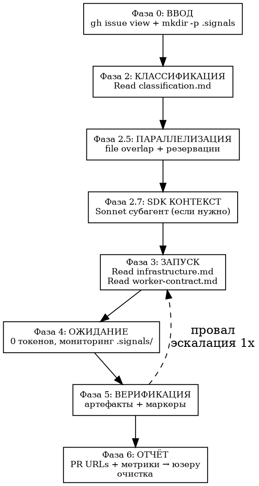

# tmux Swarm Оркестрация v8

<HARD-GATE>
ТЫ = OPUS = ДИСПЕТЧЕР. Юзер дал issues — дальше ВСЁ автоматом до PR URLs.
НЕ читаешь код, НЕ исследуешь файлы, НЕ пишешь код.
ЛЮБАЯ задача → worker. Opus inline = $15, Sonnet worker = $3.
</HARD-GATE>

## Конвейер

| Сложность | Поток | Модель |
|-----------|-------|--------|
| TRIVIAL/CLEAR | SDK исследование? → Sonnet A → PR | `--model sonnet` |
| MEDIUM | Haiku фильтрация → SDK исследование? → Sonnet A → PR | Haiku + `--model sonnet` |
| COMPLEX | SDK? → Opus C → план → **Opus решает** → 1 или N Sonnet B → PR | default + `--model sonnet` |
| VERY COMPLEX (группы) | SDK? → Opus C → план → **Opus решает** → 1 или N Sonnet B → PRs | default + N × `--model sonnet` |
| VERY COMPLEX (solo) | SDK? → Opus D → полный цикл → PR | default (Opus) |

## Поток

**Фаза 2.7: SDK КОНТЕКСТ** — если issue затрагивает SDK/библиотеку:

    Agent(model="sonnet", subagent_type="general-purpose",
      prompt="Context7 + Exa → сигнатуры, паттерны для {library}.
      Резюме (300 слов) верни мне. Полный контекст запиши в .claude/cache/sdk-{lib}-{N}.md")

Переиспользование: одно исследование → N воркеров.

**Двухволновой запуск (COMPLEX+) — Opus решает:**

Opus C анализирует задачи и выдаёт в сигнале `"execution": "sequential"` или `"parallel"`.

    # Orch читает сигнал:
    execution=$(cat .signals/worker-{name}.json | python3 -c "import sys,json; print(json.load(sys.stdin).get('execution','sequential'))")

| Решение Opus | Действие orch |
|--------------|---------------|
| `sequential` | 1 Sonnet B с полным планом → 1 PR |
| `parallel` | Парсить группы из плана → N Sonnet B, каждый со своей группой задач |

При `parallel` orch создаёт **волны**:
1. **Независимые группы** → параллельные Sonnet B в отдельных worktree (`{branch}-part-{N}`)
2. **Зависимые группы** → после завершения тех, от кого зависят
3. **Финальная группа** → последний worker ребейзит все ветки в `{branch}`, создаёт 1 PR

Orch НЕ переопределяет решение Opus. Opus видел код, зависимости и файлы — он решает.

**Фаза 5: ВЕРИФИКАЦИЯ** — двухуровневая:

### Уровень 1: Артефактная проверка (основной)

    # Для кодовых контрактов (A/B/D):
    WT="{PROJECT_ROOT}-wt-{name}"

    # 1. Тесты существуют и новые (созданы после worktree)
    test_count=$(find "$WT" -name "test_*" -newer "$WT/.git/HEAD" 2>/dev/null | wc -l)

    # 2. Lint + types чистые
    cd "$WT" && make check 2>&1 | tail -3

    # 3. PR создан
    gh pr list --head "{branch}" --json url -q '.[0].url'

    # Для контракта C (исследование):
    # 1. План существует и содержательный
    plan_words=$(wc -w < "docs/plans/{DATE}-issue-{N}-plan.md" 2>/dev/null)
    [ "$plan_words" -gt 200 ]  # минимум 200 слов

| Контракт | Артефакты |
|----------|-----------|
| A/B/D | Новые тесты + `make check` чисто + PR создан |
| C | План >200 слов + содержит секции: файлы, подход, задачи |

### Уровень 2: Маркеры скиллов (дополнительный)

    grep '\[SKILL:' logs/worker-{name}.log

| Контракт | Мин. маркеры |
|----------|--------------|
| A | tdd, review, verify (3) |
| B | executing-plans, tdd, review, verify (4) |
| C | writing-plans (1) |
| D | все 5 |

**Артефакты = решение.** Маркеры = быстрая проверка. Артефакты есть, маркеров нет → PASS с WARNING. Артефактов нет → FAIL независимо от маркеров.

### Решение при провале

    Артефакты OK + маркеры OK → PASS
    Артефакты OK + маркеры MISSING → PASS + WARNING в отчёте
    Артефакты FAIL + маркеры OK → FAIL (маркеры ≠ качество)
    Артефакты FAIL + маркеры MISSING → FAIL → эскалация

## Эскалация

    CLEAR провалился   → MEDIUM  (orch добавляет {project_scope} в промт → перезапуск)
    MEDIUM провалился  → COMPLEX (Opus C → план → Sonnet B)
    COMPLEX провалился → D       (Opus solo — полный цикл)
    D провалился       → gh issue comment "needs-human" → пропуск

## Контекст-бюджет

≤5K токенов на issue. Orch читает: `gh issue view`, `git diff --stat`, `.signals/*.json` (<1K).

## Фаза 6: Финальный отчёт

После завершения всех воркеров orch генерирует:

    ## Отчёт сессии

    | Issue | Уровень | Контракт | Worker | Время | ~Стоимость | PR | Статус |
    |-------|---------|----------|--------|-------|-----------|-----|--------|
    | #{N}  | CLEAR   | A        | W-{name} | {m}m{s}s | ~$3 | #{pr} | done |
    | #{N}  | COMPLEX | C→B      | W-{name} | {m}m | ~$8 | #{pr} | done |
    | #{N}  | MEDIUM  | A        | W-{name} | — | ~$3 | — | timeout→escalate |

    **Итого:** {X} issues, {Y} PRs, {Z} эскалаций, ~${total}, {wall_time} wall-time

    **PR URLs:**
    - #{pr1}: {title1}
    - #{pr2}: {title2}

Стоимость: оценка (Sonnet A ≈ $3, Opus C ≈ $5, C→B ≈ $8, C→N×B ≈ $3+N×$3, Opus D ≈ $15). Время: из `orch-log.jsonl`.

## Вспомогательные файлы

- **classification.md** — блок-схема классификации + маркеры + file overlap + sizing
- **worker-contract.md** — 4 контракта + общий финал + sandbox + резервации
- **infrastructure.md** — tmux, worktree, сигналы, таймауты, orch-log, VPS
- **red-flags.md** — чеклист + рационализации
