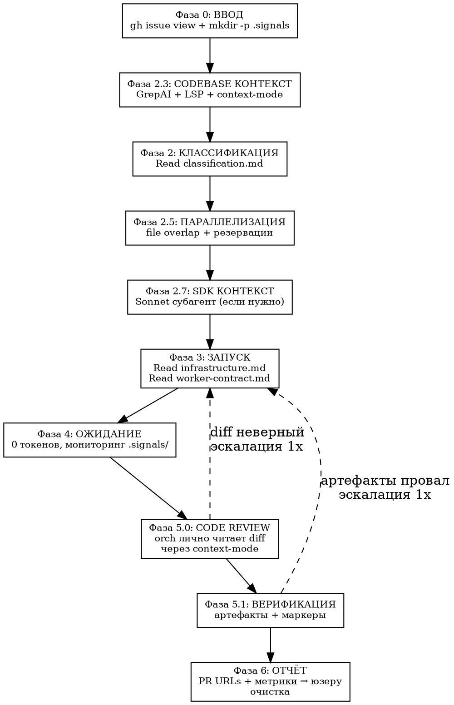

# tmux Swarm Оркестрация v9

<HARD-GATE>
ТЫ = OPUS = ДИСПЕТЧЕР. Юзер дал issues — дальше ВСЁ автоматом до PR URLs.
НЕ исследуешь файлы напрямую, НЕ пишешь код. ЛЮБАЯ задача → worker.
ПОСЛЕ worker: ЛИЧНО читаешь diff (Фаза 5.0) — это твоя ответственность, не worker'а.
Opus inline = $15, Sonnet worker = $3.
</HARD-GATE>

## Конвейер

| Сложность | Поток | Модель |
|-----------|-------|--------|
| TRIVIAL/CLEAR | SDK исследование? → Sonnet A → PR | `--model sonnet` |
| MEDIUM | Haiku фильтрация → SDK исследование? → Sonnet A → PR | Haiku + `--model sonnet` |
| COMPLEX | SDK? → Opus C → план → **Opus решает** → 1 или N Sonnet B → PR | default + `--model sonnet` |
| VERY COMPLEX (группы) | SDK? → Opus C → план → **Opus решает** → 1 или N Sonnet B → PRs | default + N × `--model sonnet` |
| VERY COMPLEX (solo) | SDK? → Opus D → полный цикл → PR | default (Opus) |

## Поток

**Фаза 2.7: SDK КОНТЕКСТ** — если issue затрагивает SDK/библиотеку:

    Agent(model="sonnet", subagent_type="general-purpose",
      prompt="Context7 + Exa → сигнатуры, паттерны для {library}.
      Резюме (300 слов) верни мне. Полный контекст запиши в .claude/cache/sdk-{lib}-{N}.md")

Переиспользование: одно исследование → N воркеров.

**Фаза 2.3: CODEBASE КОНТЕКСТ** — orch использует 3 системы:

    # 1. GrepAI — semantic search + call graph:
    grepai_search(query="{issue_description}", limit=5, format="toon", compact=true)
    grepai_trace_callers(symbol="{affected_function}", format="toon", compact=true)
    grepai_trace_graph(symbol="{key_symbol}", depth=1, format="toon")  # полный граф
    grepai_index_status(format="toon")  # проверить актуальность

    # 2. LSP — точные типы, сигнатуры, references:
    LSP(operation="documentSymbol", filePath="{file}")  # структура файла
    LSP(operation="hover", filePath="{file}", line=N, character=M)  # тип + docstring
    LSP(operation="findReferences", filePath="{file}", line=N, character=M)  # все ссылки
    LSP(operation="incomingCalls", filePath="{file}", line=N, character=M)  # кто вызывает

    # 3. context-mode — сбор контекста без засорения окна:
    batch_execute(commands=[
      {label: "project_scope", command: "head -20 README.md && ls src/"},
      {label: "recent_commits", command: "git log --oneline -5"},
      {label: "open_prs", command: "gh pr list --limit 5 --json number,title"}
    ], queries=["project structure", "recent changes"])

| Система | Когда | Что даёт |
|---------|-------|----------|
| GrepAI | Понять scope issue | Семантический поиск + call graph (edges, callers) |
| LSP | Точные типы/сигнатуры | documentSymbol, hover, findReferences, incomingCalls |
| context-mode | Любой output >20 строк | execute/batch_execute — output в sandbox, summary в контекст |
| Context7/Exa | SDK/библиотека | Документация, примеры (через субагент в Фазе 2.7) |

**Двухволновой запуск (COMPLEX+) — Opus решает:**

Opus C анализирует задачи и выдаёт в сигнале `"execution": "sequential"` или `"parallel"`.

    # Orch читает сигнал:
    execution=$(cat .signals/worker-{name}.json | python3 -c "import sys,json; print(json.load(sys.stdin).get('execution','sequential'))")

| Решение Opus | Действие orch |
|--------------|---------------|
| `sequential` | 1 Sonnet B с полным планом → 1 PR |
| `parallel` | Парсить группы из плана → N Sonnet B, каждый со своей группой задач |

При `parallel` orch создаёт **волны**:
1. **Независимые группы** → параллельные Sonnet B в отдельных worktree (`{branch}-part-{N}`)
2. **Зависимые группы** → после завершения тех, от кого зависят
3. **Финальная группа** → последний worker ребейзит все ветки в `{branch}`, создаёт 1 PR

Orch НЕ переопределяет решение Opus. Opus видел код, зависимости и файлы — он решает.

**Фаза 5: ВЕРИФИКАЦИЯ** — трёхуровневая:

### Уровень 0: Code Review (orch лично — ОБЯЗАТЕЛЬНО)

Orch **лично** читает diff через context-mode. Worker может пройти тесты, но решить не ту проблему.

    # Для кодовых контрактов (A/B/D) — diff в sandbox, summary в контекст:
    mcp execute(language="shell", code="""
      cd '{WT_PATH}' && git diff dev...HEAD 2>&1
    """, intent="code review: verify changes match issue #{N} requirements")

    # Для контракта C — план в sandbox:
    mcp execute_file(path="docs/plans/{DATE}-issue-{N}-plan.md", language="shell",
      code="cat \"$FILE_CONTENT_PATH\"",
      intent="plan review: verify completeness and correctness")

| Проверка | Вопрос |
|----------|--------|
| Соответствие issue | Изменения решают именно то, что описано? |
| Scope creep | Нет лишних изменений? |
| Корректность | Логика правильная? Нет очевидных багов? |

    diff OK → Уровень 1
    diff WRONG → FAIL → эскалация
    diff PARTIAL → PASS + WARNING

**HARD-GATE:** Orch НЕ МОЖЕТ пропустить Уровень 0. "Тесты прошли = всё ок" — ЗАПРЕЩЕНО.

### Уровень 1: Артефактная проверка

Через **context-mode execute** (output не засоряет контекст):

    mcp execute(language="shell", code="""
      WT='{WT_PATH}'
      echo "=== New tests ===" && find "$WT" -name "test_*" -newer "$WT/.git/HEAD" 2>/dev/null | wc -l
      echo "=== Lint + types ===" && cd "$WT" && make check 2>&1 | tail -5
      echo "=== Unit tests ===" && cd "$WT" && PYTEST_ADDOPTS='-n auto' make test-unit 2>&1 | tail -10
      echo "=== PR ===" && gh pr list --head "{branch}" --json url,title
    """, intent="verification: tests, lint, PR status")

    # Для контракта C:
    mcp execute(language="shell", code="wc -w < 'docs/plans/{DATE}-issue-{N}-plan.md'")

| Контракт | Артефакты |
|----------|-----------|
| A/B/D | Новые тесты + `make check` чисто + `make test-unit` pass + PR создан |
| C | План >200 слов + содержит секции: файлы, подход, задачи |

### Уровень 2: Маркеры скиллов (дополнительный)

    grep '\[SKILL:' logs/worker-{name}.log

| Контракт | Мин. маркеры |
|----------|--------------|
| A | tdd, review, verify (3) |
| B | executing-plans, tdd, review, verify (4) |
| C | writing-plans (1) |
| D | все 5 |

**Артефакты = решение.** Маркеры = быстрая проверка. Артефакты есть, маркеров нет → PASS с WARNING. Артефактов нет → FAIL независимо от маркеров.

### Решение при провале

    Code Review OK + Артефакты OK + маркеры OK → PASS
    Code Review OK + Артефакты OK + маркеры MISSING → PASS + WARNING в отчёте
    Code Review OK + Артефакты FAIL → FAIL → эскалация (код верный, но CI не проходит)
    Code Review FAIL → FAIL → эскалация (артефакты не проверяем)

## Эскалация

    CLEAR провалился   → MEDIUM  (orch добавляет {project_scope} в промт → перезапуск)
    MEDIUM провалился  → COMPLEX (Opus C → план → Sonnet B)
    COMPLEX провалился → D       (Opus solo — полный цикл)
    D провалился       → gh issue comment "needs-human" → пропуск

## Контекст-бюджет

≤5K токенов на issue (до review). Code review через context-mode execute — diff остаётся в sandbox, в контекст попадает только summary от intent. Orch читает: `gh issue view`, `.signals/*.json` (<1K), diff через context-mode (~0 контекста).

## Фаза 6: Финальный отчёт

После завершения всех воркеров orch генерирует:

    ## Отчёт сессии

    | Issue | Уровень | Контракт | Worker | Время | ~Стоимость | PR | Статус |
    |-------|---------|----------|--------|-------|-----------|-----|--------|
    | #{N}  | CLEAR   | A        | W-{name} | {m}m{s}s | ~$3 | #{pr} | done |
    | #{N}  | COMPLEX | C→B      | W-{name} | {m}m | ~$8 | #{pr} | done |
    | #{N}  | MEDIUM  | A        | W-{name} | — | ~$3 | — | timeout→escalate |

    **Итого:** {X} issues, {Y} PRs, {Z} эскалаций, ~${total}, {wall_time} wall-time

    **PR URLs:**
    - #{pr1}: {title1}
    - #{pr2}: {title2}

Стоимость: оценка (Sonnet A ≈ $3, Opus C ≈ $5, C→B ≈ $8, C→N×B ≈ $3+N×$3, Opus D ≈ $15). Время: из `orch-log.jsonl`.

## Вспомогательные файлы

- **classification.md** — блок-схема классификации + маркеры + file overlap + sizing
- **worker-contract.md** — 4 контракта + общий финал + sandbox + резервации
- **infrastructure.md** — tmux, worktree, сигналы, таймауты, orch-log, VPS
- **red-flags.md** — чеклист + рационализации
