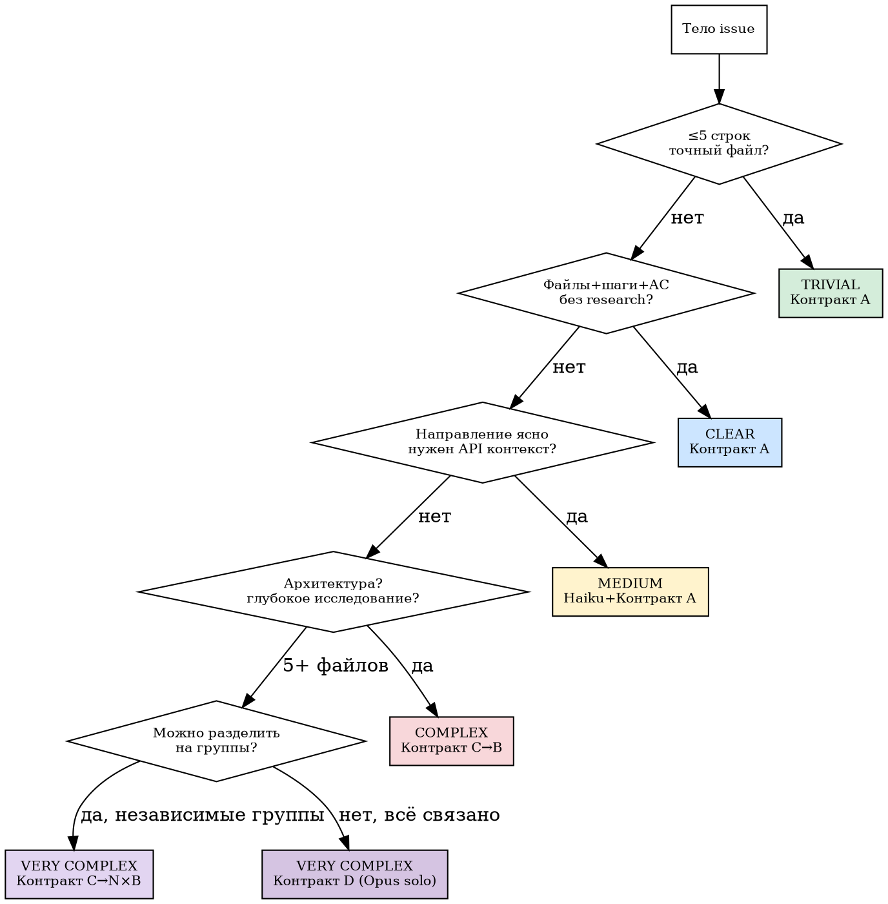

# Классификация

## Маркеры

| Уровень | Маркеры в issue | Контракт | Скиллы |
|---------|----------------|----------|--------|
| **TRIVIAL** | Точный файл/строка, ≤5 строк | A (`--model sonnet`) | tdd, review, verify |
| **CLEAR** | Файлы + задачи + критерии приёмки | A (`--model sonnet`) | tdd, review, verify |
| **MEDIUM** | ЧТО есть, КАК — нужен API контекст | A (`--model sonnet`) | tdd, review, verify |
| **COMPLEX** | "migrate", "refactor", несколько подходов | C→B (default + `--model sonnet`) | C: writing-plans · B: +executing-plans |
| **VERY COMPLEX** | 5+ файлов, мастер-план, независимые группы | C→N×B | то же |
| **VERY COMPLEX (solo)** | 5+ файлов, всё связано, Sonnet не потянет | D (Opus solo) | все 5 скиллов |

## Sizing guide

Из best practices 2026: **3-5 воркеров**, **5-6 задач на воркер**.

| Issues | Рекомендация |
|--------|-------------|
| 1-3 | Последовательные воркеры, без параллели |
| 4-8 | 3-4 параллельных воркера |
| 9-15 | 5 воркеров, фазы (batch по 5) |
| >15 | 2 фазы: Haiku фильтрация (всегда при 5+) → batch по 5 |

## Обработка Haiku-фильтрации

| Статус Haiku | Действие orch |
|--------------|---------------|
| DO | → Фаза 2 (классификация сложности) |
| SKIP | Проверить причину. Если "дубликат" — подтвердить номер оригинала. Если "решён" — подтвердить PR. Иначе → DO |
| STALE | Принять (>90 дней — объективный критерий) |
| UNCERTAIN | → DO (консервативно). Orch классифицирует сложность сам |

**Правило:** Haiku может только ПОНИЗИТЬ приоритет (SKIP/STALE), не может определить "вне скоупа". Сомнительные SKIP → DO.

## Контекст проекта для Haiku

Orch собирает `{project_scope}` автоматически (≤500 токенов):

    project_scope=$(cat <<'SCOPE'
    $(head -20 README.md 2>/dev/null || echo "No README")
    ---
    Структура: $(ls src/ 2>/dev/null | head -10)
    Последние коммиты: $(git log --oneline -5)
    Открытые PR: $(gh pr list --limit 5 --json number,title -q '.[] | "#\(.number) \(.title)"' 2>/dev/null)
    SCOPE
    )

## Фаза 2.5: Проверка пересечений (параллельные issues)

**Перед запуском параллельных воркеров** — проверить file overlap.

### Шаг 1: Собрать затронутые файлы

    # Из тела каждого issue (grep путей):
    files_issue_N=$(gh issue view $N --json body -q .body | grep -oP 'src/\S+\.py')

### Шаг 2: Найти пересечения

    # Для каждой пары issues:
    overlap=$(comm -12 <(echo "$files_A" | sort -u) <(echo "$files_B" | sort -u))

### Шаг 3: Решение

| Ситуация | Действие |
|----------|----------|
| Нет пересечений | Параллельный запуск |
| Пересечение 1-2 файла | Контракт интерфейса: кто владеет каким файлом |
| Пересечение >2 файлов | Последовательный запуск (A до B) |

### Файловые резервации

Вдохновлено SwarmTools pattern. Каждый worker получает список `{reserved_files}` в промте.

    ЗАРЕЗЕРВИРОВАННЫЕ ФАЙЛЫ (только ты их редактируешь):
    - src/services/cache.py
    - tests/unit/test_cache.py

Worker НЕ ДОЛЖЕН редактировать файлы вне своей резервации. Пересечение = merge conflict = провал.

## Эскалация

    CLEAR провалился   → MEDIUM  (orch добавляет проектный контекст из {project_scope} в промт → перезапуск)
    MEDIUM провалился  → COMPLEX (Opus C → план → Sonnet B)
    COMPLEX провалился → D       (Opus solo — полный цикл в одном worker)
    D провалился       → gh issue comment "needs-human" → пропуск
