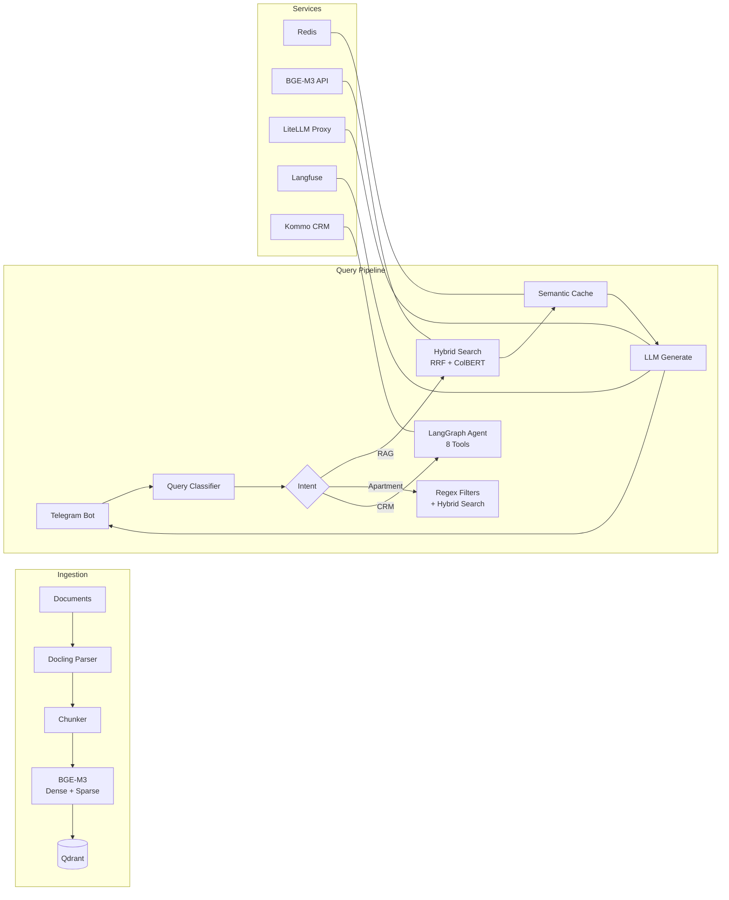

# Contextual RAG Pipeline

[](https://github.com/yastman/rag/actions/workflows/ci.yml)
[](https://www.python.org/downloads/)
[](LICENSE)
[](https://github.com/astral-sh/ruff)

Production-grade RAG system powering a Telegram bot for real estate search. Hybrid retrieval (RRF + ColBERT rerank), local BGE-M3 embeddings, multi-level semantic caching, LangGraph agent with CRM integration, and optional voice assistant via LiveKit.

## Key Features

- **Hybrid Search** — Dense + sparse vectors with RRF fusion and optional ColBERT reranking in Qdrant
- **Agentic RAG** — LangGraph state graph with 8 CRM tools, history search, and apartment search
- **Telegram Bot** — aiogram 3 + aiogram-dialog, inline menus, i18n (ru/uk/en), voice STT
- **Apartment Search** — Regex-first filter extraction (zero LLM cost), LLM fallback for complex queries
- **Semantic Cache** — Multi-tier caching (embeddings + query results) via RedisVL, ~60% cache hit rate
- **Unified Ingestion** — CocoIndex pipeline: Docling parsing → chunking → BGE-M3 embeddings → Qdrant
- **CRM Integration** — Kommo lead scoring, nurturing sequences, funnel analytics
- **Voice Agent** — LiveKit + ElevenLabs TTS + OpenAI STT, SIP trunk support
- **Observability** — Langfuse tracing, Loki logging, Alertmanager alerts

## Architecture



## Tech Stack

| Layer | Technology |
|-------|-----------|
| Language | Python 3.12 |
| LLM | Any model via LiteLLM proxy |
| Embeddings | BGE-M3 (local, self-hosted) |
| Vector DB | Qdrant (dense + sparse + ColBERT) |
| Cache | Redis + RedisVL (semantic cache) |
| Bot Framework | aiogram 3 + aiogram-dialog |
| Pipeline | LangGraph (agent), CocoIndex (ingestion) |
| Voice | LiveKit Agents + ElevenLabs + OpenAI Whisper |
| Observability | Langfuse, Loki, Alertmanager |
| Database | PostgreSQL (lead scoring, checkpoints) |
| Package Manager | uv |
| Deployment | Docker Compose / k3s |

## Quick Start

```bash
# Install dependencies
uv sync
cp .env.example .env   # Configure API keys

# Start infrastructure services
make local-up           # Redis, Qdrant, BGE-M3, Docling, LiteLLM

# Run the bot
make run-bot            # Native execution (no Docker rebuild)
```

### Docker (production-like)

```bash
make docker-bot-up      # Core services + bot
make docker-full-up     # All 23 services
```

### Optional Stacks

```bash
make docker-ml-up       # Langfuse + MLflow + ClickHouse + MinIO
make monitoring-up      # Loki + Promtail + Alertmanager
make docker-ingest-up   # Unified ingestion service
make docker-voice-up    # RAG API + LiveKit + SIP + Voice Agent
```

### Validate

```bash
make check              # Ruff lint + MyPy type checking
make test-unit          # Unit tests (parallel via pytest-xdist)
```

## Project Structure

```
telegram_bot/           # Telegram bot (aiogram + aiogram-dialog)
├── handlers/           # Message & callback handlers
├── services/           # Business logic (search, LLM, cache, CRM)
├── graph/              # LangGraph voice RAG pipeline (11 nodes)
├── agents/             # Sub-agents (history search, HITL)
├── dialogs/            # aiogram-dialog UI (menus, filters, settings)
├── integrations/       # External service clients (Redis, Postgres, Langfuse)
└── locales/            # i18n translations (ru, uk, en)

src/
├── ingestion/          # CocoIndex unified ingestion pipeline
├── retrieval/          # Search engines & evaluation
├── voice/              # LiveKit voice agent
└── api/                # FastAPI RAG API

mini_app/               # Telegram Mini App (React + TypeScript)
k8s/                    # Kubernetes manifests (k3s)
```

## Entry Points

| Service | Command |
|---------|---------|
| Telegram Bot | `uv run python -m telegram_bot.main` |
| RAG API | `uv run uvicorn src.api.main:app --host 0.0.0.0 --port 8080` |
| Ingestion CLI | `uv run python -m src.ingestion.unified.cli --help` |
| Voice Agent | `uv run python -m src.voice.agent` |

## Documentation

| Document | Description |
|----------|-------------|
| [DOCKER.md](DOCKER.md) | Docker Compose profiles, service map, env requirements |
| [Architecture](docs/PROJECT_STACK.md) | System architecture and subsystem map |
| [Pipeline Overview](docs/PIPELINE_OVERVIEW.md) | Ingestion, query, and voice runtime flows |
| [Local Development](docs/LOCAL-DEVELOPMENT.md) | Local setup and validation guide |
| [Qdrant Stack](docs/QDRANT_STACK.md) | Vector collections, schema, operations |
| [Ingestion Runbook](docs/INGESTION.md) | Unified ingestion guide and troubleshooting |
| [Alerting](docs/ALERTING.md) | Loki/Alertmanager setup |

## Environment Variables

Copy `.env.example` and configure:

| Variable | Required | Description |
|----------|----------|-------------|
| `TELEGRAM_BOT_TOKEN` | Yes | Telegram Bot API token |
| `OPENAI_API_KEY` | Yes | OpenAI API key (for LiteLLM) |
| `REDIS_PASSWORD` | Yes | Redis authentication |
| `LANGFUSE_*` | Yes | Langfuse observability keys |
| `KOMMO_*` | No | Kommo CRM integration |
| `LIVEKIT_*` | No | LiveKit voice agent |

## License

This project is licensed under the [MIT License](LICENSE).
