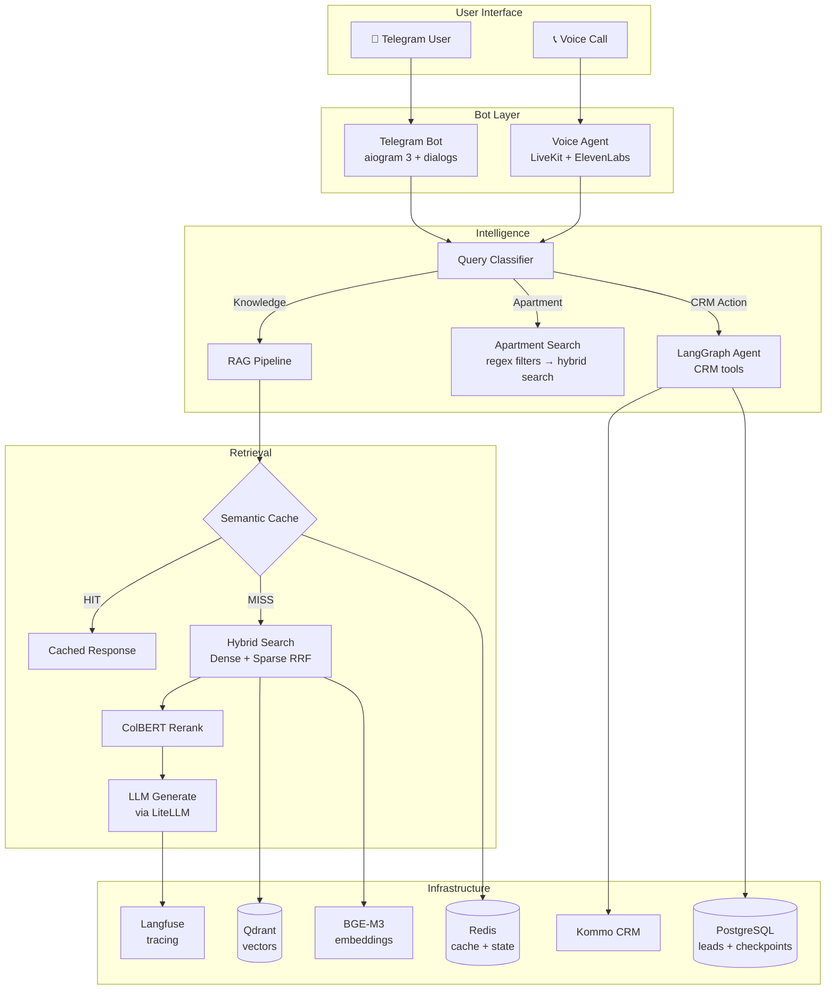

<div align="center">

# AI Real Estate Automation Platform

**Telegram + RAG + apartment search + CRM automation + voice + production-like AI infrastructure**

[](https://github.com/yastman/rag/actions/workflows/ci.yml)
[](https://www.python.org/downloads/)
[](LICENSE)
[](https://github.com/astral-sh/ruff)

</div>

---

## What Is This?

An AI-native real-estate automation platform that lets clients ask questions in
natural language via Telegram, search apartment listings, move qualified leads
into Kommo CRM workflows, and use the same RAG stack from text and voice
channels.

**The problem:** Real estate agencies drown in repetitive client questions across Telegram, phone, and CRM. Agents spend hours answering the same things.

**The solution:** An AI-powered Telegram bot that:
- Answers knowledge-base questions with source citations (RAG)
- Searches apartment listings with natural language — *"2-bedroom in Sofia under €80k"*
- Scores and nurtures leads automatically via CRM integration
- Supports Telegram voice input and a LiveKit-powered voice agent path
- Runs as a Docker Compose based local/VPS stack with observability, ingestion,
  vector search, and local ML services

> The primary runtime is Docker Compose on local/VPS environments. k3s manifests
> exist for core services as an incremental migration path, not full parity with
> the Compose stack.

---

## For Reviewers

If you have limited time, read the repository in this order:

1. [Portfolio case study](docs/portfolio/resume-case-study.md) — concise
   project narrative, feature cards, trade-offs, and honest limitations.
2. [Project guide](docs/review/PROJECT_GUIDE.md) — folder map and subsystem ownership.
3. `telegram_bot/graph/` — LangGraph orchestration and routing.
4. `telegram_bot/agents/` and `telegram_bot/services/` — CRM tools, apartment
   search, cache, lead scoring, handoff, and business logic.
5. `src/ingestion/unified/` — deterministic document ingestion and Qdrant writes.
6. `compose.yml`, `compose.dev.yml`, `compose.vps.yml`, and [DOCKER.md](DOCKER.md)
   — runtime architecture.

Safe review notes:

- Do not run production deploy scripts or real CRM write paths without a
  dedicated review environment.
- Start with [ACCESS_FOR_REVIEWERS.md](docs/review/ACCESS_FOR_REVIEWERS.md) before
  executing commands.
- GitHub repository presentation checklist lives in
  [GITHUB_REPO_SETUP.md](docs/review/GITHUB_REPO_SETUP.md).

---

## How It Works



---

## Key Features

### Hybrid Search with ColBERT Reranking
Dense + sparse vectors fused via RRF, with optional ColBERT multi-vector reranking — all server-side in Qdrant. No external reranking API needed.

### Cheap-First Apartment Search
Natural language queries like *"3 rooms in Burgas under 100k"* use
deterministic regex parsing for common filters before falling back to LLM
extraction for complex queries. Results come from hybrid vector search over
property listings.

### Agentic RAG with CRM Tools
LangGraph state graph with CRM tools for leads, contacts, tasks, notes, and
history. Write operations use HITL confirmation via `interrupt()`.

### Multi-Level Semantic Cache
Tiered caching via RedisVL: semantic answer cache, embedding caches, search
result cache, and rerank result cache. Distance thresholds are tuned per query
type.

### Voice Assistant
LiveKit agent path with ElevenLabs STT/TTS and shared RAG API integration. SIP
support is represented as outbound trunk provisioning; inbound call routing
should be described only after a dedicated production review.

### Observability
Langfuse traces and quality/operational scores cover RAG, latency, cache,
rerank, voice, security, CRM, history, nurturing, and source attribution when
observability is configured. Loki + Alertmanager are available for local/dev
monitoring.

### Partial i18n
Three language bundles (ru/uk/en) via Fluent `.ftl` files. Some operational and
dialog strings are still hardcoded and should be treated as an ongoing migration.

### Unified Ingestion
CocoIndex pipeline: Docling parses PDFs/DOCX → semantic chunking → BGE-M3 dense+sparse embeddings → Qdrant. Incremental updates, resumable.

---

## Tech Stack

| Layer | Technology | Why |
|-------|-----------|-----|
| **LLM** | Any model via LiteLLM | Provider-agnostic, easy switching |
| **Embeddings** | BGE-M3 (self-hosted) | Dense + sparse + ColBERT in one model, no API costs |
| **Vector DB** | Qdrant | Native RRF fusion, ColBERT support, server-side reranking |
| **Cache** | Redis + RedisVL | Semantic similarity cache, sub-ms latency |
| **Bot** | aiogram 3 + aiogram-dialog | Async, dialog state machines, inline keyboards |
| **Pipeline** | LangGraph | State graph with tools, checkpointing, HITL |
| **Ingestion** | CocoIndex + Docling | Deterministic, resumable, multi-format parsing |
| **Voice** | LiveKit Agents | WebRTC + SIP, plugin ecosystem |
| **Observability** | Langfuse + Loki | LLM tracing + local/dev log aggregation + alerting |
| **Database** | PostgreSQL | Lead scoring, graph checkpoints, user data |
| **Deployment** | Docker Compose / partial k3s | Local/VPS Compose primary, k3s core-service manifests |

---

## Quick Start

### Prerequisites

- Python 3.11+ (3.12 recommended), [uv](https://docs.astral.sh/uv/), Docker

### 1. Install & Configure

```bash
git clone https://github.com/yastman/rag.git && cd rag
uv sync
cp .env.example .env   # Fill in API keys (see below)
```

For local development, the canonical environment file is `.env` in the repo root. `.env.local` is not loaded automatically by the bot, `make`, or `uv run` entry points.

### 2. Start Services

```bash
make local-up    # Redis, Qdrant, BGE-M3, Docling, LiteLLM
make test-bot-health   # Local helper: Redis, Qdrant, LiteLLM + optional Postgres note
make run-bot           # Run bot natively (fast iteration, no Docker rebuild)
```

For native bot runs, `REDIS_URL` is optional in local development: when it is unset, the bot derives `redis://:REDIS_PASSWORD@localhost:6379` from `REDIS_PASSWORD` so it matches the password-protected Redis started by `make local-up`.

`make test-bot-health` validates the published local prerequisites used by native bot runs. The authoritative startup preflight still runs in [`telegram_bot/preflight.py`](telegram_bot/preflight.py) when the bot starts. That runtime preflight still owns the repo-local BGE-M3 contract because BGE-M3 is a service this repository depends on directly, not a generic upstream SDK health path.

### 3. Or Run Everything in Docker

```bash
make docker-bot-up     # Core + bot (production-like)
make docker-full-up    # All 23 services
```

<details>
<summary><strong>Optional Stacks</strong></summary>

| Stack | Command | Services |
|-------|---------|----------|
| ML/Observability | `make docker-ml-up` | Langfuse, ClickHouse, MinIO |
| Monitoring | `make monitoring-up` | Loki, Promtail, Alertmanager |
| Ingestion | `make docker-ingest-up` | Unified ingestion service |
| Voice | `make docker-voice-up` | RAG API, LiveKit, SIP, Voice Agent |

</details>

### Environment Variables

| Variable | Required | Description |
|----------|----------|-------------|
| `TELEGRAM_BOT_TOKEN` | Yes | Telegram Bot API token |
| `OPENAI_API_KEY` | Yes | OpenAI API key (routed through LiteLLM) |
| `REDIS_PASSWORD` | Yes | Redis authentication |
| `LANGFUSE_*` | Yes | Langfuse observability (public key, secret key, host) |

<details>
<summary><strong>Optional variables</strong></summary>

| Variable | Description |
|----------|-------------|
| `KOMMO_*` | Kommo CRM integration (client ID, secret, tokens) |
| `LIVEKIT_*` | LiveKit voice agent (URL, API key, secret) |
| `CEREBRAS_API_KEY` | Alternative LLM provider |
| `TTFT_DRIFT_WARN_MS` | TTFT monitoring threshold (default: 500ms) |

</details>

---

## Project Structure

```
telegram_bot/              # Telegram bot (aiogram 3 + aiogram-dialog)
├── handlers/              #   Message & callback handlers
├── services/              #   Business logic (search, LLM, cache, apartments, CRM)
├── graph/                 #   LangGraph voice RAG pipeline (11 nodes)
├── agents/                #   Sub-agents (history search, HITL)
├── dialogs/               #   Dialog UI (menus, filters, settings)
├── integrations/          #   External clients (Redis, Postgres, Langfuse)
├── middlewares/           #   Throttling, i18n, error handling
└── locales/{ru,uk,en}/    #   Fluent .ftl translations

src/
├── ingestion/unified/     #   CocoIndex ingestion pipeline
├── retrieval/             #   Search engines & evaluation
├── voice/                 #   LiveKit voice agent
└── api/                   #   FastAPI RAG API

mini_app/                  # Telegram Mini App (React + TypeScript)
k8s/                       # Kubernetes manifests (k3s deployment)
src/evaluation/            # RAG evaluation (RAGAS, A/B testing)
```

## Entry Points

| Service | Command |
|---------|---------|
| Telegram Bot | `uv run python -m telegram_bot.main` |
| RAG API | `uv run uvicorn src.api.main:app --host 0.0.0.0 --port 8080` |
| Ingestion CLI | `uv run python -m src.ingestion.unified.cli --help` |
| Voice Agent | `uv run python -m src.voice.agent` |

## Validation

```bash
make check       # Ruff lint + MyPy strict type checking
make test-unit   # Unit tests (parallel via pytest-xdist)
make test-full   # Full suite: parallel-safe tiers first, live/stateful tiers after
```

Local verification is the release authority for this repo. Run the full test suite from the working tree before merging to `dev` (the active integration branch) or deploying to VPS.

CI is intentionally lightweight. It should stay fast and is used as a guardrail for lint, format, type-check, security, and other short checks, not as the authoritative full-suite signal.

---

## Documentation

| Document | Description |
|----------|-------------|
| [Reviewer Access Guide](docs/review/ACCESS_FOR_REVIEWERS.md) | Safe review path, commands, and boundaries for people with repo access |
| [Project Guide](docs/review/PROJECT_GUIDE.md) | Folder map, subsystem ownership, and where the important code lives |
| [Portfolio Case Study](docs/portfolio/resume-case-study.md) | Resume-ready project narrative and feature highlights |
| [GitHub Repo Setup](docs/review/GITHUB_REPO_SETUP.md) | Repository metadata, topics, branch protection, release, and hygiene checklist |
| [Docs Index](docs/README.md) | Concise map of all major documentation areas |
| [DOCKER.md](DOCKER.md) | Docker Compose profiles, service map, env requirements |
| [Architecture](docs/PROJECT_STACK.md) | System architecture and subsystem map |
| [Pipeline Overview](docs/PIPELINE_OVERVIEW.md) | Ingestion, query, and voice runtime flows |
| [Local Development](docs/LOCAL-DEVELOPMENT.md) | Local setup and validation guide |
| [Qdrant Stack](docs/QDRANT_STACK.md) | Vector collections, schema, operations |
| [Ingestion Runbook](docs/INGESTION.md) | Unified ingestion guide and troubleshooting |
| [Google Drive Sync Runbook](docs/GDRIVE_INGESTION.md) | Google Drive -> local mirror -> unified ingestion contract |
| [VPS Recovery Runbook](docs/runbooks/vps-gdrive-ingestion-recovery.md) | Recover empty sync mount / empty collection incidents on VPS |
| [SDK Migration Audit](docs/SDK_MIGRATION_AUDIT_2026-03-13.md) | Canonical SDK keeper stack and bounded follow-up work |
| [SDK Migration Roadmap](docs/SDK_MIGRATION_ROADMAP_2026-03-13.md) | Post-audit execution order and guardrails |
| [Alerting](docs/ALERTING.md) | Loki/Alertmanager setup |

---

## License

This project is licensed under the [MIT License](LICENSE).
