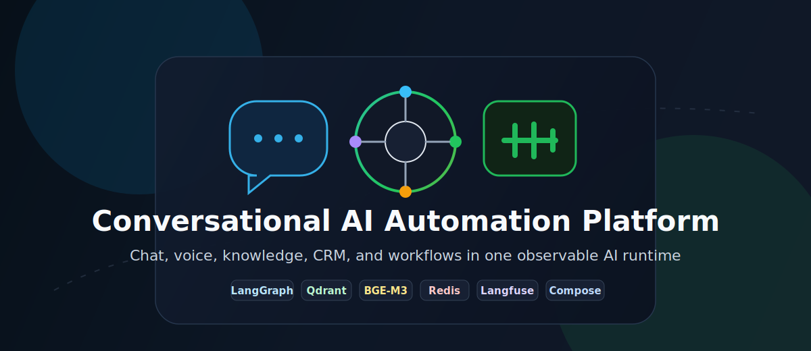
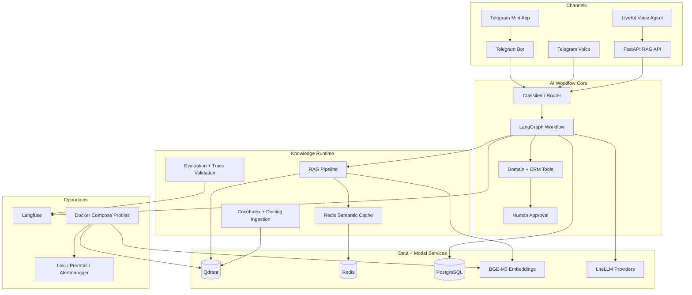

<div align="center">

# Conversational AI Automation Platform

**Build domain-specific AI assistants that connect chat, voice, knowledge search, CRM workflows, and business automation in one observable runtime.**

[](https://github.com/yastman/rag/actions/workflows/ci.yml)
[](https://www.python.org/downloads/)
[](DOCKER.md)
[](LICENSE)
[](https://github.com/astral-sh/ruff)

<p align="center">
  
</p>

</div>

---

This repository is a production-oriented foundation for AI assistants that answer from private knowledge, search domain catalogs, qualify leads, update CRM/workflow systems with human approval, and operate across Telegram, voice, API, and Mini App surfaces.

The current codebase includes one working sales/catalog automation domain, but the platform is intentionally modular: replace the domain prompts, search tools, and business integrations while keeping the orchestration, retrieval, ingestion, caching, observability, and runtime contracts.

## Why It Exists

Most business bots stop at scripted replies. Most AI demos stop at a prompt. This project demonstrates the full operational loop: users ask in natural language, the system retrieves grounded knowledge, routes workflow intent, calls business tools, asks for human approval when needed, and leaves traces operators can inspect.

| Business need | Platform capability |
|---|---|
| Reduce repeated manual answers | RAG over private documents with citation-aware generation |
| Convert conversations into action | CRM/workflow tools, lead scoring, tasks, notes, and manager handoff |
| Let users search naturally | Domain-specific extraction plus hybrid vector/search pipelines |
| Support more than text chat | Telegram bot, Telegram voice input, LiveKit voice-agent path, API, and Mini App surface |
| Keep AI behavior inspectable | LangGraph state flow, Langfuse traces, structured logs, quality scores, and runbooks |
| Control latency and cost | Redis-backed semantic, embedding, search, rerank, and extraction caches |

## Adapt It To Your Domain

The reusable part is the platform: channels, graph orchestration, retrieval, ingestion, cache, observability, and Docker runtime. The replaceable part is the domain layer: prompts, tools, search schema, CRM/workflow integration, and UI copy.

| Domain | Replaceable module examples |
|---|---|
| Sales and CRM | Lead qualification, deal lookup, tasks, notes, manager handoff |
| Customer support | Policy answers, ticket lookup, escalation workflows |
| E-commerce | Product catalog search, recommendations, order status tools |
| Education | Course search, student FAQ, onboarding flows |
| Internal operations | Knowledge-base assistant, document search, approval workflows |

## Platform Capabilities

| Capability | What it means in this repo | Evidence |
|---|---|---|
| Stateful AI orchestration | LangGraph routes classification, guard, cache, retrieval, grading, reranking, generation, response, and optional summarization | [`telegram_bot/graph/`](telegram_bot/graph/) |
| Typed workflow state | One state contract tracks query, routing, retrieval, filters, cache, scoring, policy, latency, and response metadata | [`telegram_bot/graph/state.py`](telegram_bot/graph/state.py) |
| Cross-channel assistant runtime | Telegram text, Telegram voice, LiveKit voice agent, FastAPI RAG API, and Mini App handoff reuse the same core ideas | [`src/voice/`](src/voice/), [`src/api/`](src/api/), [`mini_app/`](mini_app/) |
| Self-hosted retrieval | BGE-M3 + Qdrant support dense, sparse, and ColBERT-style retrieval paths | [`docs/QDRANT_STACK.md`](docs/QDRANT_STACK.md) |
| Deterministic ingestion | CocoIndex and Docling parse, chunk, embed, upsert/delete, retry, and track DLQ state | [`docs/INGESTION.md`](docs/INGESTION.md) |
| Business tool actions | CRM/domain tools can create workflow actions with HITL confirmation for sensitive writes | [`telegram_bot/agents/`](telegram_bot/agents/) |
| Cost and latency controls | Redis caches semantic answers, embeddings, search results, rerank results, and extraction outputs | [`telegram_bot/integrations/cache.py`](telegram_bot/integrations/cache.py) |
| Observability | Langfuse traces/scores, trace validation, Loki/Promtail/Alertmanager local monitoring, and runbooks | [`docs/PIPELINE_OVERVIEW.md`](docs/PIPELINE_OVERVIEW.md) |
| Compose-first runtime | Docker Compose profiles cover core services, bot, ingestion, voice, ML observability, monitoring, and full stack | [`DOCKER.md`](DOCKER.md) |

## Why This Is More Than A Bot

A simple chatbot receives a message and calls an LLM. This repository treats the assistant as an operating system for business workflows:

- The graph can decide whether to answer, retrieve, rewrite, rerank, call tools, ask for approval, or hand off.
- Retrieval is not a single vector query; it includes dense/sparse search, optional reranking, cache policy, grading, and fallbacks.
- Domain behavior lives behind tools and prompts, so catalog/search/CRM logic can be replaced without rewriting the runtime.
- Runtime behavior is observable through traces, logs, health checks, validation commands, and documented runbooks.

## Architecture Snapshot



## Review This In 5 Minutes

If you are evaluating the project for collaboration, hiring, or client work, read it in this order:

1. [`docs/portfolio/resume-case-study.md`](docs/portfolio/resume-case-study.md) - concise narrative, feature cards, trade-offs, and limitations.
2. [`docs/review/PROJECT_GUIDE.md`](docs/review/PROJECT_GUIDE.md) - folder map and high-signal files.
3. [`telegram_bot/graph/`](telegram_bot/graph/) - LangGraph orchestration and state flow.
4. [`telegram_bot/agents/`](telegram_bot/agents/) and [`telegram_bot/services/`](telegram_bot/services/) - tools, business logic, cache, search, CRM, scoring, handoff.
5. [`src/ingestion/unified/`](src/ingestion/unified/) - deterministic ingestion and Qdrant writes.
6. [`compose.yml`](compose.yml), [`compose.dev.yml`](compose.dev.yml), and [`DOCKER.md`](DOCKER.md) - runtime architecture.

Safe review notes:

- Do not run production deploy scripts, use real credentials, or trigger real CRM write paths without a dedicated review environment.
- Start with [`docs/review/ACCESS_FOR_REVIEWERS.md`](docs/review/ACCESS_FOR_REVIEWERS.md) before executing commands.
- Repository presentation checklist lives in [`docs/review/GITHUB_REPO_SETUP.md`](docs/review/GITHUB_REPO_SETUP.md).

## Proof Of Engineering

- Workflow architecture: LangGraph graph, typed state, conditional edges, tool boundaries, and HITL confirmation.
- Retrieval infrastructure: BGE-M3, Qdrant dense/sparse/ColBERT vectors, aliases, strict mode, and reranking path.
- Ingestion reliability: stable file identity, Docling parsing, chunking, Qdrant upsert/delete, PostgreSQL state, retries, and DLQ.
- Runtime discipline: Compose profiles, pinned images, health checks, preflight checks, remote Docker helpers, and operational docs.
- Cost controls: Redis semantic answer cache, embedding cache, search cache, rerank cache, and extraction cache.
- Observability: Langfuse traces/scores, prompt management, trace validation, local monitoring, and runbooks.
- Quality gates: Ruff, MyPy, pytest tiers, CI guardrails, and documented local validation.

## Current Domain Module

The repository currently includes a working sales/catalog automation module: catalog-style search, lead workflows, manager handoff, scoring, and Kommo CRM integration. Treat that as the first domain implementation, not the boundary of the platform.

To adapt the system, replace the domain prompts, extraction logic, catalog/search tools, CRM/tool integrations, and UI copy while keeping the common runtime: channels, LangGraph orchestration, RAG, ingestion, cache, observability, and Docker profiles.

## Quick Start

Choose the path that matches your goal:

| Goal | Start here |
|---|---|
| Review safely before running commands | [`docs/review/ACCESS_FOR_REVIEWERS.md`](docs/review/ACCESS_FOR_REVIEWERS.md) |
| Run core local services | `make local-up` |
| Run the bot natively for fast iteration | `make test-bot-health` then `make run-bot` |
| Run the Compose bot stack | `make docker-bot-up` |
| Run the full Compose stack | `make docker-full-up` |
| Understand runtime profiles and ports | [`DOCKER.md`](DOCKER.md) |

### Prerequisites

- Python 3.11+; Python 3.12 is recommended for local development.
- [`uv`](https://docs.astral.sh/uv/)
- Docker with Compose support.
- `.env` copied from `.env.example` and filled with local/test credentials.

For full setup, validation ladder, environment behavior, and troubleshooting, use [`docs/LOCAL-DEVELOPMENT.md`](docs/LOCAL-DEVELOPMENT.md).

### Runtime Profiles

Docker Compose is the primary local/VPS runtime. Profiles split the system by operational surface:

| Profile | Services |
|---|---|
| default/core | PostgreSQL, Redis, Qdrant, BGE-M3, Docling, user-base, Mini App API/frontend |
| `bot` | LiteLLM and Telegram bot |
| `ingest` | unified ingestion service |
| `ml` | Langfuse, ClickHouse, MinIO, Redis Langfuse, worker |
| `obs` | Loki, Promtail, Alertmanager |
| `voice` | RAG API, LiveKit, SIP, voice agent |
| `full` | all profile-gated services |

The repo also includes SSH-based remote Docker helpers for running Compose on a MacBook/Colima host. Keep this as a development convenience, not a required public setup path; see [`docs/LOCAL-DEVELOPMENT.md`](docs/LOCAL-DEVELOPMENT.md) and [`DOCKER.md`](DOCKER.md) for details.

## Project Map

Use [`docs/review/PROJECT_GUIDE.md`](docs/review/PROJECT_GUIDE.md) for the maintained folder map and high-signal files.

High-level entry points:

| Area | Path |
|---|---|
| Telegram assistant runtime | [`telegram_bot/`](telegram_bot/) |
| LangGraph workflow | [`telegram_bot/graph/`](telegram_bot/graph/) |
| Business/domain tools | [`telegram_bot/agents/`](telegram_bot/agents/) and [`telegram_bot/services/`](telegram_bot/services/) |
| RAG API and voice | [`src/api/`](src/api/) and [`src/voice/`](src/voice/) |
| Unified ingestion | [`src/ingestion/unified/`](src/ingestion/unified/) |
| Mini App | [`mini_app/`](mini_app/) |
| Runtime | [`compose.yml`](compose.yml), [`compose.dev.yml`](compose.dev.yml), [`DOCKER.md`](DOCKER.md) |

## Validation

```bash
make check       # Ruff lint + MyPy strict type checking
make test-unit   # Unit tests (parallel via pytest-xdist)
make test-full   # Full suite: parallel-safe tiers first, live/stateful tiers after
```

Local verification is the release authority for this repo. Run focused checks for the touched area before merging to `dev` or deploying. CI is intentionally lightweight: it is a guardrail for fast checks, not the authoritative full-suite signal.

## Honest Scope

- Docker Compose is the primary local/VPS runtime path.
- k3s manifests exist for core services but are not full parity with Compose.
- Monitoring services are local/dev unless production evidence is added.
- HITL confirmation protects CRM/write workflows, not every possible state transition.
- The Mini App is a lightweight entry surface and not full parity with the Telegram bot.
- Some UI/i18n strings are still being migrated into Fluent bundles.
- Domain-specific names, prompts, and catalog fields remain in the current implementation and should be replaced for a different customer domain.

## Documentation

| Document | Use it for |
|---|---|
| [`docs/portfolio/resume-case-study.md`](docs/portfolio/resume-case-study.md) | portfolio narrative and feature cards |
| [`docs/review/ACCESS_FOR_REVIEWERS.md`](docs/review/ACCESS_FOR_REVIEWERS.md) | safe review path |
| [`docs/review/PROJECT_GUIDE.md`](docs/review/PROJECT_GUIDE.md) | folder map and high-signal files |
| [`docs/README.md`](docs/README.md) | full documentation index |
| [`DOCKER.md`](DOCKER.md) | Compose services, profiles, ports, env, runtime contracts |
| [`docs/LOCAL-DEVELOPMENT.md`](docs/LOCAL-DEVELOPMENT.md) | local setup and validation ladder |
| [`docs/PIPELINE_OVERVIEW.md`](docs/PIPELINE_OVERVIEW.md) | query, retrieval, ingestion, voice, observability flows |
| [`docs/INGESTION.md`](docs/INGESTION.md) | unified ingestion operations |
| [`docs/QDRANT_STACK.md`](docs/QDRANT_STACK.md) | vector schema and Qdrant operations |

## License

This project is licensed under the [MIT License](LICENSE).
