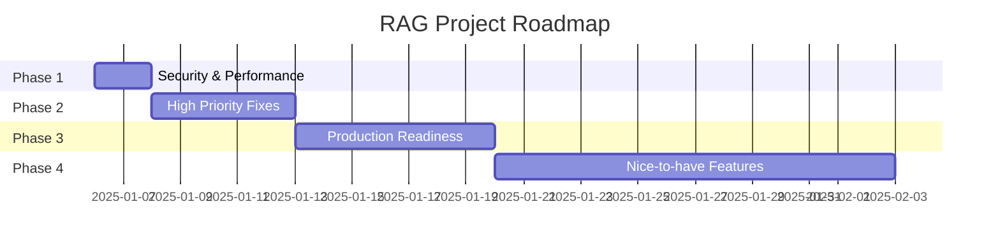

# 🗺️ RAG Project Roadmap

> **Статус проекта:** 🟡 Development (40% production-ready)
> **Последнее обновление:** 2025-01-06
> **Следующий релиз:** v2.6.0 (Critical Fixes)

---

## 📊 Прогресс

```
Phase 1 (Critical):     ░░░░░░░░░░  0% (0/4)
Phase 2 (High):         ░░░░░░░░░░  0% (0/4)
Phase 3 (Medium):       ░░░░░░░░░░  0% (0/4)
Phase 4 (Nice-to-have): ░░░░░░░░░░  0% (0/4)
```

**Общий прогресс:** `0/16` задач выполнено

---

## 🎯 PHASE 1: CRITICAL SECURITY & PERFORMANCE (v2.6.0)

**Срок:** 1-2 дня
**Приоритет:** 🔴 **CRITICAL**
**Блокер для production:** ДА

### ✅ Задачи

- [ ] **1.1 Security: Ротация API ключей** `#security` `#critical`
  - **Файл:** `README.md:88,101`, `.env`
  - **Проблема:** Exposed Qdrant API key в публичном README
  - **Действия:**
    1. Немедленно сгенерировать новый Qdrant API key
    2. Заменить в README на `QDRANT_API_KEY=your_api_key_here`
    3. Обновить `.env` с новым ключом
    4. Добавить `.env` в `.gitignore` (если еще не добавлен)
    5. Проверить git history на leaked secrets
  - **Время:** 30 минут
  - **Ответственный:** TBD
  - **Статус:** 🔴 NOT STARTED

- [ ] **1.2 Performance: Заменить requests на httpx** `#performance` `#critical`
  - **Файл:** `src/retrieval/search_engines.py:234,415,600`
  - **Проблема:** Blocking requests в async контексте
  - **Действия:**
    1. Установить httpx: `pip install httpx`
    2. Заменить все `requests.post()` на `httpx.AsyncClient()`
    3. Добавить timeout configuration (10 секунд)
    4. Обновить type hints
    5. Тестирование search engines
  - **Время:** 2 часа
  - **Ответственный:** TBD
  - **Статус:** 🔴 NOT STARTED
  - **PR:** N/A

- [ ] **1.3 Dependencies: Создать полный requirements.txt** `#dependencies` `#critical`
  - **Файл:** `requirements.txt`
  - **Проблема:** Missing 9 критических зависимостей
  - **Действия:**
    1. Добавить FlagEmbedding>=1.2.0
    2. Добавить sentence-transformers>=2.2.0
    3. Добавить anthropic>=0.18.0, openai>=1.10.0, groq>=0.4.0
    4. Добавить requests>=2.31.0 (temporary, удалить после 1.2)
    5. Протестировать чистую установку: `pip install -r requirements.txt`
  - **Время:** 1 час
  - **Ответственный:** TBD
  - **Статус:** 🔴 NOT STARTED

- [ ] **1.4 Performance: Исправить blocking calls в pipeline.py** `#performance` `#critical`
  - **Файл:** `src/core/pipeline.py:114-124`
  - **Проблема:** Синхронные encode() и search() блокируют event loop
  - **Действия:**
    1. Обернуть `embedding_model.encode()` в `run_in_executor`
    2. Обернуть `search_engine.search()` в `run_in_executor`
    3. Добавить async type hints
    4. Benchmark: измерить latency до/после
  - **Время:** 2 часа
  - **Ответственный:** TBD
  - **Статус:** 🔴 NOT STARTED

### 📈 Метрики успеха Phase 1
- ✅ Нет exposed secrets в репозитории
- ✅ `pip install -r requirements.txt` работает без ошибок
- ✅ Все async методы non-blocking
- ✅ Search latency < 1.5s (было ~2s при concurrent requests)

---

## 🔥 PHASE 2: HIGH PRIORITY FIXES (v2.7.0)

**Срок:** 3-5 дней
**Приоритет:** 🟠 **HIGH**
**Блокер для production:** ДА

### ✅ Задачи

- [ ] **2.1 Performance: Singleton для embedding model** `#performance` `#memory`
  - **Файл:** `src/core/pipeline.py:57`, `src/retrieval/search_engines.py:135,308,493`
  - **Проблема:** BGE-M3 модель загружается 2-3 раза (~4-6GB RAM)
  - **Действия:**
    1. Создать `src/core/embedding_manager.py` с singleton pattern
    2. Рефакторинг pipeline.py использовать singleton
    3. Рефакторинг search_engines.py использовать singleton
    4. Memory profiling до/после
  - **Время:** 4 часа
  - **Ответственный:** TBD
  - **Статус:** 🔴 NOT STARTED
  - **Ожидаемый эффект:** RAM usage: 6GB → 2GB

- [ ] **2.2 Concurrency: Distributed lock для semantic cache** `#cache` `#concurrency`
  - **Файл:** `telegram_bot/services/cache.py:164-271`
  - **Проблема:** Race condition при параллельных запросах
  - **Действия:**
    1. Установить `aioredlock` library
    2. Добавить lock manager в CacheService
    3. Обернуть semantic cache check+store в distributed lock
    4. Добавить timeout для lock (5 секунд)
    5. Testing: параллельные запросы
  - **Время:** 3 часа
  - **Ответственный:** TBD
  - **Статус:** 🔴 NOT STARTED

- [ ] **2.3 Security: Rate limiting для telegram bot** `#security` `#telegram`
  - **Файл:** `telegram_bot/bot.py`
  - **Проблема:** Нет защиты от spam и DoS
  - **Действия:**
    1. Создать `telegram_bot/middlewares/rate_limit.py`
    2. Implement RateLimitMiddleware (5 req/min per user)
    3. Register middleware в bot.py
    4. Добавить graceful error message
    5. Testing: stress test с 100 concurrent users
  - **Время:** 3 часа
  - **Ответственный:** TBD
  - **Статус:** 🔴 NOT STARTED

- [ ] **2.4 Code Quality: Proper error handling** `#quality` `#errors`
  - **Файл:** Multiple files
  - **Проблема:** Inconsistent error handling patterns
  - **Действия:**
    1. Создать `src/core/exceptions.py` с custom exceptions
    2. Заменить `except Exception` на specific exceptions
    3. Заменить `print()` на `logger.error()`
    4. Добавить error context (query, collection, etc.)
    5. Remove recursive fallbacks без depth limit
  - **Время:** 6 часов
  - **Ответственный:** TBD
  - **Статус:** 🔴 NOT STARTED

### 📈 Метрики успеха Phase 2
- ✅ RAM usage < 3GB при 10 concurrent searches
- ✅ Нет duplicate LLM calls при race conditions
- ✅ Rate limiter блокирует > 5 req/min
- ✅ Все errors логируются с context

---

## 🚀 PHASE 3: PRODUCTION READINESS (v3.0.0)

**Срок:** 1 неделя
**Приоритет:** 🟡 **MEDIUM**
**Блокер для production:** Желательно

### ✅ Задачи

- [ ] **3.1 Infrastructure: Connection pooling** `#infrastructure` `#performance`
  - **Файл:** `src/retrieval/search_engines.py:46`, `telegram_bot/services/cache.py:78`
  - **Действия:**
    1. Создать `src/core/client_manager.py` (Qdrant + Redis)
    2. Implement singleton pattern для clients
    3. Заменить QdrantClient на AsyncQdrantClient
    4. Enable gRPC для Qdrant (`prefer_grpc=True`)
    5. Configure connection pooling для Redis
  - **Время:** 6 часов
  - **Ответственный:** TBD
  - **Статус:** 🔴 NOT STARTED

- [ ] **3.2 DevOps: Docker Compose для всех сервисов** `#devops` `#docker`
  - **Файл:** `docker-compose.yml` (new)
  - **Действия:**
    1. Создать docker-compose.yml (Qdrant, Redis, MLflow, Langfuse)
    2. Добавить Prometheus + Grafana services
    3. Configure networks и volumes
    4. Создать `.env.example` для всех secrets
    5. Documentation: DOCKER_SETUP.md
  - **Время:** 8 часов
  - **Ответственный:** TBD
  - **Статус:** 🔴 NOT STARTED

- [ ] **3.3 DevOps: CI/CD pipeline (GitHub Actions)** `#devops` `#cicd`
  - **Файл:** `.github/workflows/ci.yml` (new)
  - **Действия:**
    1. Создать CI workflow (lint, test, coverage)
    2. Создать CD workflow (build, push Docker image)
    3. Setup branch protection (require CI pass)
    4. Configure secrets в GitHub
    5. Add status badges в README
  - **Время:** 6 часов
  - **Ответственный:** TBD
  - **Статус:** 🔴 NOT STARTED

- [ ] **3.4 Code Quality: AsyncQdrantClient migration** `#refactoring` `#async`
  - **Файл:** All files using QdrantClient
  - **Действия:**
    1. Audit: найти все sync QdrantClient usage
    2. Заменить на AsyncQdrantClient
    3. Update all methods to async
    4. Fix type hints
    5. Integration testing
  - **Время:** 8 часов
  - **Ответственный:** TBD
  - **Статус:** 🔴 NOT STARTED

### 📈 Метрики успеха Phase 3
- ✅ `docker-compose up` поднимает все сервисы за < 2 минуты
- ✅ CI pipeline проходит < 5 минут
- ✅ Connection pooling: max connections < 10
- ✅ All Qdrant operations async

---

## 🎁 PHASE 4: NICE-TO-HAVE (v3.1.0+)

**Срок:** 2+ недели
**Приоритет:** 🟢 **LOW**
**Блокер для production:** НЕТ

### ✅ Задачи

- [ ] **4.1 Observability: Prometheus metrics** `#monitoring` `#metrics`
  - **Файл:** New files
  - **Действия:**
    1. Установить `prometheus-client`
    2. Создать `/metrics` endpoint
    3. Добавить metrics: search_duration, cache_hit_rate, llm_tokens
    4. Создать Grafana dashboard config
    5. Documentation: MONITORING.md
  - **Время:** 8 часов
  - **Ответственный:** TBD
  - **Статус:** 🔴 NOT STARTED

- [ ] **4.2 Performance: Flat payload structure в Qdrant** `#performance` `#qdrant`
  - **Файл:** `src/ingestion/indexer.py:301-304`
  - **Действия:**
    1. Migration script: nested → flat payload
    2. Update indexer.py
    3. Update filter queries во всех search engines
    4. Re-index существующие collections
    5. Benchmark: query speed improvement
  - **Время:** 12 часов
  - **Ответственный:** TBD
  - **Статус:** 🔴 NOT STARTED

- [ ] **4.3 Testing: Integration tests с mocks** `#testing` `#quality`
  - **Файл:** `tests/integration/` (new)
  - **Действия:**
    1. Setup pytest-mock, pytest-asyncio
    2. Create mocks для Qdrant, Redis, LLM APIs
    3. Write integration tests для RAG pipeline
    4. Write integration tests для telegram bot
    5. Configure pytest-cov для coverage report (target: 80%)
  - **Время:** 16 часов
  - **Ответственный:** TBD
  - **Статус:** 🔴 NOT STARTED

- [ ] **4.4 Code Quality: Завершить TODOs в evaluation** `#quality` `#cleanup`
  - **Файл:** `src/evaluation/mlflow_experiments.py:181,212`
  - **Действия:**
    1. Integrate MLflow с actual RAG pipeline
    2. Replace mock evaluation с real metrics
    3. Add auto-logging для experiments
    4. Documentation: EVALUATION_GUIDE.md
  - **Время:** 8 hours
  - **Ответственный:** TBD
  - **Статус:** 🔴 NOT STARTED

### 📈 Метрики успеха Phase 4
- ✅ Grafana dashboard показывает все метрики
- ✅ Flat payload: query speed improvement > 20%
- ✅ Test coverage > 80%
- ✅ Нет TODO комментариев в production коде

---

## 📅 TIMELINE



**Projected dates:**
- Phase 1 end: 2025-01-08
- Phase 2 end: 2025-01-15
- Phase 3 end: 2025-01-24
- Phase 4 end: 2025-02-10

---

## 🏷️ Labels & Tags

- `#critical` - Блокер для production
- `#security` - Security-related
- `#performance` - Performance improvement
- `#quality` - Code quality
- `#testing` - Testing & QA
- `#devops` - Infrastructure & DevOps
- `#refactoring` - Code refactoring
- `#documentation` - Documentation

---

## 📊 KPIs

### Technical KPIs
- **RAM usage:** < 3GB (current: ~6GB)
- **Search latency:** < 1s (current: ~2s under load)
- **Test coverage:** > 80% (current: unknown)
- **CI pipeline time:** < 5 minutes
- **Docker startup:** < 2 minutes

### Business KPIs
- **Cache hit rate:** > 70%
- **Error rate:** < 1%
- **Uptime:** > 99.9% (после production)
- **Cost per query:** < $0.01

---

## 🔄 Процесс обновления

1. **Ежедневно:** Обновлять статус задач
2. **Еженедельно:** Review прогресса и adjustments
3. **После каждой фазы:** Update CHANGELOG.md
4. **После completion:** Archive в `/docs/roadmaps/ROADMAP_v2.5-v3.0.md`

---

## 🤝 Участие

Для работы над задачами:

1. Выбрать задачу из текущей фазы
2. Присвоить себя в поле "Ответственный"
3. Обновить статус на 🟡 IN PROGRESS
4. После completion: статус → ✅ DONE
5. Создать PR с reference на task number

**Формат commit:** `feat(1.2): replace requests with httpx in search engines`

---

**Last updated:** 2025-01-06
**Maintained by:** Project Team
**Questions:** Create issue с label `#roadmap-question`
