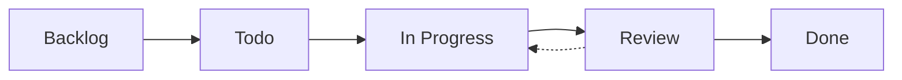

# 🎯 Task Management Best Practices 2025

> **Современные подходы к управлению задачами в software projects**
> **Дата:** 2025-01-06
> **Версия:** 1.0

---

## 📋 Содержание

1. [Обзор подходов 2025](#обзор-подходов-2025)
2. [Рекомендуемый стек](#рекомендуемый-стек)
3. [Структура файлов](#структура-файлов)
4. [GitHub Issues + Projects](#github-issues--projects)
5. [Conventional Commits](#conventional-commits)
6. [Автоматизация](#автоматизация)
7. [Best Practices](#best-practices)
8. [Инструменты](#инструменты)

---

## 🌟 Обзор подходов 2025

### Современные тренды

1. **Markdown-first approach**
   - ✅ Version controlled
   - ✅ Readable in any editor
   - ✅ Easy to automate
   - ✅ Works offline

2. **Git-native workflows**
   - Issues as source of truth
   - PRs linked to tasks
   - Automatic status updates
   - Audit trail built-in

3. **Automation-driven**
   - CI/CD для всего
   - Bots для routine tasks
   - Auto-generated reports
   - Metrics dashboards

4. **Docs-as-code**
   - Documentation в repo
   - Versioned with code
   - Reviewed in PRs
   - Tested automatically

---

## 🛠️ Рекомендуемый стек

### Для нашего проекта (RAG)

```yaml
Task Tracking:
  - ROADMAP.md      # Strategic planning
  - TODO.md         # Daily tasks
  - GitHub Issues   # Detailed tracking
  - GitHub Projects # Visual boards

Version Control:
  - CHANGELOG.md    # Keep a Changelog format
  - Semantic Versioning (semver)
  - Git tags для releases

Automation:
  - GitHub Actions  # CI/CD
  - Dependabot      # Dependencies
  - Pre-commit hooks # Code quality

Communication:
  - GitHub Discussions # Q&A
  - Issue templates    # Structured input
  - PR templates       # Review checklist
```

---

## 📁 Структура файлов

### Базовая структура

```
project/
├── .github/
│   ├── workflows/
│   │   ├── ci.yml              # Continuous Integration
│   │   ├── release.yml         # Release automation
│   │   └── update-roadmap.yml  # Auto-update progress
│   ├── ISSUE_TEMPLATE/
│   │   ├── bug_report.md
│   │   ├── feature_request.md
│   │   └── task.md
│   └── PULL_REQUEST_TEMPLATE.md
│
├── docs/
│   ├── CONTRIBUTING.md         # Contribution guide
│   ├── DEVELOPMENT.md          # Dev setup
│   └── ARCHITECTURE.md         # System design
│
├── ROADMAP.md                  # Strategic plan (this file)
├── CHANGELOG.md                # Version history
├── TODO.md                     # Daily tasks
├── README.md                   # Project overview
└── .gitignore
```

---

## 🎯 GitHub Issues + Projects

### Почему GitHub Issues в 2025?

**Преимущества:**
- ✅ Integrated с кодом
- ✅ Free для open source
- ✅ Powerful API
- ✅ Rich automation
- ✅ Mobile apps

**Недостатки:**
- ⚠️ Требует интернет
- ⚠️ Vendor lock-in
- ⚠️ Learning curve для Projects v2

### Setup GitHub Projects

```bash
# 1. Create project
gh project create --title "RAG Development" --owner @me

# 2. Add custom fields
gh project field-create --project-number 1 \
  --name "Priority" \
  --data-type "SINGLE_SELECT" \
  --options "P0:Critical,P1:High,P2:Medium,P3:Low"

# 3. Link to repository
gh project link <project-id> --owner <org> --repo <repo>
```

### Workflow



**Statuses:**
- **Backlog** - Unprioritized
- **Todo** - Ready to start
- **In Progress** - Actively working
- **Review** - PR created, awaiting review
- **Done** - Merged & deployed

---

## 📝 Conventional Commits

### Формат (2025 standard)

```
<type>(<scope>): <subject>

<body>

<footer>
```

### Types

```yaml
feat:     New feature
fix:      Bug fix
docs:     Documentation
style:    Formatting
refactor: Code restructuring
perf:     Performance improvement
test:     Testing
build:    Build system
ci:       CI/CD changes
chore:    Maintenance
revert:   Revert previous commit
```

### Примеры

```bash
# Feature
git commit -m "feat(search): add semantic cache with Redis Vector Search"

# Bug fix
git commit -m "fix(bot): resolve race condition in cache check"

# Breaking change
git commit -m "feat(api)!: migrate to AsyncQdrantClient

BREAKING CHANGE: All Qdrant methods are now async.
Update your code to use await."

# Multi-line
git commit -m "refactor(core): extract embedding manager singleton

- Create EmbeddingModelManager class
- Update pipeline.py to use singleton
- Update search_engines.py to use singleton
- Reduce RAM usage from 6GB to 2GB

Closes #42"
```

### Automated CHANGELOG

```bash
# Install conventional-changelog
npm install -g conventional-changelog-cli

# Generate CHANGELOG from commits
conventional-changelog -p angular -i CHANGELOG.md -s -r 0

# Auto-bump version
npx standard-version
```

---

## 🤖 Автоматизация

### 1. Pre-commit Hooks

```yaml
# .pre-commit-config.yaml
repos:
  - repo: https://github.com/pre-commit/pre-commit-hooks
    rev: v4.5.0
    hooks:
      - id: trailing-whitespace
      - id: end-of-file-fixer
      - id: check-yaml
      - id: check-added-large-files
      - id: check-merge-conflict

  - repo: https://github.com/astral-sh/ruff-pre-commit
    rev: v0.1.9
    hooks:
      - id: ruff
        args: [--fix]
      - id: ruff-format

  - repo: https://github.com/pre-commit/mirrors-mypy
    rev: v1.8.0
    hooks:
      - id: mypy
        additional_dependencies: [types-all]
```

```bash
# Install
pip install pre-commit
pre-commit install

# Run manually
pre-commit run --all-files
```

### 2. GitHub Actions

**Автоматические проверки:**

```yaml
# .github/workflows/ci.yml (см. созданный файл)
on: [push, pull_request]
jobs:
  - lint      # Code quality
  - test      # Unit tests
  - security  # Vulnerability scan
  - build     # Package build
```

**Auto-merge Dependabot:**

```yaml
# .github/workflows/dependabot-auto-merge.yml
name: Dependabot auto-merge
on: pull_request

permissions:
  pull-requests: write
  contents: write

jobs:
  dependabot:
    runs-on: ubuntu-latest
    if: github.actor == 'dependabot[bot]'
    steps:
      - name: Dependabot metadata
        id: metadata
        uses: dependabot/fetch-metadata@v1

      - name: Auto-merge patch updates
        if: steps.metadata.outputs.update-type == 'version-update:semver-patch'
        run: gh pr merge --auto --squash "$PR_URL"
        env:
          PR_URL: ${{github.event.pull_request.html_url}}
          GH_TOKEN: ${{secrets.GITHUB_TOKEN}}
```

### 3. Issue Automation

```yaml
# .github/workflows/issue-labeler.yml
name: Auto-label issues
on:
  issues:
    types: [opened]

jobs:
  label:
    runs-on: ubuntu-latest
    steps:
      - uses: actions/github-script@v7
        with:
          script: |
            const title = context.payload.issue.title.toLowerCase();
            const labels = [];

            if (title.includes('bug')) labels.push('bug');
            if (title.includes('feature')) labels.push('enhancement');
            if (title.includes('[1.')) labels.push('phase-1', 'critical');
            if (title.includes('[2.')) labels.push('phase-2', 'high-priority');
            if (title.includes('security')) labels.push('security');

            if (labels.length > 0) {
              await github.rest.issues.addLabels({
                owner: context.repo.owner,
                repo: context.repo.repo,
                issue_number: context.payload.issue.number,
                labels
              });
            }
```

---

## ✅ Best Practices

### Для ROADMAP.md

1. **Структура**
   ```markdown
   ## Phase X: Name (vX.Y.Z)
   **Срок:** Timeframe
   **Приоритет:** Level

   - [ ] **X.Y** Task name - `time` - 🔴 STATUS
     - **Файл:** path/to/file
     - **Проблема:** Description
     - **Действия:**
       1. Step 1
       2. Step 2
     - **Статус:** NOT STARTED
     - **PR:** #123
   ```

2. **Приоритизация**
   - P0 (Critical) → P1 (High) → P2 (Medium) → P3 (Low)
   - Используйте emoji для визуальной индикации
   - Группируйте по phases

3. **Метрики**
   - Отслеживайте progress bars
   - Считайте velocity (задач/день)
   - Измеряйте lead time

4. **Обновление**
   - Daily: статусы задач
   - Weekly: прогресс и adjustments
   - Monthly: strategic review

### Для CHANGELOG.md

1. **Follow Keep a Changelog format**
   ```markdown
   ## [Version] - YYYY-MM-DD
   ### Added
   - New feature X
   ### Changed
   - Modified behavior Y
   ### Fixed
   - Bug Z
   ```

2. **Group changes by type**
   - Added, Changed, Deprecated, Removed, Fixed, Security

3. **Link to issues/PRs**
   ```markdown
   - Fixed caching bug ([#123](link))
   ```

4. **Keep Unreleased section**
   - Все новые changes идут в [Unreleased]
   - При release переименовать в [X.Y.Z]

### Для TODO.md

1. **Daily updates**
   - Morning: план на день
   - Evening: что сделано

2. **Checkboxes**
   ```markdown
   - [ ] Task not done
   - [x] Task completed
   ```

3. **Context**
   - Добавляйте assignee: `@username`
   - Добавляйте время: `2h`
   - Добавляйте ссылки: `(ROADMAP.md#1.2)`

4. **Weekly review**
   - Что сделано
   - Что блокирует
   - План на след. неделю

---

## 🔧 Инструменты

### CLI Tools

```bash
# GitHub CLI
gh issue create --title "Task 1.2" --label "phase-1"
gh pr create --title "feat(search): add httpx" --body "Closes #42"

# Git extras
git-changelog  # Generate changelog
git-flow       # Branching model

# Task runners
just           # Modern make
task           # Task runner
```

### VS Code Extensions

```json
{
  "recommendations": [
    "github.vscode-pull-request-github",
    "github.vscode-github-actions",
    "yzhang.markdown-all-in-one",
    "bierner.markdown-checkbox",
    "gruntfuggly.todo-tree"
  ]
}
```

### Browser Extensions

- **GitHub Projects** - Improved project boards
- **Refined GitHub** - UI enhancements
- **Octotree** - Code tree sidebar

---

## 📊 Метрики и KPIs

### Development Metrics

```yaml
Velocity:
  - Tasks per day: 1-2 (Phase 1-2)
  - Story points per sprint: 20-30

Quality:
  - Code coverage: >80%
  - Bug fix time: <24h (P0), <1w (P1)
  - PR review time: <4h

Lead Time:
  - Idea → Deployed: <2 weeks
  - Bug report → Fixed: <1 week
```

### Tracking Tools

```python
# Calculate velocity
def calculate_velocity(completed_tasks, days):
    return completed_tasks / days

# Track cycle time
def cycle_time(task):
    return task.completed_at - task.started_at
```

---

## 🚀 Workflow Example

### Daily Routine

```bash
# Morning
1. Review TODO.md
2. Pick 1-2 tasks for today
3. Update status to IN PROGRESS
4. git checkout -b feature/1.2-httpx-migration

# During work
5. Follow Conventional Commits
6. Update TODO.md with progress
7. Run pre-commit hooks

# Evening
8. Create PR if task completed
9. Update TODO.md (Done today)
10. Plan tomorrow's tasks
11. git commit -m "docs(todo): update 2025-01-06"
```

### Weekly Routine

```bash
# Friday afternoon
1. Review week's progress
2. Update ROADMAP.md stats
3. Check blockers
4. Plan next week
5. Team sync meeting
```

### Release Routine

```bash
# When phase completed
1. Update CHANGELOG.md (move from Unreleased)
2. Update version in code
3. git tag -a v2.6.0 -m "Release v2.6.0"
4. git push --tags
5. GitHub Actions creates release automatically
```

---

## 🎓 Learning Resources

### Books
- "The Phoenix Project" - DevOps practices
- "Accelerate" - Metrics-driven development
- "Team Topologies" - Team organization

### Online
- [Keep a Changelog](https://keepachangelog.com/)
- [Semantic Versioning](https://semver.org/)
- [Conventional Commits](https://www.conventionalcommits.org/)
- [GitHub Skills](https://skills.github.com/)

### Courses
- GitHub Actions Masterclass
- Agile Project Management
- DevOps Fundamentals

---

## 🔄 Migration Path

### Если у вас сейчас...

**Jira/Linear:**
```bash
# Export tasks to CSV
# Convert to GitHub Issues
gh issue create --title "$TITLE" --body "$BODY" --label "$LABELS"
```

**Trello:**
```bash
# Use Trello API
# Convert boards to GitHub Projects
```

**Notion:**
```bash
# Export to Markdown
# Import to GitHub repo
```

**Google Sheets:**
```bash
# Export to CSV
# Parse and create Issues
```

---

## 💡 Tips & Tricks

### 1. Task Estimation

```markdown
# T-shirt sizing
XS - 15 min
S  - 30 min - 1h
M  - 2-4h
L  - 1 day
XL - 2-3 days
XXL - 1+ week (break down!)
```

### 2. Status Emojis

```markdown
🔴 NOT STARTED
🟡 IN PROGRESS
🟢 REVIEW
✅ DONE
⚠️ BLOCKED
❌ CANCELLED
```

### 3. Priority System

```markdown
P0 - Drop everything (security, data loss)
P1 - Fix this week (blockers, critical bugs)
P2 - Fix this month (important features)
P3 - Nice to have (improvements)
```

### 4. Branch Naming

```bash
feature/1.2-httpx-migration
fix/2.2-cache-race-condition
refactor/2.1-embedding-singleton
docs/update-readme
chore/upgrade-dependencies
```

---

## 🎯 Template Repository

**Create template for future projects:**

```bash
# Structure
template-repo/
├── .github/
│   ├── workflows/     # CI/CD templates
│   └── ISSUE_TEMPLATE/
├── ROADMAP.md         # With example phases
├── CHANGELOG.md       # With examples
├── TODO.md            # Daily template
└── TASK_MANAGEMENT.md # This guide
```

---

## 📞 Support

**Questions?**
- GitHub Discussions: Project Q&A
- Issues: `label:question`
- Team chat: Slack/Discord

**Contributions:**
- Fork repo
- Update docs
- Submit PR

---

**Maintained by:** Project Team
**Last updated:** 2025-01-06
**Version:** 1.0
**License:** MIT

---

## Appendix: Quick Reference

### Commands

```bash
# Tasks
gh issue create --title "Task" --label "phase-1"
gh issue edit 42 --add-label "in-progress"
gh issue close 42 --comment "Completed!"

# PRs
gh pr create --title "feat: X" --body "Closes #42"
gh pr merge 123 --squash

# Releases
git tag -a v1.0.0 -m "Release"
git push --tags

# Changelog
conventional-changelog -p angular -i CHANGELOG.md -s

# Pre-commit
pre-commit install
pre-commit run --all-files
```

### Links

- [Project Board](https://github.com/users/USERNAME/projects/1)
- [Milestones](https://github.com/USERNAME/REPO/milestones)
- [Releases](https://github.com/USERNAME/REPO/releases)
- [Actions](https://github.com/USERNAME/REPO/actions)
