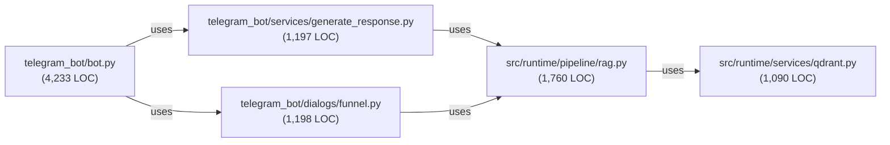

# Oversized Module Inventory

**Status:** Analysis complete as of 2026-06-19
**Task:** #2829 — Oversized-module split inventory (P3/docs)
**Scope:** LOC measurement, logical split points, and refactor risk assessment

---

## Summary

Measured 7 candidate modules; identified 5 oversized (>500 LOC). Total LOC across all candidates: **9,850**. All oversized modules have clear logical split boundaries.

## Modules Measured

| Module | LOC | Status | Risk |
|--------|-----|--------|------|
| `telegram_bot/bot.py` | 4,233 | Oversized, actively decomposing | Low |
| `src/runtime/pipeline/rag.py` | 1,760 | Oversized, retrieval pipeline | Medium |
| `telegram_bot/dialogs/funnel.py` | 1,198 | Oversized, UI/catalog logic | Low |
| `telegram_bot/services/generate_response.py` | 1,197 | Oversized, LLM response gen | Low |
| `src/runtime/services/qdrant.py` | 1,090 | Oversized, vector DB gateway | Medium |
| `telegram_bot/graph/nodes/cache.py` | 331 | OK | — |
| `telegram_bot/integrations/cache.py` | 41 | OK | — |

---

## Detailed Split Recommendations

### 1. `telegram_bot/bot.py` — 4,233 LOC

**Current Status:** Actively decomposing via sliced PRs (#1265, #2046)

**Decomposition Progress:**
- ✅ Module-level helpers extracted to focused submodules (Slice 1)
- 🔄 Lifecycle method extraction planned (Slice 2, #2048, blocked on #1948/#2045)

**Proposed Splits (Slice 2):**

| Proposed Module | Extracted Methods | Est. LOC | Purpose |
|---|---|---|---|
| `_bot_handlers_apartment.py` | apartment list, result handling | ~400 | Apartment listing handlers |
| `_bot_handlers_search.py` | search, filter logic | ~400 | Search query and filter handlers |
| `_bot_handlers_catalog.py` | catalog controls, pagination | ~300 | Catalog UI and pagination |
| `_bot_handlers_generation.py` | response streaming, generation | ~350 | LLM response delivery |
| `_bot_error_handling.py` | error recovery, retry logic | ~250 | Error handling and recovery |
| `_bot_core_agent.py` | agent initialization and routing | ~300 | Core agent orchestration |
| Remaining PropertyBot core | Lifecycle, state machine | ~1,800 | State transitions and core logic |

**Dependencies:**
- PropertyBot class imports from `telegram_bot/graph/` (legacy graph facades)
- Depends on `telegram_bot/agents/` (business tools, CRM)
- Depends on `src/runtime/pipeline/assistant_pipeline.py` (imperative core)

**Risk Level:** Low — extraction enforced by contract tests; historical trace preserved in comments

**Blockers:** #1948 (runtime migration), #2045 (graph consolidation), #2047 (reverse-layering)

---

### 2. `src/runtime/pipeline/rag.py` — 1,760 LOC

**Current Structure:** Monolithic retrieval pipeline with 28 functions

**Proposed Splits by Logical Layer:**

| Layer | Functions | Est. LOC | Purpose |
|---|---|---|---|
| **Cache Layer** | `_cache_check`, `_cache_store`, `_load_cached_query_bundle`, `_lookup_search_cache` | ~400 | Query and result caching |
| **Vector Prep** | `_embed_and_cache_query_vectors`, `_resolve_query_vectors`, `_ensure_sparse_vector` | ~250 | Query embedding and vector normalization |
| **Retrieval** | `_execute_qdrant_retrieval`, `_retrieve_with_relaxation`, `_hybrid_retrieve`, `_run_initial_retrieval`, `_run_relaxed_retrieval` | ~500 | Dense/sparse search and relaxation |
| **Post-Processing** | `_grade_documents`, `_rerank`, `_rewrite_query`, `_store_search_results` | ~350 | Grading, reranking, query rewriting |
| **Context Assembly** | `_assemble_context`, `_expand_small_to_big`, `_compute_retrieval_filters`, `_find_missing_evidence_constraints` | ~250 | Final context building and filtering |
| **Pipeline Orchestration** | `rag_pipeline` (main entry, 388 LOC) | ~388 | State routing and coordination |

**Proposed Module Layout:**
```
src/runtime/pipeline/
├── rag.py (reduced to orchestrator + exports)
├── rag_cache.py (query/result caching)
├── rag_vectors.py (embedding and vector prep)
├── rag_retrieval.py (Qdrant search paths)
├── rag_postprocess.py (grading, reranking)
└── rag_context.py (context assembly and filtering)
```

**Dependencies:**
- `src/runtime/services/qdrant.py` — vector search
- `src/runtime/services/bge_m3.py` — embeddings
- `src/runtime/services/redis_*.py` — caching
- `src/runtime/pipeline/assistant_pipeline.py` — state contracts

**Risk Level:** Medium — Cache layer is critical path; test coverage required for relaxation and fusion logic

**Verification Strategy:** Preserve `rag_pipeline` interface; unit test each layer; e2e validate against `test_e2e_core_live`

---

### 3. `telegram_bot/dialogs/funnel.py` — 1,198 LOC

**Current Structure:** UI/Catalog dialog builders with 30 handler/formatter functions

**Proposed Splits by Feature:**

| Module | Functions | Est. LOC | Purpose |
|---|---|---|---|
| `funnel_city_property.py` | City, property type, budget selection | ~300 | Initial search filters |
| `funnel_preferences.py` | Preference builders (floor, view, category, etc.) | ~400 | Preference panel UI and logic |
| `funnel_summary.py` | Summary data builder, display | ~200 | Search result summarization |
| `funnel_actions.py` | All handler/callback functions | ~250 | Button callbacks and state transitions |
| Remaining `funnel.py` | Dialog construction, helpers | ~50 | Dialog assembly |

**Proposed Module Layout:**
```
telegram_bot/dialogs/
├── funnel.py (main dialog builder)
├── funnel_initial_filters.py (city/property/budget)
├── funnel_preferences_ui.py (preference panel construction)
├── funnel_summary_display.py (result summary rendering)
└── funnel_actions.py (all event handlers)
```

**Dependencies:**
- `telegram_bot/agents/search.py` — search execution
- `telegram_bot/agents/catalog.py` — catalog data
- Domain models (apartment, property, filter contracts)

**Risk Level:** Low — UI logic is domain-specific but isolated; no core business logic

**Verification Strategy:** Test option generators and summary formatter; verify Telegram dialog state machine

---

### 4. `telegram_bot/services/generate_response.py` — 1,197 LOC

**Current Structure:** LLM response generation with 26 helper functions + main entry

**Proposed Splits by Concern:**

| Layer | Functions | Est. LOC | Purpose |
|---|---|---|---|
| **Streaming** | `_generate_streaming`, `_generate_streaming_response`, `_unpack_stream_result`, `_handle_stream_error`, `_deliver_final_message` | ~450 | Stream handling, delivery |
| **LLM Call** | `_build_streaming_request`, `_chat_create_with_optional_name`, `_non_streaming_llm_call`, `_extract_queue_ms_from_provider_headers` | ~300 | Request building and LLM calls |
| **Context & Prompt** | `_format_context`, `_format_context_for_mode`, `_build_system_prompt`, `_build_system_prompt_with_config`, `_ensure_history_instruction`, `_select_recent_history` | ~250 | System prompt and context formatting |
| **Response Processing** | `_sanitize_response_text`, `_build_fallback_response`, `_extract_usage_details`, `_extract_sent_message_ref` | ~200 | Response text and metadata extraction |
| **Pipeline State** | `_update_current_span`, `_update_current_generation`, `_extract_stream_metadata`, `_make_draft_id` | ~150 | Trace and generation state |

**Proposed Module Layout:**
```
telegram_bot/services/
├── generate_response.py (orchestrator + exports)
├── response_streaming.py (stream delivery)
├── response_llm_call.py (LLM request/call)
├── response_context.py (prompt and context)
├── response_processing.py (text/metadata extraction)
└── response_pipeline_state.py (span/generation tracking)
```

**Dependencies:**
- `src/core/llm_provider.py` — LLM client
- `src/runtime/pipeline/assistant_pipeline.py` — state contracts
- `telegram_bot/integrations/cache.py` — response caching (optional)

**Risk Level:** Low — Streaming and LLM call logic is self-contained; test coverage sufficient

**Verification Strategy:** Unit test stream error handling; e2e test streaming delivery; mock LLM for fast iterations

---

### 5. `src/runtime/services/qdrant.py` — 1,090 LOC

**Current Structure:** Monolithic gateway with 9 methods in single class

**Proposed Splits by Search Path:**

| Layer | Methods | Est. LOC | Purpose |
|---|---|---|---|
| **Initialization & Config** | `__init__`, `set_quantization_mode`, properties, `_apply_strict_mode`, `ensure_collection_preflight` | ~200 | Client setup and validation |
| **Search Core** | `search`, `search_with_fusion`, `search_with_mmr`, `search_with_boosting` | ~400 | Primary search entry points and fusion |
| **Filtering & Helpers** | `_build_filter`, `_compute_boosting_fn`, `_is_missing_vector_error`, `_format_results`, `_format_group_results` | ~200 | Filter construction and result formatting |
| **Group Search** | Group-based search and aggregation | ~150 | Group-level retrieval (if present) |
| **Health & Diagnostics** | Health checks, diagnostics, status | ~140 | Service health and observability |

**Proposed Module Layout:**
```
src/runtime/services/
├── qdrant.py (QdrantService class, reduced)
├── qdrant_search_paths.py (search, fusion, MMR, boosting implementations)
├── qdrant_filters.py (filter building and query construction)
└── qdrant_diagnostics.py (health, preflight, collection validation)
```

**Alternative:** Thin facade + strategy pattern for search algorithms (less extraction, more composition)

**Dependencies:**
- `qdrant_client` — SDK
- `src/config/qdrant_policy.py` — collection naming
- `src/observability.py` — tracing
- `src/runtime/services/metrics.py` — event recording

**Risk Level:** Medium — Qdrant SDK API surface is large; RRF fusion logic is critical path

**Verification Strategy:** Contract tests for filter building; e2e validate search paths; mock Qdrant for unit tests

---

## Cross-Module Dependencies



**Import Order Risk:** None identified; split candidates are layered, not circular

---

## Refactoring Checklist by Priority

### Phase 1: Lowest Risk (UI & Generation)
- [ ] Extract `telegram_bot/dialogs/funnel.py` → UI layer split
- [ ] Extract `telegram_bot/services/generate_response.py` → streaming/context/processing tiers
- **Rationale:** Isolated business logic, good test coverage, no core dependencies

### Phase 2: Medium Risk (Retrieval Pipeline)
- [ ] Extract `src/runtime/pipeline/rag.py` → cache/vectors/retrieval/postprocess/context layers
- **Rationale:** Cache layer is critical; requires e2e validation; good abstraction boundaries
- **Blockers:** Ensure `rag_pipeline` orchestrator remains stable interface

### Phase 3: High Effort (Bot Core)
- [ ] Extract `telegram_bot/bot.py` → handler groups (apartment/search/catalog/generation/error)
- **Rationale:** Largest module; decomposition already tracked in #1265/#2046/#2048
- **Blockers:** #1948 (runtime migration), #2045 (graph consolidation)

### Phase 4: Medium Risk (Qdrant Gateway)
- [ ] Extract `src/runtime/services/qdrant.py` → search paths/filters/diagnostics
- **Rationale:** Search algorithm changes less frequently; filter logic is independent
- **Blockers:** Ensure SDK version compatibility; validate all search paths via contract tests

---

## Risk Assessment Summary

| Module | Split Effort | Complexity | Test Coverage | Critical Path | Overall Risk |
|--------|---|---|---|---|---|
| `bot.py` | High | High | Good | Yes (handlers) | Low (tracked) |
| `rag.py` | High | High | Good | Yes (cache/fusion) | Medium |
| `funnel.py` | Medium | Low | Good | No | Low |
| `generate_response.py` | Medium | Medium | Good | Yes (streaming) | Low |
| `qdrant.py` | Medium | Medium | Good | Yes (search) | Medium |

**Overall Recommendation:** Execute Phase 1 (UI + Generation) first for confidence; Phase 2 (RAG) adds complexity but has clear boundaries; Phase 3 (Bot core) is tracked in existing issues; Phase 4 (Qdrant) depends on SDK maturity.

---

## Evidence & Commands

```bash
# Measure LOC for all candidates
cd /home/user/projects/rag-fresh/.worktrees/docs/2829-module-inventory
wc -l telegram_bot/bot.py src/runtime/pipeline/rag.py telegram_bot/dialogs/funnel.py \
  telegram_bot/services/generate_response.py src/runtime/services/qdrant.py \
  telegram_bot/graph/nodes/cache.py telegram_bot/integrations/cache.py

# Verify function counts per module
for f in telegram_bot/bot.py src/runtime/pipeline/rag.py telegram_bot/services/generate_response.py; do
  echo "$f: $(grep -c '^\s*def ' $f) functions"
done
```

---

## Next Steps

1. **Immediate:** Link this inventory to existing decomposition tracking (#1265, #2046, #2048)
2. **Recommended:** Start Phase 1 extraction with PR review process
3. **Follow-up:** Create focused issue per phase with specific split checklist
4. **Verification:** Preserve interfaces; add contract tests for each split
5. **Documentation:** Update module ownership in `docs/architecture/STRUCTURE.md`
