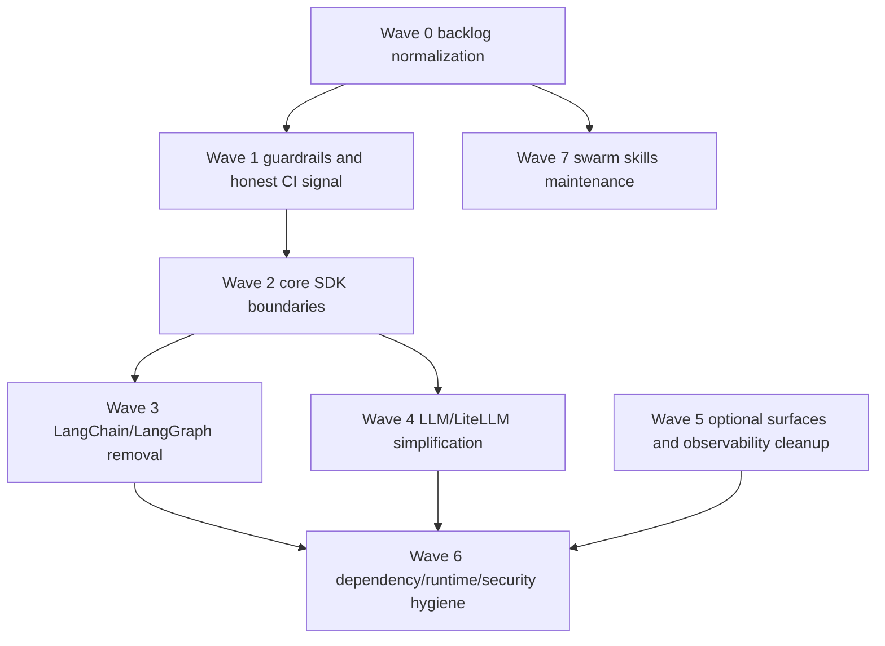

# Open Issues Roadmap — 2026-06-10

## Context and source of truth

This roadmap is based on the currently open GitHub issues for `yastman/rag`, collected on 2026-06-10 after installing GitHub CLI in the workspace. GitHub returned 23 open items from the REST issues endpoint; 2 of them were pull requests, so the execution backlog below covers the 21 open issues only.

Collection notes:

- `gh` was installed from Ubuntu packages (`gh version 2.45.0`).
- `gh config set git_protocol https --host github.com` was applied.
- The ambient `GH_TOKEN` is invalid for GitHub API calls in this environment, so issue bodies/comments were collected through the public GitHub REST API instead of `gh issue list` GraphQL.
- The repository checkout has no `origin` remote configured; roadmap links therefore use the canonical GitHub repository URL from project badges/docs: `https://github.com/yastman/rag`.

Canonical repo guidance used for ordering:

- Product simplification work follows Stage 0 docs first, then test/logging infrastructure, one golden live E2E, and then runtime simplification.
- Issue triage lanes are: quick execution, plan needed, design first.
- Runtime simplification is centered on making Telegram a thin production adapter over `src.core` / `src.runtime`, removing optional surfaces and heavy dependencies from the required path.

## Backlog snapshot

| Area | Issues | Count | Primary lane |
|---|---:|---:|---|
| Core architecture / monolith simplification | #2411, #2404, #2405, #2406, #2407 | 5 | Design first → plan needed |
| LangChain / LangGraph removal | #2426, #2427, #2428 | 3 | Plan needed |
| LLM / LiteLLM simplification | #2429, #2454 | 2 | Plan needed |
| Optional surfaces and observability dependency removal | #2430, #2431, #2452, #2437 | 4 | Plan needed / product decision |
| Dependency cleanup and runtime upgrades | #2451, #2300, #2043, #11 | 4 | Plan needed / manual-control |
| Guardrails / CI enforcement / audit | #2324, #2319 | 2 | Plan needed, some owner-controlled settings |
| Swarm skill maintenance | #2305 | 1 | Separate maintenance track |

## Agent workflow boundary

This roadmap is an Audit Planner artifact. Before executing it, agents must use
[`../engineering/agent-workflow-modes.md`](../engineering/agent-workflow-modes.md)
and select exactly one mode per assignment:

- use PR Coordinator mode for existing open PR review, rebase, merge, close, or supersede decisions;
- use Issue Executor mode for one accepted issue or approved issue cluster in an isolated worktree;
- use Audit Planner mode only for refreshing this roadmap or producing backlog analysis.

Do not mix PR queue cleanup with new issue execution in the same task.

## Recommended execution order

### Wave 0 — Normalize backlog and unblock decisions

Goal: convert the open issues into an executable graph before touching broad code paths.

1. Confirm which already-referenced child issues are closed or absent from the current open list, especially DEPS-LC1 #2425 and observability removal issues #2434, #2435, #2436.
2. Mark dependencies directly in GitHub issue comments so workers do not start blocked work out of order.
3. Decide whether #2437 is an accepted product request, a vendor proposal to close, or a future optional evaluation track.
4. Decide owner-controlled items from #2319/#2324: required checks on `main`, branch protection, and any repository settings that cannot be implemented purely in code.

Exit criteria:

- Every open issue has one owner lane: `quick execution`, `plan needed`, `design first`, `external/manual`, or `close/no-op`.
- The core simplification epic (#2411) has a visible dependency order linking child issues.
- No worker starts #2428, #2452, or #2454 before their blockers are confirmed.

### Wave 1 — Authority and CI signal before broad refactors

Goal: make refactor feedback trustworthy before deleting orchestration and dependency layers.

Issues:

- #2324 — guardrails roadmap.
- #2319 — enforcement gaps.

Execution plan:

1. Finish the accepted “honest signal” split from #2324: `no_services` vs `requires_services`, fast-lane tests, nightly service checks, and non-silent nightly notifications.
2. Make PR guardrails fail-closed for empty diffs and label-driven bugfix detection.
3. Add or strengthen contextvars contracts around `asyncio.run` / `run_until_complete` with an explicit CLI allowlist.
4. Implement branch-protection/required-check verification only after repository-owner approval, because that setting is outside the normal code patch path.
5. Add dedup or recurrence detection only after the bug-class registry contract is stable.

Validation focus:

- Fast local unit/static checks for guardrail scripts.
- Contract tests for marker coverage and fail-closed behavior.
- A documented manual verification step for GitHub branch protection.

### Wave 2 — Core architecture decisions and SDK boundaries

Goal: stabilize the target shape of the core before removing dependencies.

Issues:

- #2411 — epic for Python monolith core migration.
- #2404 — `AssistantApp` builder / dependency encapsulation.
- #2405 — drop LangGraph in favor of imperative `assistant_pipeline`.
- #2406 — separate pure retrieval service from RAG generation pipeline.
- #2407 — replace global `log_event` with SDK-friendly logging/callbacks.

Execution plan:

1. Start with #2407: define the telemetry/logging seam first, because observability removal and core SDK embedding both depend on it.
2. Implement #2404 next: introduce `AssistantApp` / builder configuration so adapters stop constructing low-level Qdrant, LLM, embedding, and runtime dependencies directly.
3. Implement #2406: split retrieval into a pure retrieval service and move generation ownership to the runtime generation service.
4. Implement #2405 only after #2404/#2406 have seams: replace remaining LangGraph orchestration with the imperative assistant pipeline and keep adapter compatibility shims temporary and explicit.
5. Keep #2411 as the umbrella and update it after every child completion.

Validation focus:

- Unit tests for the builder and dependency injection boundaries.
- Core golden E2E that calls `run_assistant_request()` without Telegram-only construction.
- Coupling ratchets proving `src.core` / `src.runtime` no longer import Telegram implementation details except through temporary allowlisted shims.

### Wave 3 — LangChain / LangGraph removal

Goal: remove LangChain stack only after core orchestration has a replacement path.

Issues:

- #2426 — remove `create_agent` from voice path.
- #2427 — remove LangGraph `StateGraph`, `langmem`, and create-agent middleware.
- #2428 — drop `langchain`, `langgraph`, and `langmem` dependencies from `pyproject.toml` and lockfile.

Execution plan:

1. Treat #2426 as optional-surface cleanup: either repoint voice to the procedural core or archive voice if product scope says it is optional.
2. Execute #2427 after #2405: fold guard/classify middleware into the imperative pipeline or adapter layer, and remove default coupling from `src/runtime/graph` to `telegram_bot.graph.graph`.
3. Execute #2428 last: remove dependency declarations and lockfile entries only after code search proves no runtime imports remain.
4. Delete or rewrite tests that assert the old dual `create_agent` path.

Validation focus:

- `rg` checks for `langchain`, `langgraph`, and `langmem` runtime imports.
- Focused tests for voice/core routing if voice is retained.
- `uv lock`, dependency diff review, and image-size/dependency-tree comparison.

### Wave 4 — LLM provider and LiteLLM simplification

Goal: consolidate LLM calls while avoiding a half-migrated state where both proxy and SDK are required.

Issues:

- #2429 — consolidate LLM access through LiteLLM/OpenAI-compatible access; drop redundant provider SDKs and `instructor`.
- #2454 — migrate LiteLLM from Docker proxy to Python SDK / in-process router.

Execution plan:

1. First complete the API shape from #2429: all core LLM calls should go through one internal LLM facade, even if it still talks to the current proxy temporarily.
2. Use `src/runtime/llm/router.py` as the in-process LiteLLM router and keep fallback configuration in Python/config.
3. Replace direct external-proxy call sites in runtime graph config, contextualization, voice, and handoff summary.
4. Remove external proxy surfaces: compose service, preflight health checks, and proxy-specific env assumptions.
5. Remove redundant provider SDKs and `instructor` only after the router path is fully covered.

Validation focus:

- Unit tests for model routing, fallback order, timeout, and missing-key behavior.
- One live opt-in E2E (`make e2e-core-live`) after secrets are available.
- `make check` and focused tests for handoff/contextualization paths.

### Wave 5 — Optional surfaces and observability dependency cleanup

Goal: keep product logs and core proof required; move heavy or optional observability/UI surfaces out of base install and required runtime.

Issues:

- #2430 — archive Mini App from required path.
- #2431 — make observability and heavy UI dependencies optional.
- #2452 — clean tests/scripts after Langfuse/OTel/Sentry/Mini App removal.
- #2437 — offline traces/eval proposal.

Execution plan:

1. Execute #2430 before deleting Mini App tests: move Mini App to archive or otherwise remove it from default compose/k8s/required CI while preserving source history.
2. Execute #2431: move `gradio`, `pillow`, `apscheduler`, `sentry-sdk`, and `langfuse` into optional extras/profiles; prove core imports do not require them.
3. Execute #2452 after observability removals land: remove or rewrite stale Langfuse, OTel, Sentry, Mini App, and trace-validation tests/scripts.
4. Decide #2437 separately: if accepted, design it as an optional offline evaluation/listener path that does not reintroduce mandatory observability dependencies; otherwise close politely as not aligned with current simplification.

Validation focus:

- Base install dependency diff.
- `make test-unit` after stale test deletion.
- Import smoke test for core path without optional extras.
- Compose profile checks proving optional observability remains opt-in only.

### Wave 6 — Dependency hygiene, runtime versions, and security backlog

Goal: reduce dependency drag without unsafe automatic upgrades or dismissing unresolved security alerts.

Issues:

- #2451 — audit/remove Boto3 and Google Cloud dependencies if unused.
- #2300 — plan Python 3.14 and Node 24 runtime migrations.
- #2043 — track no-patch Dependabot alerts for `diskcache` and `ragas`.
- #11 — Renovate Dependency Dashboard.

Execution plan:

1. Run #2451 after LangChain/optional dependency removals, because boto/google packages may disappear as transitive dependencies once the heavy stack is removed.
2. For #2300, inventory all Dockerfiles/images, decide per-service Python 3.14 readiness, and keep Node 24 separate from core Python migration.
3. Reconcile #2043 against current dependency state: `ragas` and `diskcache` should remain absent from dependency/lockfile surfaces unless maintainers explicitly accept restoring that exposure.
4. Use #11 as the Renovate coordination board: recreate closed runtime-upgrade PRs only after #2300 has compatibility decisions.

Validation focus:

- `uv tree` / lockfile diff for dependency provenance.
- Docker build smoke tests for changed runtime images.
- Focused service tests for any Python/Node runtime migration.
- Security notes documenting no-patch exposure and mitigation state.

### Wave 7 — Swarm skills maintenance as a separate track

Goal: avoid mixing repo product refactors with agent-skill infrastructure cleanup.

Issue:

- #2305 — refactor swarm skills to reduce duplication, token overhead, and phase-boundary drift.

Execution plan:

1. Keep this out of the product/runtime simplification critical path.
2. Split into small skill-system PRs: shared runtime contract, strict JSON decision matrix, report schema authority, acceptance/disposition split, and intake/orchestrator slimming.
3. Validate with a live worker smoke test for the exact scenario mentioned in the issue: `$swarm-orchestrator изучи открытые issues и составь план` should route to `secretary-flash` and avoid local issue/PR analysis.

Validation focus:

- Skill quick validation for each changed skill.
- One live smoke test after the contract split.

## Dependency graph

## Issue-by-issue execution table

| Issue | Decision | Depends on | Recommended next action |
|---:|---|---|---|
| #2454 | Plan needed | #2429, Langfuse removal status | Implement after LLM facade exists; migrate proxy config to in-process LiteLLM router. |
| #2452 | Plan needed | #2430, #2431, OTel/Langfuse removal status | Run after optional-surface removals; delete/rewrite stale observability tests/scripts. |
| #2451 | Plan needed | Wave 3/5 dependency reductions | Re-audit imports and transitive provenance after large dependency removals. |
| #2437 | Product decision | #2407/#2431 optional listener policy | Accept only as optional offline eval/listener, or close as out of current scope. |
| #2431 | Plan needed | #2407 telemetry seam | Move heavy observability/UI packages to extras and prove base core imports stay clean. |
| #2430 | Plan needed | Product owner confirmation for archive path | Archive Mini App and remove it from default compose/k8s/required CI. |
| #2429 | Plan needed | #2404 builder seam preferred | Create single LLM facade before removing provider SDKs. |
| #2428 | Plan needed | #2426, #2427 | Remove dependency declarations only after runtime imports are gone. |
| #2427 | Plan needed | #2405 and DEPS-LC1/#2426 status | Fold graph middleware into imperative pipeline and delete LangGraph state graph. |
| #2426 | Plan needed | DEPS-LC1 status / voice product status | Repoint voice to core or archive voice as optional. |
| #2411 | Umbrella | All core/deps child issues | Keep open; update after each wave with completed child issues and evidence. |
| #2407 | Design first | None | Define logging/telemetry callback seam; unblock observability optionalization. |
| #2406 | Design first → plan needed | #2404 recommended | Extract pure retrieval service and remove RAG black-box coupling. |
| #2405 | Design first → plan needed | #2404/#2406 recommended | Replace LangGraph with imperative assistant pipeline. |
| #2404 | Design first → plan needed | #2407 helpful | Introduce `AssistantApp` builder and adapter config boundary. |
| #2324 | Plan needed | Some items depend on #2319/owner settings | Continue wave-based guardrail roadmap; finish honest signal and enforcement. |
| #2319 | Plan needed / external for settings | Repo owner for branch protection | Implement code guardrails; document/manual-check repository settings. |
| #2305 | Separate maintenance | None | Execute as skill-system cleanup, not product runtime work. |
| #2300 | Plan needed/manual | Dependency cleanup first | Inventory runtimes, decide Python 3.14/Node 24 per service, then recreate Renovate work. |
| #2043 | Manual-control security | Upstream patches or risk acceptance | Keep open; audit exposure and mitigate locally if practical. |
| #11 | Manual-control dependency dashboard | #2300 decisions | Use as Renovate control board after runtime migration plan is approved. |

## Suggested first three PRs

1. **PR 1: Backlog/guardrail normalization**
   - Update issue comments/labels for blockers and lanes.
   - Add/adjust marker-contract tests and fail-closed PR guardrails from #2319/#2324.
   - Do not touch runtime simplification yet.

2. **PR 2: SDK-friendly logging seam**
   - Implement #2407 with a minimal callback/logging interface.
   - Keep current product JSON logs intact.
   - Add tests that core can run without Langfuse/OTel imports.

3. **PR 3: AssistantApp builder skeleton**
   - Implement #2404 enough for adapters to pass config instead of constructing low-level dependencies.
   - Add ratchets for forbidden Telegram imports in core/runtime.
   - Use this as the foundation for retrieval split, imperative pipeline, and LLM router work.

## Risks and controls

- **Risk: deleting dependencies before replacement seams exist.** Control: do #2407/#2404/#2406 before #2427/#2428/#2454.
- **Risk: optional observability removal reduces debugging quality.** Control: preserve structured JSON product logs and add optional listener seams instead of hard dependencies.
- **Risk: runtime upgrades mix with simplification regressions.** Control: defer #2300/#11 runtime upgrades until after dependency simplification or run them in separate PRs with focused service validation.
- **Risk: invalid local GitHub token makes `gh issue list` unreliable.** Control: refresh `GH_TOKEN` or run public REST collection; do not treat local token status as repository state.
