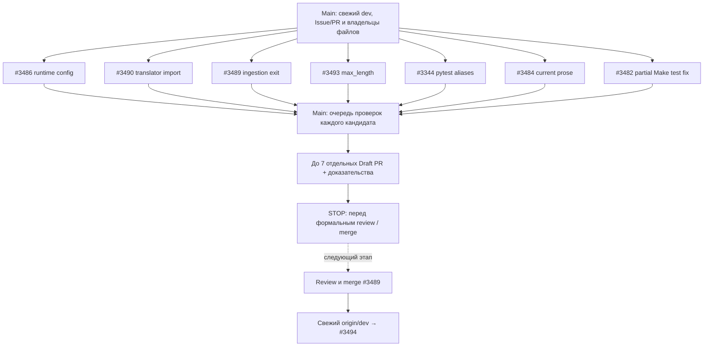

# План реализации и Draft PR — 6 сентября 2026

> **For agentic workers:** применять `superpowers:dispatching-parallel-agents` к независимым пакетам; `superpowers:using-git-worktrees` для изоляции; `superpowers:test-driven-development` для поведения; `superpowers:verification-before-completion` для доказательств. Серийный fallback — `superpowers:executing-plans`. Шаги выполнения отмечать в рабочем отчёте/Issue, а не превращать этот снимок в отдельный tracker.

**Goal:** подготовить семь отдельных Draft PR по существующим Issues, затем остановиться перед формальным ревью и слиянием. Шесть — кандидаты на полную приёмку, #3482 — заведомо частичный PR.
**Architecture:** Main координирует до трёх независимых исполнителей с отдельными ветками/worktrees и непересекающимися файлами. Полные gates и публикация PR принадлежат Main; каждый кандидат проверяется отдельно на своём SHA.
**Tech Stack:** Python 3.12, uv/frozen locks, pytest, aiogram, FastAPI/Pydantic, GitHub CLI.
**Spec:** [PROJECT.md](PROJECT.md), [AGENTS.md](AGENTS.md), [Tests](tests/README.md), [общий индекс и процесс #3338](https://github.com/yastman/rag/issues/3338), актуальные пакеты в семи Issues ниже.

Дата: **2026-09-06**, Europe/Kiev. Проверенный source SHA: `6a10a8f39aa95f4121427f7b79e6cb6ff107ccd2`. Это план запуска, а не выполненная работа и не обещание длительности. При более позднем запуске перечитать GitHub и проверить актуальность SHA/файлов.

## Границы сегодняшнего этапа

- Код, regression proof, локальная проверка, commit/push и отдельный Draft PR входят в запуск плана. Формальный review, merge, auto-merge и ручное закрытие Issue не входят.
- Полную приёмку можно связать с PR через `Closes #N`; при неполном результате — `Refs #N`. `dev` проверена как default branch: автоматическое закрытие произойдёт после принятого merge. Для #3482 всегда `Refs #3482` в рамках этого пакета. Механизм closing keywords: [GitHub Docs](https://docs.github.com/en/issues/tracking-your-work-with-issues/using-issues/linking-a-pull-request-to-an-issue).
- Авторитетные scope/приёмка/статус — в GitHub Issues; правила и gates — в текущих root/scoped AGENTS. Этот файл задаёт выбор и диспетчеризацию на дату, а подробный план каждой правки находится в начале соответствующей Issue.
- Не менять зависимости, lock-файлы, модели, архитектуру, CI/branch protection, production data. Не исправлять соседние ошибки в PR выбранной Issue. При изменившемся контракте вернуть Main точный blocker.
- Родительская, Related или Successor ссылка сама по себе не является prerequisite. Отдельно учитывать semantic dependencies, занятость файлов, доступность окружения и готовность PR к закрытию Issue.

## DAG до ревью



Семь стрелок из S означают независимость, а не семь одновременных агентов. При четырёх доступных слотах: Main + максимум три worker. Начать #3486, #3490, #3489; по мере освобождения слотов брать #3482, #3493, #3344, #3484. Между этими семью реализациями нет обязательного merge. Gates выполняются Main по одному; Review не является условием старта следующей независимой реализации.

## Выбранные Issues

| Issue | Результат | PR/закрытие |
|---|---|---|
| [#3486](https://github.com/yastman/rag/issues/3486) | GraphConfig доходит из Telegram до настоящей generation | Closes только со всей исходной приёмкой |
| [#3490](https://github.com/yastman/rag/issues/3490) | Штатная factory создаёт hub и lifecycle подключает i18n | Closes только со всей исходной приёмкой |
| [#3489](https://github.com/yastman/rag/issues/3489) | Ошибки файлов дают exit 1 и честный terminal status | Closes только со всей исходной приёмкой |
| [#3493](https://github.com/yastman/rag/issues/3493) | Encode принимает max_length 1–2048, invalid request → 422 до модели | Closes только со всей исходной приёмкой |
| [#3344](https://github.com/yastman/rag/issues/3344) | Четыре Test-import aliases, без подавления warnings | Closes после чистой collection и gates |
| [#3484](https://github.com/yastman/rag/issues/3484) | Текущие контракты больше не называют удалённый Docling живым | Closes после bounded audit и gates |
| [#3482](https://github.com/yastman/rag/issues/3482) | Только удаление stale unit assertion и локальный mutation proof | **Refs; Issue остаётся открытой** |

## Старт координатора

- [x] Прочитать этот файл, root/scoped AGENTS и пакет выбранной Issue. Из #3338 читать только раздел `Agent execution — 2026-09-06` между маркерами `agent-execution-day-2026-09-06:start/end`; весь исторический DAG и комментарии эпика в worker context не загружать. У выбранной Issue сохранить её исходную приёмку и новые релевантные уточнения. Не выполнять остальной backlog из #3338.
- [x] Применить skills. `dispatching-parallel-agents` обязателен для независимых workers. `systematic-debugging` включать при непонятном failure. `requesting-code-review` и review-этапы `subagent-driven-development` оставить до следующего пользовательского этапа; требование остановки перед ревью имеет приоритет.
- [x] Проверить Git и GitHub:

```powershell
rtk git rev-parse --show-toplevel
rtk git status --short
rtk git worktree list --porcelain
rtk git fetch origin
rtk git rev-parse origin/dev
rtk proxy gh pr list --repo yastman/rag --state open --limit 100 --json number,title,headRefName,baseRefName,url
```

- [x] Сопоставить действующие PR с Issue, проверить tracked/untracked состояние существующих worktrees. Возобновлять совпадающую задачу; не создавать duplicate PR. На снимке есть незавершённые worktrees #3350/#3366 — сохранить их, включая их локальные `task.md` и планы.
- [x] Определить фактическое количество слотов. Для fresh worker использовать `fork_turns="none"`, нужную роль и самодостаточный пакет. Не передавать весь backlog/историю разговора. `implementer` — для кода; `sonic` возможен только для механических aliases #3344. Модели выбирать по текущей конфигурации пользователя, не задавать более дорогую модель самовольно.

## Worktrees и окружения

Main создаёт только worktree запускаемой задачи через `superpowers:using-git-worktrees`, после проверки существующего соответствия. Ниже команды создания только для отсутствующих веток/worktrees. Все команды выполняются из **main checkout**; не запускать их внутри linked worktree и не удалять существующие каталоги.

```powershell
rtk git check-ignore -v .worktrees/
```

Каждый worker получает фактические absolute root и HEAD созданного worktree. Одна Issue — одна ветка, один writer и один Draft PR. `.venv` отдельная для каждого worktree; никаких symlink на окружение main checkout. Setup выполнять в нужном worktree:

```powershell
rtk uv sync --frozen
```

Для #3486/#3490 вместо base-selection использовать `rtk uv sync --frozen --extra telegram`; для #3493 — `rtk uv sync --frozen --extra bge-extras`. Это альтернативные selections, а не повод перезаписывать соседнее окружение. Main возвращает текущий candidate к `rtk uv sync --frozen` перед `make candidate-check`.

## Пакеты и точные команды

Пути ниже — бюджет изменяемых файлов; дополнительные read-only verification targets указаны в Issue. Каждый worker сначала читает актуальное тело своей Issue через приведённую команду. Затем следует её конкретным шагам и приёмке; намеренные source/test изменения описаны там с code/assertion fragments.

### #3486: Передать runtime GraphConfig в основной путь ответа Telegram

**Scope/приёмка:** [#3486](https://github.com/yastman/rag/issues/3486).
**Изменять:** `telegram_bot/pipeline/supervisor.py`, `tests/unit/test_bot_query_supervisor.py`, `tests/unit/telegram_bot/test_assistant_core_adapter.py`.
**Branch:** `codex/issue-3486-runtime-config`. **Worktree:** `.worktrees/issue-3486-runtime-config`.

```powershell
rtk proxy gh issue view 3486 --repo yastman/rag --json number,title,body,comments,labels,state
rtk git worktree add .worktrees/issue-3486-runtime-config -b codex/issue-3486-runtime-config origin/dev
```

- [x] Worker воспроизводит scoped baseline, выполняет конкретные шаги Issue, затем запускает:

```text
rtk uv run --no-sync pytest -q tests/unit/test_bot_query_supervisor.py tests/unit/telegram_bot/test_assistant_core_adapter.py tests/unit/runtime/test_assistant_pipeline.py tests/unit/runtime/test_generate_answer.py::test_generate_answer_llm_failure_returns_fallback
```

- [x] Worker возвращает Main owned diff и доказательства. Предложить `Closes` только при доказанной полной исходной приёмке; иначе `Refs`.

### #3490: Восстановить штатное создание переводчика и подключение i18n

Новый запланированный regression node: `TestBotLifecycle.test_setup_workflow_data_installs_i18n_hub` в существующем handler-тесте. Его focused-команда выполняется после добавления; baseline запускать по существующим классам.

**Scope/приёмка:** [#3490](https://github.com/yastman/rag/issues/3490).
**Изменять:** `telegram_bot/lifecycle/services.py`, `tests/unit/test_bot_handlers.py`.
**Branch:** `codex/issue-3490-translator-import`. **Worktree:** `.worktrees/issue-3490-translator-import`.

```powershell
rtk proxy gh issue view 3490 --repo yastman/rag --json number,title,body,comments,labels,state
rtk git worktree add .worktrees/issue-3490-translator-import -b codex/issue-3490-translator-import origin/dev
```

- [x] Worker воспроизводит scoped baseline, выполняет конкретные шаги Issue, затем запускает:

```text
rtk uv run --no-sync pytest -q tests/unit/test_bot_handlers.py::TestPropertyBotInit tests/unit/middlewares/test_i18n.py tests/unit/test_i18n_middleware.py tests/unit/test_bot_handlers.py::TestBotLifecycle::test_setup_workflow_data_installs_i18n_hub
```

- [x] Worker возвращает Main owned diff и доказательства. Предложить `Closes` только при доказанной полной исходной приёмке; иначе `Refs`.

### #3489: Вернуть ненулевой exit code при per-file ошибках one-shot ingestion

**Scope/приёмка:** [#3489](https://github.com/yastman/rag/issues/3489).
**Изменять:** `src/ingestion/unified/commands.py`, `tests/unit/ingestion/test_unified_cli.py`.
**Branch:** `codex/issue-3489-ingestion-exit`. **Worktree:** `.worktrees/issue-3489-ingestion-exit`.

```powershell
rtk proxy gh issue view 3489 --repo yastman/rag --json number,title,body,comments,labels,state
rtk git worktree add .worktrees/issue-3489-ingestion-exit -b codex/issue-3489-ingestion-exit origin/dev
```

- [x] Worker воспроизводит scoped baseline, выполняет конкретные шаги Issue, затем запускает:

```text
rtk uv run --no-sync pytest -q tests/unit/ingestion/test_unified_cli.py::TestCmdRun
rtk uv run --no-sync pytest -q tests/unit/ingestion/test_unified_cli.py
```

- [x] Worker возвращает Main owned diff и доказательства. Предложить `Closes` только при доказанной полной исходной приёмке; иначе `Refs`.

### #3493: Ограничить max_length всех BGE encode endpoints существующим пределом

**Scope/приёмка:** [#3493](https://github.com/yastman/rag/issues/3493).
**Изменять:** `services/bge-m3-api/app.py`, `tests/unit/test_bge_m3_endpoints.py`.
**Branch:** `codex/issue-3493-encode-max-length`. **Worktree:** `.worktrees/issue-3493-encode-max-length`.

```powershell
rtk proxy gh issue view 3493 --repo yastman/rag --json number,title,body,comments,labels,state
rtk git worktree add .worktrees/issue-3493-encode-max-length -b codex/issue-3493-encode-max-length origin/dev
```

- [x] Worker воспроизводит scoped baseline, выполняет конкретные шаги Issue, затем запускает:

```text
rtk uv run --no-sync pytest -q tests/unit/test_bge_m3_endpoints.py tests/unit/test_bge_m3_rerank.py
rtk uv run --no-sync pytest -q tests/unit/test_bge_m3_artifact.py
rtk uv run --no-sync pytest -q tests/unit/test_docker_static_validation.py -k "bge_m3 or bge-m3"
```

- [x] Worker возвращает Main owned diff и доказательства. Предложить `Closes` только при доказанной полной исходной приёмке; иначе `Refs`.

### #3344: Убрать ложную pytest collection четырёх импортированных Test-типов

**Scope/приёмка:** [#3344](https://github.com/yastman/rag/issues/3344).
**Изменять:** `tests/unit/scripts/test_e2e_runner.py`.
**Branch:** `codex/issue-3344-pytest-import-aliases`. **Worktree:** `.worktrees/issue-3344-pytest-import-aliases`.

```powershell
rtk proxy gh issue view 3344 --repo yastman/rag --json number,title,body,comments,labels,state
rtk git worktree add .worktrees/issue-3344-pytest-import-aliases -b codex/issue-3344-pytest-import-aliases origin/dev
```

- [x] Worker воспроизводит scoped baseline, выполняет конкретные шаги Issue, затем запускает:

```text
rtk uv run --no-sync pytest -q tests/unit/scripts/test_e2e_runner.py
rtk uv run --no-sync pytest --collect-only -q tests/unit
```

- [x] Worker возвращает Main owned diff и доказательства. Предложить `Closes` только при доказанной полной исходной приёмке; иначе `Refs`.

### #3484: Убрать противоречия о уже удалённом Docling из текущих контрактов

**Scope/приёмка:** [#3484](https://github.com/yastman/rag/issues/3484).
**Изменять:** `pyproject.toml`, `tests/contract/test_legacy_ingestion_removed_contract.py`, `tests/contract/test_dead_code_cleanup_contract.py`, `tests/contract/test_markdown_only_ingestion_contract.py`.
**Branch:** `codex/issue-3484-current-ingestion-prose`. **Worktree:** `.worktrees/issue-3484-current-ingestion-prose`.

```powershell
rtk proxy gh issue view 3484 --repo yastman/rag --json number,title,body,comments,labels,state
rtk git worktree add .worktrees/issue-3484-current-ingestion-prose -b codex/issue-3484-current-ingestion-prose origin/dev
```

- [x] Worker воспроизводит scoped baseline, выполняет конкретные шаги Issue, затем запускает:

```text
rtk uv run --no-sync pytest -q tests/contract/test_legacy_ingestion_removed_contract.py tests/contract/test_dead_code_cleanup_contract.py tests/contract/test_markdown_only_ingestion_contract.py
rtk rg -n -i "docling_client|src/ingestion/service[.]py|STILL LIVE|cannot be deleted yet" pyproject.toml tests/contract
rtk rg -n -i "src[.]api|client.direct|ImperativeBotAgent|Voyage|LangGraph|LangChain" pyproject.toml tests/contract
```

- [x] Worker возвращает Main owned diff и доказательства. Предложить `Closes` только при доказанной полной исходной приёмке; иначе `Refs`.

### #3482: Подготовить частичный PR со снятием устаревшей Makefile-проверки

**Scope/приёмка:** [#3482](https://github.com/yastman/rag/issues/3482).
**Изменять:** `tests/unit/test_makefile_contract.py`.
**Branch:** `codex/issue-3482-make-contract-partial`. **Worktree:** `.worktrees/issue-3482-make-contract-partial`.

```powershell
rtk proxy gh issue view 3482 --repo yastman/rag --json number,title,body,comments,labels,state
rtk git worktree add .worktrees/issue-3482-make-contract-partial -b codex/issue-3482-make-contract-partial origin/dev
```

- [x] Worker воспроизводит scoped baseline, выполняет конкретные шаги Issue, затем запускает:

```text
rtk uv run --no-sync pytest -q tests/unit/test_makefile_contract.py tests/contract/test_local_gate_policy_contract.py tests/contract/test_makefile_review_gate_no_autosync_contract.py
```

- [x] Worker возвращает Main owned diff и доказательства. Это частичный результат: только `Refs #3482`.

## Промпт одного worker

Main заполняет фактические Issue/абсолютный worktree/HEAD/список файлов из выбранной секции. Не отправлять worker весь этот план вместо его пакета. Формат обязательно сохранять:

```text
# Goal
Реализовать одну назначенную Issue до готового diff и focused proof для Draft PR.
# Constraints
Работать только в назначенном worktree и file budget. Ты не один в кодовой базе:
не откатывай чужие изменения, не меняй соседние модули. Root/scoped AGENTS обязательны.
Не запускать глобальные formatter/linter/suites; не push/merge/close Issue.
# Contract
Вернуть source/test diff, команды и exit codes, red/green proof, риски и непроверенную
приёмку. Не объявлять Issue выполненной по одному успешному тесту.
# Target
Координатор при dispatch вставляет фактический номер Issue, absolute root и expected HEAD.
# Change
Координатор вставляет актуальный пакет этой Issue и её точный бюджет изменяемых файлов.
# Acceptance
Координатор вставляет исходную приёмку Issue и focused-команды. Каждый пункт должен
иметь доказательство либо явную причину, почему он ещё не выполнен.
```

Это шаблон формирования сообщения Main, а не готовый dispatch с пропущенными значениями. До вызова spawn все фактические значения должны быть вставлены; worker проверяет root/HEAD/status до изменений.

## Проверки Main и создание PR

1. Дождаться владельца конкретного diff. Проверить весь `git diff` и `git diff --cached`, соответствие file budget и исходной приёмке. Это проверка комплекта и scope перед публикацией; формальное независимое code review сегодня не запускать.
2. Выполнить требуемые проверки из текущих root/scoped AGENTS, затем общий `make candidate-check` в окружении candidate. Для Telegram дополнительно `make check`, `make test-unit`, а supervisor требует `make test-core` и `make test-no-service-lane`. Для ingestion — `make check`, `make test-ingestion`, `make test-core`, `make test` и scoped preflight с согласованным dev stack. Для BGE — перечисленные endpoint/rerank/artifact/static проверки. Для изменённых test contracts — `make test-contract`.
3. Make recipes требуют POSIX-инструментов: использовать поддержанный в [Tests](tests/README.md) WSL/Linux/container route; не заменять gate выдуманной PowerShell-командой. В PowerShell для parallel pytest переменная задаётся как `$env:PYTEST_ADDOPTS = '-n auto --dist=worksteal'`; восстановить прежнее значение после команды. Не репурпозить HOME/CODEX_HOME. Full suites запускать последовательно, не насыщать CPU несколькими `-n auto` одновременно.
4. Сохранить baseline отдельно. Известная #3482 может ломать broad unit gate на исходном dev. Не ослаблять gates, не cherry-pick соседний фикс, не выдавать baseline failure за успех; при сохранении такого gap — только Draft/Refs с точным blocker. Если обязательный hook отвергает commit/push, не обходить его: вернуть локальный результат и причину, остальные независимые задачи продолжить.
5. Main коммитит только owned files после focused проверки. Зафиксировать проверенный SHA; если hooks изменили содержимое — проверить изменённый candidate заново. Push без force, один Draft PR в `dev`, без reviewer request/auto-merge. Текст PR передавать через файл и `--body-file`, сохранить буквальные переносы строк.
6. Указать trigger/исправленное поведение, scope, тесты с exit codes/counts и SHA, непроверенные пункты, rollback через revert, `Refs`/`Closes`. Для полного результата keyword закроет Issue после принятого merge; вручную её сейчас не закрывать.
7. Остановиться на таблице результатов. Worktrees/ветки сохраняются для следующего ревью; cleanup до review/merge не выполнять.

## Отложенные связи и занятость файлов

| Не запускать в этом пакете | Причина / условие следующего старта |
|---|---|
| #3494 | После review/merge #3489 и fresh origin/dev: общий commands.py и test_unified_cli.py; stacked PRs исключены |
| #3491, изменение GraphConfig по #3332 | Не совмещать с границей #3486; locale/prompt/cache требует отдельного плана |
| #3492, app.py edits в #3366 | app.py зарезервирован для #3493; проверить активного writer перед стартом |
| #3340 | Его массовое удаление не совмещать с узкой правкой current prose #3484 |
| #3391/#3439 | Общий E2E-runner test owner с #3344; #3439 сохраняет свою actual dependency #3391 |
| #3438 | Сначала #3355/#3361/#3367; release/Compose не является маленьким независимым PR |
| #3339 | Сначала его удаляемые contract owners, включая #3340 |
| #3487/#1602/#599 | Нужен отдельный проверенный план concurrency/atomicity/checkpoint safety |
| #3350/#3366 existing worktrees | Чужие незавершённые состояния сохранить; не дублировать и не смешивать |

Занятость файла — временная диспетчеризация, а не новая архитектурная dependency. Не помечать всю будущую задачу blocked только потому, что сегодня её файл назначен другому worker.

## Результат сегодняшнего запуска

Main возвращает таблицу: Issue → Draft PR URL (или конкретный blocker) → base/HEAD SHA → изменённые файлы → focused/scoped/candidate результаты → оставшаяся приёмка → `Refs`/`Closes`. Статус implementation и статус delivered различать. Создание PR не означает, что ревью/слияние или закрытие уже произошли.

## Выполнение — 2026-09-07 (base `7f5b0eceb185cc652f6e938699247069f7da434a`)

DAG выполнен: Main + три параллельных исполнителя в трёх волнах (#3486/#3490/#3489 → #3482/#3493/#3344 → #3484) через `superpowers:dispatching-parallel-agents`; отдельные worktrees `.worktrees/issue-<n>-<slug>` и ветки `codex/issue-<n>-<slug>` от свежего `origin/dev`; diff-бюджеты всех семи пакетов соблюдены и проверены чтением полных diff'ов. Семь Draft PR созданы в `dev`; ревью/merge/закрытие Issue не выполнялись. Worktrees и ветки сохранены для этапа ревью. Отмечено окружение: `rtk` на машине исполнения отсутствовал — использованы прямые `uv`/`gh`/`make` с теми же семантиками (`--frozen`, `--no-sync`); pre-commit/push hooks в клоне не установлены, все обязательные gates выполнены как Make-цели, приёмка не ослаблялась.

| Issue | Draft PR | HEAD SHA | Файлы | Gates Main | Итог |
|---|---|---|---|---|---|
| #3486 | [#3502](https://github.com/yastman/rag/pull/3502) | `e110267f301a38f35d31bdb943b5e1269ec99b85` | `supervisor.py` + 2 теста | focused 31 passed; candidate-check ✓ (core 328 / no-service 21 / contract 953) | `Refs` — red baseline `test-unit` |
| #3490 | [#3503](https://github.com/yastman/rag/pull/3503) | `5ec6cb3a847eae268b9de953340c733e18ae1e05` | `services.py` + handler-тесты | focused 25 passed (файл 76); candidate-check ✓ | `Refs` — red baseline `test-unit` |
| #3489 | [#3501](https://github.com/yastman/rag/pull/3501) | `893e13b163a39fc1d7b22f8b79ec60b984e40656` | `commands.py` + CLI-тесты | focused 8/49; `make check` ✓; `test-ingestion` 170; candidate-check ✓ | `Closes` (live-preflight не доказан — нет dev stack; указано в PR) |
| #3482 | [#3500](https://github.com/yastman/rag/pull/3500) | `4cc4432a3db2cb8c7ec3e31fcc639dc3799ebd29` | 1 тест (−22 строки) | focused 50; mutation-check PASS; candidate-check ✓ | `Refs` — частичный по пакету |
| #3493 | [#3504](https://github.com/yastman/rag/pull/3504) | `faa6cf28c436e7b6428fa368b2ea2dbdc4a2b519` | `app.py` + endpoints-тесты | focused 64+23+11; candidate-check ✓ | `Closes` (image/offline-artifact вне proof; указано в PR) |
| #3344 | [#3505](https://github.com/yastman/rag/pull/3505) | `4cc6cdae4869de6f760204bf0ac220fc74566309` | `test_e2e_runner.py` | focused 26; collection 4160 tests / 0 warnings; candidate-check ✓ | `Closes` |
| #3484 | [#3506](https://github.com/yastman/rag/pull/3506) | `4d5287a5f062809078b3634a531ce32737c27d3c` | `pyproject.toml` + 2 контракта | focused 28; `test-contract` 955; candidate-check ✓ | `Closes` (2 out-of-budget резидуума перечислены в PR) |

Baseline-блокеры: `make test-unit` на чистом `origin/dev` @ `7f5b0eceb` падает с 5 pre-existing провалами — устаревший тест #3482; `test_readme_documents_minimal_and_default_core_profiles`; `test_setup_workflow_data_registers_lead_sink_for_handlers`; `test_pr_template_has_validation_and_runtime_fields`; stale `collection=` в `test_assistant_core_adapter.py` (чинится #3502). Проверено запуском этих тестов на чистом чекауте; ни один кандидат не добавил регрессий, `make candidate-check` зелёный у всех семи. Из-за red broad unit lane Telegram-кандидаты #3486/#3490 — `Refs` с перечнем блокеров в PR; перевод в `Closes` — на этапе ревью после слияния baseline-фиксов. Все 7 Issues и #3338 остались открытыми: `Closes` сработает при merge в `dev` (правила GitHub соблюдены).

Короткая команда следующему исполнителю:

> Прочитай task.md от 2026-09-06 и актуальные пакеты выбранных Issues. Выполни только этот дневной DAG, используй superpowers:dispatching-parallel-agents для независимых workers. Подготовь отдельные Draft PR и остановись перед формальным ревью/merge. Приёмку и hooks не ослабляй; Issue вручную не закрывай.

## Выполнение — 2026-09-08 (base `7f5b0eceb` → `7b783c651`)

Полный цикл доставки: Main-оркестратор + параллельные суб-агенты-исполнители (`superpowers:dispatching-parallel-agents`, TDD/verification у воркеров) в изолированных worktrees от свежего `origin/dev`; Main владел ревью полных diff'ов, пушем через pre-push hooks (core pytest + bandit), PR, хостед-гейтами (Candidate Gate + CodeQL) и merge. Слиты все 27 PR этого цикла, включая семь Draft'ов 2026-09-07 (#3500–#3507); `origin/dev` = `7b783c651`. Issue закрыты (авто-`Closes` или вручную с доказательством приёмки): #3486, #3490, #3494, #3479, #3483, #3430, #3426, #3425, #3484, #3489, #3493, #3491, #3487, #3478, #3477, #3488, #3452, #3446, #3481, #3335, #3350, #3429, #3340, #3339. Вычищены все задачные ветки/worktree; pre-existing регрессия #3513 (дубликат имени теста на contract-lane) поймана локальным гейтом и починена #3514.

| Issue | PR | HEAD | Суть / LOC | Gates | Итог |
|---|---|---|---|---|---|
| #3494 | [#3508](https://github.com/yastman/rag/pull/3508) | `6a73a3d8b` | preflight api-key per-request | red→green; 48/169/328 | `Closes` |
| #3479 | [#3509](https://github.com/yastman/rag/pull/3509) | `014419235` | один truthful search outcome | red→green; 14/42/329 | `Closes` |
| #3483 | [#3510](https://github.com/yastman/rag/pull/3510) | `0eeefb990` | LiteLLM boundary owns classification | 43/331/953 | `Closes` |
| #3430 | [#3511](https://github.com/yastman/rag/pull/3511) | `94dc5f874` | −292 дубль middleware-сьют | 17-строчная матрица; 22/75 | `Closes` |
| #3426 | [#3512](https://github.com/yastman/rag/pull/3512) | `eeb67139e` | −214 VPS-тесты; 31 skip→0 | 17 passed | `Closes` |
| #3425 | [#3513](https://github.com/yastman/rag/pull/3513) | `4c869b7a4` | −125 AST-ратчат; +64-byte тест | 126 passed | `Closes` |
| — | [#3514](https://github.com/yastman/rag/pull/3514) | `3cf918cef` | rename-фикс регрессии #3513 | ratchet green | merged |
| #3491 | [#3515](https://github.com/yastman/rag/pull/3515) | `e9972d222` | locale → prompt + cache read/store | red→green; 36/335 | `Closes` |
| #3487 | [#3516](https://github.com/yastman/rag/pull/3516) | `c1edd7b60` | stale topic mappings + guard delete | red→green; 26/121/332 | `Closes` |
| #3478 | [#3517](https://github.com/yastman/rag/pull/3517) | `6bafca513` | Qdrant failure terminal | red→green; 336/180 | `Closes` |
| #3477 | [#3518](https://github.com/yastman/rag/pull/3518) | `249a112b3` | leads: notify gated + dedup | 13 red→35/107 | `Closes` |
| #3488 | [#3519](https://github.com/yastman/rag/pull/3519) | `128c983f8` | handoff recovery, fault-таблицы | 9 red→14/135/340/1238 | `Closes` |
| #3452 | [#3520](https://github.com/yastman/rag/pull/3520) | `cfa643a2b` | metadata/ignore prune −51 | 75 passed; check-ignore | `Closes` |
| #3446 | [#3521](https://github.com/yastman/rag/pull/3521) | `4dfbaf0a8` | PEP 440 python matrix | red 4→20 passed | `Closes` |
| #3481 | [#3522](https://github.com/yastman/rag/pull/3522) | `89cd986bb` | −728/+168 streaming surface | zero-owners proof; 336/954 | `Closes` |
| #3335 | [#3523](https://github.com/yastman/rag/pull/3523) | `b26b7a358` | extras dedupe; lock без версий | 1007 passed | `Closes` |
| #3350 | [#3524](https://github.com/yastman/rag/pull/3524) | `ae87d6f79` | −39 мёртвых BotConfig knobs | red→green; 336/1232/975 | `Closes` |
| #3429 | [#3525](https://github.com/yastman/rag/pull/3525) | `b71f90f12` | −704 HyDE-остров; parity-тесты | 409/373/966; import-linter ✓ | `Closes` |
| #3340 | [#3526](https://github.com/yastman/rag/pull/3526) | `b4ace0572` | −987 tombstone-контракты | collect 5280 ✓; 829 | `Closes` (floor 989→985: дрейф файла до задачи, задокументирован) |
| #3339 | [#3527](https://github.com/yastman/rag/pull/3527) | `31ca7a3d3` | −817 false dedupe-ratchet | collect 5200 ✓; 814 | `Closes` |

Остаток фронтера (59 открытых Issues): (а) DAG-блокировка на открытых корнях — #3333 (SPEC qdrant; держит #3443/#3461/#3457/#3379), #3392-эпик deps (держит #3445/#3400-…), #3353, #3379 (держит #3423/#3444/#3427), #3328 (держит остаток #3482), #3350-наследник #3387, #3412–#3422 e2e-полосы; (б) `verify:local-runtime` — требуется Docker-рантайм (daemon на машине не запущен): #3492, #3442, #3440–#3443, #3450/#3451/#3453 (цепочка #3449/#3454), #3458, #3460/#3462, e2e-полосы; (в) `manual-control`: #3459-эпик, #3480. Исполнимых без рантайма/корней Issues на момент остановки не осталось; следующий исполнимый шаг — закрытие корней #3333/#3379/#3392 их владельцами либо подъём Docker-стека для local-runtime полосы.
